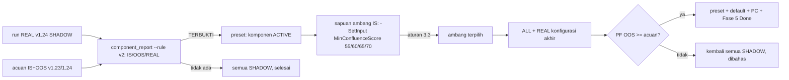

# Design — Aktivasi komponen dan kalibrasi ambang

Status: Done (2026-10-08)
Requirements: [requirements.md](requirements.md) (Approved 2026-10-07; IS ≥ 50 / OOS ≥ 10 per kelompok; ambang kandidat 55/60/65/70%; komponen tak terbukti tetap SHADOW; filter klimaks dan entry Adaptive/Limit ditunda ke Fase 6)

## 1. Overview

Spec ini sebagian besar berupa prosedur pengukuran. Perubahan kode EA hanya pada default input dan preset.

Prosedur ditetapkan sebelum data OOS dilihat:
1. **Data REAL:** backtest `-Period REAL` (real ticks 2026-01-05..10-01) dengan v1.24, semua komponen SHADOW.
2. **Keputusan aktivasi:** `component_report.py --rule v2` atas sesi IS, OOS, dan REAL. Komponen TERBUKTI menjadi ACTIVE.
3. **Sapuan ambang di IS:** dengan komponen terbukti ACTIVE, `-Period IS` dijalankan untuk `MinConfluenceScore` 55/60/65/70. Ambang dipilih dengan aturan §3.3, hanya dari IS.
4. **Validasi akhir:** `-Period ALL` dan `-Period REAL` dengan konfigurasi akhir, dibandingkan dengan acuan.

Bila langkah 2 tidak menghasilkan komponen TERBUKTI, langkah 3–4 dilewati: semua tetap SHADOW, ambang tetap 65% dari 55, dan Fase 5 selesai (Req 2.3).

## 2. Architecture



## 3. Components and interfaces

### 3.1 `tools/component_report.py`: aturan v2 (Req 1)

```python
def verdict_v2(is_g: list[Group], oos_g: list[Group], real_g: list[Group] | None,
               min_is: int = 50, min_oos: int = 10) -> str
    # kelompok "pos" = gabungan nilai > 0, "zero" = nilai 0 (R per trade dari total R / n)
    # SAMPEL KURANG: pos atau zero < min di IS atau OOS
    # TERBUKTI: pos > zero di IS dan OOS, dan (REAL tidak ada / pos REAL >= zero REAL)
    # TIDAK: selain itu
```

- Opsi `--rule v2|pc25`, default `v2`. Aturan lama tetap tersedia.
- Render menampilkan baris ringkas `> 0 vs 0` per periode, termasuk REAL bila ada sesi REAL.
- Kelompok REAL dengan < 10 trade ditandai "sampel kecil", tetapi tidak membatalkan (EC-05).

### 3.2 Runner `-SetInput` (Req 3.1)

`run-ea-tests.ps1 -Baseline ... -SetInput 'InpMinConfluenceScore=60','InpScoreBreakoutMode=2'`:
- pasangan kunci=nilai ditambahkan ke baris preset (mengganti kunci yang sama);
- dicatat di `inputs_json` sesi, sehingga laporan bisa membedakan run.

Satu run per ambang, dijalankan berurutan di background, satu agen.

### 3.3 Aturan pemilihan ambang (Req 3)

1. Kandidat: 55, 60, 65, 70 (% dari maksimum aktif).
2. Kandidat yang memenuhi jumlah trade setara PC-22 di IS dipertahankan:
   - IS efektif sekitar 26 bulan (Mei 2024–Juni 2026), jadi total ≥ 200 × 26/12 = 433 trade;
   - setiap simbol ≥ 10 × 26/12 = 22 trade.
3. Dari yang lolos, dipilih **R per trade IS tertinggi**. Bila selisih < 0,01R, dipilih ambang yang lebih dekat ke 65 (default PRD).
4. Ambang ditulis ke preset sebelum validasi OOS, dan tidak diubah lagi (Req 3.3).

### 3.4 Default input dan preset (Req 2)

- `Core/Constants.mqh` atau `InputRules`: default mode komponen TERBUKTI = ACTIVE. Default `MinConfluenceScore` = ambang terpilih.
- `gen_presets.py` memakai nilai yang sama. Test default (TC-xx-11, TS-72..75, TC-SU) disesuaikan.
- Komponen lain tetap SHADOW (keputusan requirements).

### 3.5 Acuan dan perbandingan (Req 4)

- **Acuan IS/OOS:** v1.23 (sesi 1157–1180). Trade identik dengan v1.24, karena 1.24 hanya mengubah log.
- **Acuan REAL:** run REAL di langkah 1.
- **Lolos validasi:** PF OOS konfigurasi akhir ≥ PF OOS acuan (1,07). Status PRD tahap 2–3 dicatat apa adanya.

## 4. Data

| Item | Perubahan |
|---|---|
| Input default | mode komponen TERBUKTI = ACTIVE; `MinConfluenceScore` = ambang terpilih (tetap 65 bila tidak berubah) |
| Preset 12 simbol | sama dengan default |
| Skema DB | tidak berubah |
| PC | PC-27: aturan aktivasi v2, komponen aktif, ambang; PRD-EA §Skor konfluensi, §Parameter input |
| Versi | 1.25 |

## 5. Test case catalogue

| ID | Kasus | Harapan | Kriteria |
|---|---|---|---|
| TS-76 | `verdict_v2`: pos > zero di IS (60 vs 300) dan OOS (12 vs 40), REAL searah | TERBUKTI | 1.1–1.3 |
| TS-77 | `verdict_v2`: OOS pos 8 trade | SAMPEL KURANG | 1.2 |
| TS-78 | `verdict_v2`: IS dan OOS lolos, REAL pos < zero | TIDAK | 1.3, EC-01 |
| TS-79 | render `--rule v2` menampilkan ringkasan `> 0 vs 0` per periode, termasuk REAL | — | 1.4 |
| TS-80 | `--rule pc25` tetap memberi status lama | — | 1.4 |
| RUN-01 | `-Period REAL` v1.24 | sesi REAL tercatat; XAU ditandai tick buatan | 1.3, EC-05 |
| RUN-02 | `component_report --rule v2` IS/OOS/REAL | status per komponen dicatat | 1.2, 1.3, 2.1 |
| RUN-03 | sapuan ambang IS (4 run) | tabel trade, R/trade, PF per ambang; ambang terpilih dengan aturan §3.3 | 3.1–3.3 |
| RUN-04 | `-Period ALL` + `REAL` konfigurasi akhir | PF OOS vs acuan; status PRD | 4.1–4.3 |
| Unit/skenario | default input baru (TC-BO-11 / TC-FIB-11 dll., TC-SU, TestPresets), regresi `-All` | ALL PASS | 2.1, 2.2 |

## 6. Traceability

| Req | Komponen | Uji |
|---|---|---|
| 1.1–1.4 | `verdict_v2`, render, opsi `--rule` | TS-76..80, RUN-02 |
| 2.1–2.3 | default input, preset | unit, TS presets, RUN-02 |
| 3.1–3.3 | `-SetInput`, aturan §3.3 | RUN-03 |
| 4.1–4.3 | run akhir, perbandingan | RUN-04 |
| 5.1 | keputusan tertunda | dokumen spec + PC-27 |
| 6.1–6.2 | dokumen | — |

## 7. Keputusan yang perlu disetujui

1. **R per trade sebagai kriteria pemilihan ambang**, bukan PF, karena R tidak dipengaruhi ukuran lot dan swap. PF tetap dilaporkan.
2. **Jumlah trade minimum diskalakan ke panjang IS efektif** (433 total, 22 per simbol), agar setara PC-22 (200 / 10 per 12 bulan).
3. **Acuan REAL diambil dari run REAL v1.24 di langkah 1**, sebelum aktivasi, sehingga perbandingan REAL memakai tick dan periode yang sama.
4. **Filter candle klimaks dan mode entry Adaptive/Limit ditunda ke Fase 6** (keputusan requirements). Separuh loser memang sempat untung ≥ 0,3R (MFE), tetapi data itu lebih relevan untuk tuning exit dan entry dengan data live daripada untuk komponen skor.
