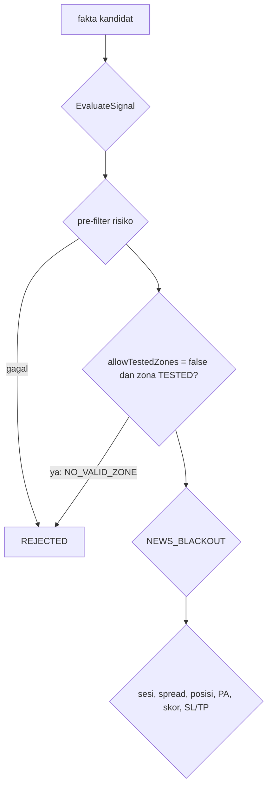

# Design — Entry hanya dari zona Fresh (H1)

Status: Approved (2026-10-08)
Requirements: [requirements.md](requirements.md) (Approved 2026-10-08; tahap tolak `NO_VALID_ZONE`, tanpa migrasi skema)

## 1. Overview

- **Gerbang zona.** Satu cabang baru di `EvaluateSignal`, sesudah pre-filter risiko dan sebelum `NEWS_BLACKOUT`. Bila `p.allowTestedZones == false` dan `f.zone.status == SDB_ZONE_TESTED`, tahapnya `NO_VALID_ZONE` dengan detail `zona TESTED (InpAllowTestedZones=false)`.
- **Skor tetap dihitung**, jadi baris `signals` dan `signal_scores` tetap lengkap.
- **Plumbing input** sama dengan input lain: `InputValues`, `SdbSignalParams`, `inputs_json` (53 kunci), preset, README.
- **Pengukuran** memakai `-SetInput 'InpAllowTestedZones=false'`, tanpa mengubah default lebih dulu (pola spec 22).

## 2. Architecture

## 3. Components and interfaces

| Komponen | Perubahan |
|---|---|
| `Core/InputRules.mqh` | `InputValues.allowTestedZones` (default `SDB_DEF_ALLOW_TESTED_ZONES` = true) |
| `Core/Inputs.mqh` | `input bool InpAllowTestedZones`; `inputs_json` kunci ke-53 |
| `Core/Types.mqh` | `SdbSignalParams.allowTestedZones` |
| `Signals/SignalRules.mqh` | cabang `NO_VALID_ZONE` di `EvaluateSignal` (§1) |
| `App/SdbApp.mqh` | `sp.allowTestedZones = cfg.inputs.allowTestedZones` |
| `tools/gen_presets.py` | `InpAllowTestedZones=true` (sementara; berubah bila H1 diterima) |
| README | baris input |
| Versi | 1.25 |

## 4. Error handling

Tidak ada kondisi gagal baru. Input bool tidak perlu validasi rentang.

## 5. Test case catalogue

| ID | Kasus | Harapan | Kriteria |
|---|---|---|---|
| TC-SG-35 | Zona TESTED + `allowTestedZones=false` | `NO_VALID_ZONE`, detail menyebut TESTED, skor tetap terisi | 1.2, 1.5 |
| TC-SG-36 | Zona FRESH + false; zona TESTED + true | tahap sama dengan sebelumnya (tidak ditolak zona) | 1.1, 1.4 |
| TC-SG-37 | STOPPED + TESTED + false; TESTED + false + news blackout | `STOPPED`; `NO_VALID_ZONE` | 1.3, EC-03, EC-04 |
| TC-SU-04c, TestPresets, TS-81 | input baru di `inputs_json` (53) dan preset | — | 1.1 |
| SC-22 | **Given** harness pipeline EURUSDc 2026.06.01–2026.09.26, `InpAllowTestedZones=false`. **Then** tidak ada sinyal ACCEPTED dengan `zone_status` TESTED; ada `NO_VALID_ZONE` dengan detail TESTED; setiap sinyal punya skor ZONE/TREND/PA. | 1.2, 1.5 |
| RUN-01 | `-Period IS -SetInput 'InpAllowTestedZones=false'` | dibandingkan acuan IS 1157–1168 | 2.1, 2.2 |
| RUN-02 | Bila IS lolos: `-Period OOS` dan `REAL` dengan input sama | dibandingkan acuan OOS 1169–1180 dan REAL 1260–1271 | 2.3, 3.1 |

## 6. Traceability

| Req | Komponen | Uji |
|---|---|---|
| 1.1–1.5 | input, `EvaluateSignal` | TC-SG-35..37, TC-SU-04c, TS-81, SC-22 |
| 2.1–2.4 | backtest, laporan | RUN-01, RUN-02 |
| 3.1–3.3 | default, preset, PC | — (sesudah keputusan) |

## 7. Keputusan yang perlu disetujui

1. **Gerbang di `EvaluateSignal`**, bukan di `TouchedZone`. Kandidat tetap tercatat dengan skor (Req 1.5), dan pemilihan zona (Fresh lebih dulu) tidak berubah. Alternatif: memfilter di `TouchedZone`, yang lebih sederhana tetapi membuat kandidat hilang dari telemetri.
2. **Pengukuran memakai `-SetInput` dulu, default diubah hanya bila H1 diterima** (pola spec 22). Tidak ada perubahan yang perlu dibalik.
