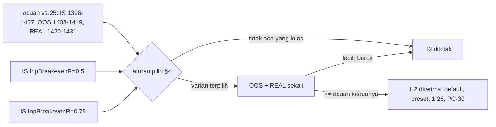

# Design — Breakeven lebih awal (H2)

Status: Done (2026-10-08)
Requirements: [requirements.md](requirements.md) (Approved 2026-10-08)

## 1. Overview

Spec ini tidak mengubah logika EA. Perubahannya ada di tiga bagian:

- **Alat ukur.** Alat baru `tools/exit_report.py` membaca DB tester dan melaporkan per rentang sesi:
  - jumlah trade, R per trade, dan PF;
  - sebaran alasan tutup (SL, BE_STOP, TRAIL_STOP, TP, lainnya), dengan jumlah dan R rata-rata;
  - jumlah SL yang sempat MFE ≥ 0,5R;
  - jumlah event `MODIFY_FAILED`.

  `baseline_report.py` tetap dipakai untuk PF, DD, dan jumlah trade per simbol.
- **Backtest.** Varian dijalankan dengan `-SetInput 'InpBreakevenR=x'`, pola yang sama dengan spec 22 dan 23. Default tidak diubah dulu.
- **Keputusan.** Default, preset, dan versi berubah hanya bila H2 diterima.

## 2. Alur

## 3. Komponen

| Komponen | Perubahan | Kriteria |
|---|---|---|
| `tools/exit_report.py` (baru, fungsi murni + CLI) | `exit_summary(conn, sessions) -> ExitSummary`, `render(summaries) -> str`; CLI `--db`, `--runs NAMA=A-B[,C-D]` (bisa diulang), cetak satu tabel per run berdampingan | 1.2, 2.2 |
| `tools/tests/test_exit_report.py` | TS-84..87 pada DB fixture kecil (pola `test_component_report.py`) | 1.2 |
| README tools | baris `exit_report.py` | 1.2 |
| Bila H2 diterima: `Core/Constants.mqh` `SDB_DEF_BREAKEVEN_R`, `tools/gen_presets.py` + 12 preset, TS-88 (nilai preset), versi 1.26, README input, CHANGELOG, PC-30 | default baru | 3.2, 3.4 |

`ExitSummary` berisi:
- `trades`, `total_r`, `r_per_trade`, `pf`;
- `reasons: dict[str, tuple[int, float]]` (jumlah, R rata-rata) untuk SL, BE_STOP, TRAIL_STOP, TP, dan alasan lain;
- `sl_mfe_half` (SL dengan `mfe_r ≥ 0,5`);
- `modify_failed` (jumlah `position_events` tipe `MODIFY_FAILED`).

Sumber datanya `closures` yang di-join ke `trades` lewat `login`, `run_key`, dan `position_id`, dengan `source = 'EA'` dan `r_result` tidak null. Cara hitungnya sama dengan `baseline_report.py`, jadi angkanya cocok.

## 4. Aturan pilih varian (ditulis sebelum OOS)

1. Varian yang lolos adalah yang memenuhi:
   - R per trade IS > acuan (+0,046);
   - IS ≥ 325 trade;
   - setiap simbol ≥ 13 trade.
2. Dari varian yang lolos, pilih yang R per trade IS-nya tertinggi.
3. Bila selisih R per trade dua varian < 0,01R, pilih nilai yang lebih dekat ke acuan (0,75). Alasannya, perubahan yang lebih kecil lebih kecil pula risikonya terhadap winner.
4. Bila tidak ada yang lolos, H2 ditolak (Req 1.5).

PF dan DD dilaporkan, tetapi tidak dipakai memilih, sama seperti spec 23.

## 5. Penanganan error

- `exit_report.py`:
  - DB tidak ada, atau rentang sesi kosong → pesan dan exit 1;
  - tabel `position_events` tidak ada (DB lama) → `modify_failed` ditulis "-";
  - format `--runs` salah → exit 2.
- Run tester gagal atau time-out → runner sudah menandai FAIL. Run diulang sekali; bila masih gagal, keputusan ditunda dan alasannya dicatat.

## 6. Test case

| ID | Kasus | Harapan | Kriteria |
|---|---|---|---|
| TS-84 | Fixture 5 closure: 2 SL (satu MFE 0,6), 1 BE_STOP, 1 TRAIL_STOP, 1 TP | jumlah dan R rata-rata per alasan benar; `sl_mfe_half` = 1; R per trade = total / 5 | 1.2 |
| TS-85 | Dua rentang sesi dalam satu `--runs` (`A-B,C-D`) | trade dari kedua rentang dijumlah, sesi di luar rentang diabaikan | 1.2 |
| TS-86 | `position_events` berisi 2 `MODIFY_FAILED` di rentang dan 1 di luar | `modify_failed` = 2 | 1.2, EC-01 |
| TS-87 | `--runs` salah format; rentang tanpa trade | exit 2; baris run menulis 0 trade tanpa error pembagian | — |
| TS-88 | (bila diterima) preset 12 simbol `InpBreakevenR` = varian terpilih | — | 3.2 |
| RUN-01 | `-Period IS -SetInput 'InpBreakevenR=0.5'` dan `'InpBreakevenR=0.75'` | dibandingkan dengan acuan IS 1396–1407 | 1.1–1.4 |
| RUN-02 | Varian terpilih `-Period OOS` dan `-Period REAL` | dibandingkan dengan acuan 1408–1419 dan 1420–1431 | 2.1, 3.1 |
| REG | (bila diterima) `-All` | skenario posisi (BE/partial/trailing) tetap PASS dengan default baru; skenario yang memakai default ditinjau | 3.2, 3.4 |

## 7. Traceability

| Req | Komponen | Uji |
|---|---|---|
| 1.1–1.5 | runner `-SetInput`, `exit_report.py`, `baseline_report.py`, aturan §4 | TS-84..87, RUN-01 |
| 2.1–2.3 | runner, `exit_report.py`, CHANGELOG | RUN-02 |
| 3.1–3.4 | default, preset, validasi input yang ada | TS-88, REG, TC-CU-05 (validasi BE < partial) |

## 8. Keputusan yang perlu disetujui

1. **Alat terpisah `exit_report.py`**, bukan tambahan di `baseline_report.py`. Laporan dasar tetap ringkas dan kriteria PC-19/PC-22 tidak terganggu. Alternatifnya flag `--exits` di `baseline_report.py`.
2. **Aturan pilih §4.** Varian dengan R per trade IS tertinggi yang lolos; bila selisih < 0,01R, pilih 0,75.
3. **Grid 0,5 dan 0,75 saja** (pertanyaan terbuka requirements). Total 2 run IS, ditambah satu OOS dan satu REAL bila ada yang lolos.
4. **Versi 1.26 hanya bila diterima.** Kalau ditolak, EA tetap 1.25. `exit_report.py` tetap di-commit sebagai alat analisis.
