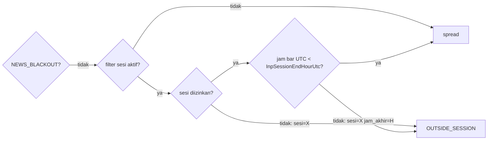

# Design — Jendela entry dipersempit (H3)

Status: Done (2026-10-09)
Requirements: [requirements.md](requirements.md) (Approved 2026-10-09; kriteria jumlah trade PC-30)

## 1. Overview

- **Input dan aturan.** `InpSessionEndHourUtc` masuk ke `SdbSessionParams.endHourUtc`. Fungsi murni baru `SessionAllowedAt(utcSecOfDay, p)` menggabungkan aturan sesi yang ada dengan batas jam akhir:
  - sesi harus diizinkan (`SessionAllowed`);
  - bila filter sesi aktif, `utcSecOfDay < endHourUtc × 3600`.

  `SessionAllowed` dan `SessionOfUtc` tidak berubah, jadi uji TC-FL-01..07 tetap berlaku.
- **Pipeline.** `CSignalEngine` mengisi `f.sessionAllowed` dari `SessionAllowedAt` dan `f.sessionEndHour` dari parameter. Tahap tolak tetap `OUTSIDE_SESSION` di posisi yang sama: sesudah berita, sebelum spread. Detail tolaknya `sesi=NEWYORK jam_akhir=17` bila yang menolak adalah jam akhir.
- **Default 22.** Jam 22–24 sudah di luar sesi, jadi default 22 tidak mengubah perilaku v1.25 (EC-05).
- **Pengukuran.** `-SetInput 'InpSessionEndHourUtc=17'` dan `'=19'` di IS, lalu aturan pilih §5. Default berubah hanya bila diterima.

## 2. Alur tahap sesi

## 3. Komponen

| Komponen | Perubahan | Kriteria |
|---|---|---|
| `Core/Constants.mqh` | `SDB_DEF_SESSION_END_HOUR` 22, `SDB_MIN_SESSION_END_HOUR` 9, `SDB_MAX_SESSION_END_HOUR` 22 | 1.1, 1.5 |
| `Core/InputRules.mqh` | `InputValues.sessionEndHourUtc` (default konstanta); `IrCheckRange("InpSessionEndHourUtc", …, 9, 22)` | 1.1, 1.5 |
| `Core/Inputs.mqh` | `input int InpSessionEndHourUtc`; `inputs_json` kunci ke-54 | 1.1, 1.7 |
| `Filters/FilterRules.mqh` | `SdbSessionParams.endHourUtc`; `bool SessionAllowedAt(const int utcSecOfDay, const SdbSessionParams &p)` (murni) | 1.2–1.4 |
| `Core/Types.mqh` | `SdbSignalFacts.sessionInWindow` (bool, sesi diizinkan tanpa jam akhir) dan `sessionEndHour` (int) | 1.2 |
| `Signals/SignalEngine.mqh` | `f.sessionInWindow = SessionAllowed(ses, m_sessions)`; `f.sessionAllowed = SessionAllowedAt(sec, m_sessions)`; `f.sessionEndHour = m_sessions.endHourUtc` | 1.2, 1.3 |
| `Signals/SignalRules.mqh` | detail `OUTSIDE_SESSION`: tambah ` jam_akhir=H` bila sesi diizinkan tetapi jam ≥ akhir | 1.2 |
| `App/SdbApp.mqh` | `ses.endHourUtc = cfg.inputs.sessionEndHourUtc` | 1.1 |
| `tools/gen_presets.py` + 12 preset | `InpSessionEndHourUtc=22` (sementara, berubah bila diterima) | 1.1, 3.3 |
| README, `docs/flows/signals.md` | baris input; node sesi menyebut jam akhir | 1.1 |
| Versi | 1.26 (input baru); 1.27 bila default berubah | 3.3, 3.4 |

Manajemen posisi (BE, partial, trailing) tidak memakai filter sesi, jadi Req 1.6 terpenuhi tanpa perubahan. SC-23 memeriksanya.

Detail jam akhir dibuat di `SignalRules`, bukan di engine. Penentunya: `f.sessionAllowed == false` dan sesi bar termasuk sesi yang diizinkan. Untuk itu fakta membawa `f.sessionInWindow` (hasil `SessionAllowed` tanpa jam akhir). Alternatif yang lebih sederhana, menaruh detail di engine, membuat engine menulis teks yang seharusnya milik aturan.

## 4. Error handling

Tidak ada kondisi gagal baru. Nilai di luar 9–22 ditolak validasi input, lalu EA gagal init dengan pesan seperti input lain (`INIT_PARAMETERS_INCORRECT`).

## 5. Aturan pilih varian (ditulis sebelum OOS)

1. Varian yang lolos adalah yang memenuhi:
   - R per trade IS > acuan (+0,046);
   - IS ≥ 260 trade;
   - setiap simbol ≥ 13 trade (PC-30).
2. Dari yang lolos, pilih yang R per trade IS-nya tertinggi.
3. Bila selisih dua varian < 0,01R, pilih 19 (pemotongan lebih kecil).
4. Bila tidak ada yang lolos, H3 ditolak (Req 2.4).

## 6. Test case

| ID | Kasus | Harapan | Kriteria |
|---|---|---|---|
| TC-FL-09 | `SessionAllowedAt` London+NY, akhir 17: 16:59:59 → ya; 17:00:00 → tidak; 13:00 → ya; 07:00 (Tokyo mati) → tidak | sesuai | 1.2, 1.3, EC-01, EC-02 |
| TC-FL-10 | Akhir 22: hasil `SessionAllowedAt` sama dengan `SessionAllowed(SessionOfUtc(s))` untuk setiap jam 0–23 | identik | 1.1, EC-05 |
| TC-FL-11 | Filter mati (ketiga sesi false) dan akhir 17: 18:00 → ya | sesuai | 1.4, EC-06 |
| TC-FL-12 | Validasi: 9 dan 22 lolos; 8 dan 23 ditolak dengan nama `InpSessionEndHourUtc` | sesuai | 1.5 |
| TC-SG-38 | `EvaluateSignal`: sesi diizinkan tetapi lewat jam akhir → `OUTSIDE_SESSION`, detail berisi `jam_akhir=17`; sesi mati → detail tanpa `jam_akhir`; berita blackout + lewat jam → `NEWS_BLACKOUT` | sesuai | 1.2, EC-09 |
| TC-SU-04c, TestPresets, TS-89 | `inputs_json` 54 kunci; preset berisi `InpSessionEndHourUtc=22` | — | 1.7, 1.1 |
| SC-23 | **Given** harness pipeline EURUSDc 2026.06.01–2026.09.26, `InpSessionEndHourUtc=17`. **Then** tidak ada sinyal ACCEPTED dengan jam bar UTC ≥ 17; ada `OUTSIDE_SESSION` dengan `jam_akhir=17`; ada posisi yang ditutup sesudah 17:00 UTC (manajemen posisi tetap jalan) | sesuai | 1.2, 1.6 |
| RUN-01 | `-Period IS -SetInput 'InpSessionEndHourUtc=17'` dan `=19` | dibandingkan acuan IS 1396–1407 (`baseline_report.py`, `exit_report.py`) | 2.1–2.4 |
| RUN-02 | Varian terpilih `-Period OOS` dan `REAL` | dibandingkan acuan 1408–1419 dan 1420–1431 | 3.1, 3.2 |
| REG | `-All` | semua PASS; SC-15 (sesi Tokyo) tetap PASS | 1.1, EC-05 |

## 7. Traceability

| Req | Komponen | Uji |
|---|---|---|
| 1.1, 1.5, 1.7 | Constants, InputRules, Inputs, preset | TC-FL-10, TC-FL-12, TC-SU-04c, TestPresets, TS-89 |
| 1.2–1.4 | `SessionAllowedAt`, engine, `EvaluateSignal` | TC-FL-09, TC-FL-11, TC-SG-38, SC-23 |
| 1.6 | manajemen posisi (tidak berubah) | SC-23 |
| 2.1–2.4 | runner, laporan, aturan §5 | RUN-01 |
| 3.1–3.5 | runner, default, preset, PC | RUN-02, REG |

## 8. Keputusan yang perlu disetujui

1. **Satu input jam akhir global (9–22)**, bukan jam mulai dan akhir, atau jendela per simbol. Data hanya konsisten untuk jam akhir. Jam mulai dan jendela per simbol bisa ditambah nanti bila data mendukung.
2. **Batas memakai waktu bar M15 (awal bar)**, sama dengan filter sesi yang ada. Bar 16:45 masih boleh, dan order bisa terisi 17:00.
3. **Fakta `sessionInWindow` + detail di `SignalRules`** (§3), agar teks tolak tetap milik aturan murni.
4. **Versi 1.26 untuk input baru**, dan 1.27 hanya bila default berubah (Req 3.3–3.4).
5. **Aturan pilih §5:** R per trade IS tertinggi yang lolos; bila selisih < 0,01R, pilih 19.
