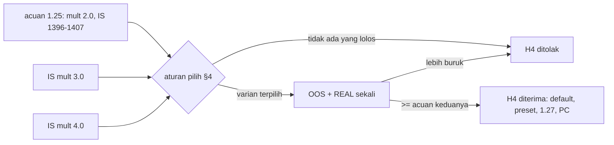

# Design — Trailing lebih longgar (H4)

Status: Done (2026-10-09)
Requirements: [requirements.md](requirements.md) (Approved 2026-10-09)

## 1. Overview

Kode EA tidak berubah. Spec ini terdiri dari tiga bagian:

- **Alat ukur.** `exit_report.py` ditambah dua angka untuk trade TRAIL_STOP: MFE rata-rata dan give-back rata-rata (MFE − R hasil). Keduanya tampil sebagai kolom `TRAIL MFE` dan `GIVEBACK`. Fungsi dan CLI lain tidak berubah.
- **Backtest.** `-SetInput 'InpTrailATRMult=3.0'` dan `'=4.0'` di IS, pola yang sama dengan spec 24.
- **Keputusan.** Default, preset, dan versi berubah hanya bila diterima.

## 2. Alur

## 3. Komponen

| Komponen | Perubahan | Kriteria |
|---|---|---|
| `tools/exit_report.py` | `ExitSummary.trail_mfe_avg`, `trail_giveback_avg` (None bila tidak ada TRAIL_STOP atau MFE kosong); dua kolom baru di `render` | 1.2 |
| `tools/tests/test_exit_report.py` | TS-90 | 1.2 |
| Bila diterima: `Core/Constants.mqh` `SDB_DEF_TRAIL_ATR_MULT`, `gen_presets.py` + 12 preset, TS-91, versi 1.27 (EA + harness), README input, CHANGELOG, PC | default baru | 2.3 |

Validasi input yang ada (`0 < InpTrailATRMult ≤ 10`, `SDB_MAX_TRAIL_ATR_MULT`) sudah menerima 3,0 dan 4,0, jadi tidak perlu diubah.

## 4. Aturan pilih varian (ditulis sebelum OOS)

1. Varian lolos bila:
   - R per trade IS > acuan (+0,046);
   - IS ≥ 325 trade;
   - setiap simbol ≥ 13 trade.
2. Dari yang lolos, pilih yang R per trade IS-nya tertinggi.
3. Bila selisih dua varian < 0,01R, pilih 3,0 (perubahan lebih kecil).
4. Bila tidak ada yang lolos, H4 ditolak (Req 1.5).

## 5. Penanganan error

Sama dengan spec 24. `exit_report.py` menulis "-" untuk angka yang tidak bisa dihitung. Run tester yang gagal diulang sekali; bila tetap gagal, keputusan ditunda dan dicatat.

## 6. Test case

| ID | Kasus | Harapan | Kriteria |
|---|---|---|---|
| TS-90 | Fixture: 2 TRAIL_STOP (MFE 2,0 / R 1,0; MFE 1,5 / R 0,5), 1 TRAIL_STOP tanpa MFE, 1 TP | `trail_mfe_avg` = 1,75; `trail_giveback_avg` = 1,0 (MFE kosong diabaikan); run tanpa TRAIL_STOP → None dan "-" di render | 1.2 |
| TS-91 | (bila diterima) preset 12 simbol `InpTrailATRMult` = varian terpilih | — | 2.3 |
| RUN-01 | `-Period IS -SetInput 'InpTrailATRMult=3.0'` dan `'=4.0'` | dibandingkan acuan IS 1396–1407 | 1.1–1.5 |
| RUN-02 | Varian terpilih `-Period OOS` dan `REAL` | dibandingkan acuan 1408–1419 dan 1420–1431 | 2.1, 2.2 |
| REG | (bila diterima) `-All` | semua PASS; skenario trailing ditinjau bila memakai default | 2.3 |

## 7. Traceability

| Req | Komponen | Uji |
|---|---|---|
| 1.1–1.5 | runner, `baseline_report.py`, `exit_report.py`, aturan §4 | TS-90, RUN-01 |
| 2.1–2.5 | runner, default, preset, PC | RUN-02, TS-91, REG |

## 8. Keputusan yang perlu disetujui

1. **Tanpa perubahan kode EA.** Hanya `InpTrailATRMult` yang diuji; ATR tetap M15.
2. **Kolom give-back ditambahkan ke `exit_report.py`**, bukan alat baru.
3. **Aturan pilih §4.** Bila selisih < 0,01R, pilih 3,0.
4. **Versi 1.27 hanya bila diterima.** Kalau ditolak, EA tetap 1.26 dan perubahan `exit_report.py` tetap di-commit.
