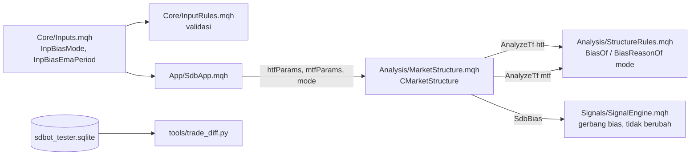

# Design — Bias HTF lebih responsif (H5)

Status: Done (2026-10-10)
Requirements: [requirements.md](requirements.md) (Approved 2026-10-09)

## 1. Overview

- **Aturan murni.** `BiasOf` dan `BiasReasonOf` mendapat parameter mode bias (`ENUM_SDB_BIAS_MODE`). Dengan mode `SDB_BIAS_AND_EMA`, hasilnya sama dengan sekarang, jadi uji TC-MS lama tetap berlaku.
- **EMA bias terpisah.** `CMarketStructure` menyimpan dua set parameter. HTF memakai `emaPeriod = InpBiasEmaPeriod` (atau `InpEmaPeriod` bila 0). MTF tetap memakai `InpEmaPeriod`. Jadi skor tren MTF (`TrendScore`) tidak berubah. Kebutuhan histori dihitung per timeframe.
- **Telemetri tetap.** Alasan bias tetap dari himpunan `OK / STRUCTURE / EMA / CONFLICT / DATA`. `context_json` dan skema tidak berubah. Mode yang dipakai sebuah run terbaca dari `inputs_json`.
- **Alat ukur baru.** `tools/trade_diff.py` membandingkan trade varian dengan trade acuan per simbol + waktu bar sinyal + arah. Hasilnya: trade sama, trade baru, dan trade hilang, masing-masing dengan jumlah dan R per trade.
- **Pengukuran.** Tiga run IS (`-SetInput`), aturan pilih §5, lalu OOS + REAL untuk varian terpilih. Default berubah hanya bila diterima.

## 2. Arsitektur



Lapisan tidak berubah: Analysis hanya membaca harga, sedangkan Signals memakai `SdbBias` seperti sekarang.

## 3. Komponen dan antarmuka

| Komponen | Perubahan | Murni | Kriteria |
|---|---|---|---|
| `Core/Types.mqh` | `enum ENUM_SDB_BIAS_MODE { SDB_BIAS_AND_EMA = 0, SDB_BIAS_NOT_OPPOSED = 1, SDB_BIAS_STRUCTURE_ONLY = 2 }` | — | 1.1 |
| `Core/Constants.mqh` | `SDB_DEF_BIAS_MODE` (`SDB_BIAS_AND_EMA`), `SDB_DEF_BIAS_EMA_PERIOD` 0 | — | 1.1, 2.1 |
| `Core/InputRules.mqh` | `InputValues.biasMode`, `biasEmaPeriod`; validasi mode ∈ 0..2; periode 0 atau `SDB_MIN_EMA_PERIOD`..`SDB_MAX_EMA_PERIOD` (10–400); helper `int EffectiveBiasEmaPeriod(const InputValues &v)` | ya | 1.7, 2.1, EC-08 |
| `Core/Inputs.mqh` | `input ENUM_SDB_BIAS_MODE InpBiasMode`; `input int InpBiasEmaPeriod`; `inputs_json` kunci ke-55 dan ke-56 (`EnumToString` untuk mode) | — | 1.1, 2.1, 2.4 |
| `Analysis/StructureRules.mqh` | `ENUM_SDB_DIR BiasOf(const ENUM_SDB_DIR st, const ENUM_SDB_DIR ema, const ENUM_SDB_BIAS_MODE mode)` | ya | 1.2–1.5 |
| `Analysis/MarketStructure.mqh` | `string BiasReasonOf(const SdbTfAnalysis &htf, const ENUM_SDB_BIAS_MODE mode)`; `Init(symbol, htf, mtf, const SdbStructureParams &htfP, const SdbStructureParams &mtfP, const ENUM_SDB_BIAS_MODE mode)`; cache HTF/MTF masing-masing `BarsNeeded` dari parameternya; `BarsRequired()` = maksimum keduanya; log perubahan bias menambah `mode=` | ya (`BiasReasonOf`) | 1.5, 1.6, 2.2, 2.3 |
| `App/SdbApp.mqh` | isi `htfP` (EMA = `EffectiveBiasEmaPeriod`) dan `mtfP` (EMA = `InpEmaPeriod`), teruskan mode | — | 2.1, 2.2 |
| `tools/gen_presets.py` + 12 preset | `InpBiasMode=0`, `InpBiasEmaPeriod=0` | — | 2.4, 4.3 |
| `tools/trade_diff.py` (baru) | `--db`, `--base <a-b>`, `--variant <a-b>` (dapat diulang, format sama dengan `exit_report.py --runs`) | ya (`diff_trades`) | 3.2 |
| README (tabel konfigurasi), `docs/flows/signals.md`, tools README | baris input dan alat | — | 1.1 |
| Versi | `#property version "1.27"`; 1.28 bila default berubah | — | 4.3, 4.4 |

### 3.1 Tabel aturan bias

| Struktur | EMA | `AND_EMA` | `NOT_OPPOSED` | `STRUCTURE_ONLY` |
|---|---|---|---|---|
| BULL | BULL | BULL (OK) | BULL (OK) | BULL (OK) |
| BULL | NONE | NONE (EMA) | BULL (OK) | BULL (OK) |
| BULL | BEAR | NONE (CONFLICT) | NONE (CONFLICT) | BULL (OK) |
| NONE | apa pun | NONE (STRUCTURE) | NONE (STRUCTURE) | NONE (STRUCTURE) |
| histori kurang | — | NONE (DATA) | NONE (DATA) | NONE (DATA) |

BEAR simetris dengan BULL. `BiasReasonOf` mengembalikan `OK` tepat bila `BiasOf` ≠ NONE. Invarian ini diuji di TC-MS-24.

### 3.2 `trade_diff.py`

Kunci trade: `(symbol, signals.time, direction)` lewat `trades.signal_id → signals.id`. `signal_id` sendiri tidak bisa dipakai karena berbeda antar run (memuat run_key). Trade `RECONCILED` tanpa `signal_id` diabaikan dan jumlahnya dicetak. R per trade dihitung sama dengan `exit_report.py`, dengan fungsi yang dipakai bersama, bukan salinan.

Contoh keluaran:

```
run      sama        baru         hilang
v-a      402 +0,051  118 +0,012   9 -0,210
```

## 4. Data dan error handling

- Tidak ada perubahan skema, tabel, atau Global Variable.
- Input tidak sah → `INIT_PARAMETERS_INCORRECT` dengan pesan validasi (nama input), sama dengan input lain.
- Histori HTF kurang untuk EMA bias → `MarkNotReady` yang ada (WARN throttled), bias NONE `DATA`.
- `trade_diff.py`:
  - rentang sesi tanpa trade → baris dengan 0 dan "-";
  - DB tanpa tabel `signals` → keluar kode 2 dengan pesan.
- Run tester yang gagal diulang sekali. Bila tetap gagal, keputusan ditunda dan dicatat.
- Backtest dijalankan satu agen tester di background, dengan batas CPU ≤ 50% core (affinity/BelowNormal).

## 5. Aturan pilih varian (ditulis sebelum OOS)

1. Varian lolos bila:
   - R per trade IS > acuan (+0,046);
   - IS ≥ 325 trade;
   - setiap simbol ≥ 13 trade.
2. Dari yang lolos, pilih yang R per trade IS-nya tertinggi.
3. Bila selisih dua varian < 0,01R, pilih yang paling dekat dengan aturan PRD sekarang, dengan urutan V-b (EMA 21), lalu V-c (`NOT_OPPOSED`), lalu V-a (`STRUCTURE_ONLY`).
4. Bila tidak ada yang lolos, H5 ditolak (Req 3.4).
5. `trade_diff.py` hanya untuk interpretasi, bukan syarat lolos. Bila trade baru varian terpilih rata-rata negatif, hal itu dicatat sebagai risiko di keputusan.

## 6. Test case

| ID | Kasus | Harapan | Kriteria |
|---|---|---|---|
| TC-MS-22 | `BiasOf` dengan `AND_EMA`: 9 kombinasi struktur × EMA | sama dengan aturan lama (tabel §3.1) | 1.2, EC-01 |
| TC-MS-23 | `BiasOf` dengan `NOT_OPPOSED` dan `STRUCTURE_ONLY`: 9 kombinasi masing-masing | sesuai tabel §3.1 (BULL+NONE → BULL; BULL+BEAR → NONE / BULL) | 1.3, 1.4, EC-01, EC-02 |
| TC-MS-24 | `BiasReasonOf` 3 mode × kombinasi, termasuk `ready=false` | alasan sesuai tabel; `OK` ⇔ bias ≠ NONE; `DATA` dan `STRUCTURE` sama di semua mode | 1.5, 1.6, EC-03 |
| TC-MS-25 | `BarsNeeded(2, 100, 21, 3)` dan `(2, 100, 50, 3)`; `AnalyzeTf` dengan 120 bar | 105 (batas struktur) dan 154 (batas EMA); dengan 120 bar EMA 21 siap, EMA 50 belum (`DATA`) | 2.3, EC-04 |
| TC-MS-26 | `CMarketStructure` dengan EMA HTF 21 dan MTF 50 pada data sintetis yang sama | `Htf().ema` ≠ `Mtf().ema`; `Mtf()` identik dengan init lama (EMA 50) | 2.2 |
| TC-IR-03 | Validasi: mode 0..2 lolos, 3 ditolak; periode 0, 10, 400 lolos; 5 dan 401 ditolak dengan nama input; `EffectiveBiasEmaPeriod` 0 → `InpEmaPeriod`, 21 → 21 | sesuai | 1.7, 2.1, EC-07, EC-08 |
| TC-SU-04c, TestPresets, TS-91 | `inputs_json` 56 kunci; preset berisi `InpBiasMode=0` dan `InpBiasEmaPeriod=0` | sesuai | 2.4 |
| TS-92 | `diff_trades` fixture: acuan 3 trade, varian 3 trade (2 sama, 1 baru, 1 hilang), 1 RECONCILED tanpa signal | sama 2, baru 1, hilang 1 dengan R benar; RECONCILED diabaikan dan dihitung | 3.2 |
| TS-93 | `trade_diff.py` CLI: rentang kosong → "-"; DB tanpa `signals` → kode 2 | sesuai | 3.2 |
| SC-27 | **Given** harness pipeline EURUSDc 2026.06.01–2026.09.26, `InpBiasMode=STRUCTURE_ONLY`, `InpBiasEmaPeriod=21`. **Then** run selesai tanpa ERROR; `inputs_json` memuat kedua nilai; ≥ 1 sinyal ACCEPTED; setiap kandidat punya `bias_reason=OK` | sesuai | 1.4, 1.6, 2.4 |
| REG | `run-ea-tests.ps1 -All` dengan default | semua PASS; skenario lama identik (default = acuan) | 2.5, EC-07 |
| RUN-01 | `-Period IS` dengan `-SetInput 'InpBiasMode=2'` (V-a), `'InpBiasEmaPeriod=21'` (V-b), `'InpBiasMode=1'` (V-c) | `baseline_report.py`, `exit_report.py`, `trade_diff.py` vs acuan IS 1396–1407; aturan §5 | 3.1–3.4 |
| RUN-02 | Varian terpilih `-Period OOS` dan `REAL` | vs acuan 1408–1419 dan 1420–1431 | 4.1, 4.2 |

EC-05 (posisi terbuka saat bias berbalik) dan EC-06 (restart) tidak butuh uji baru. Manajemen posisi tidak membaca bias, dan bias dihitung ulang dari bar H4 tertutup (TC-MS-21 sudah menguji hasil identik untuk data yang sama).

## 7. Traceability

| Req | Komponen | Uji |
|---|---|---|
| 1.1, 1.7 | Types, Constants, InputRules, Inputs | TC-IR-03, TC-SU-04c |
| 1.2–1.5 | `BiasOf` | TC-MS-22, TC-MS-23 |
| 1.5, 1.6 | `BiasReasonOf`, log bias | TC-MS-24, SC-27 |
| 2.1–2.3 | `EffectiveBiasEmaPeriod`, `CMarketStructure` dua parameter, `BarsNeeded` | TC-IR-03, TC-MS-25, TC-MS-26 |
| 2.4 | `inputs_json`, preset | TC-SU-04c, TestPresets, TS-91, SC-27 |
| 2.5 | default | REG |
| 3.1–3.4 | runner, `trade_diff.py`, aturan §5 | TS-92, TS-93, RUN-01 |
| 4.1–4.5 | runner, default, preset, PC, CHANGELOG | RUN-02, REG |

## 8. Keputusan yang perlu disetujui

1. **Mode sebagai enum input dengan tiga nilai**, bukan tiga input boolean. Kombinasi boolean bisa saling bertentangan.
2. **`CMarketStructure` menerima dua `SdbStructureParams`** (HTF, MTF) dan bukan field tambahan "emaPeriod HTF" di struct yang sama. Satu struct per timeframe membuat `AnalyzeTf` dan `BarsNeeded` tidak berubah.
3. **Alasan bias tidak ditambah nilai baru.** Di `NOT_OPPOSED`, struktur BULL + EMA datar menghasilkan `OK`. Alternatifnya alasan baru seperti `OK_NO_EMA`, tetapi itu mengubah himpunan enum telemetri dan tidak dibutuhkan untuk keputusan. Mode run sudah ada di `inputs_json`.
4. **Pencocokan trade lewat simbol + waktu bar sinyal + arah** (§3.2), karena `signal_id` memuat run_key.
5. **Aturan pilih §5**, termasuk urutan seri V-b → V-c → V-a.
6. **Versi 1.27** untuk input baru (default tidak berubah); 1.28 bila H5 diterima.
