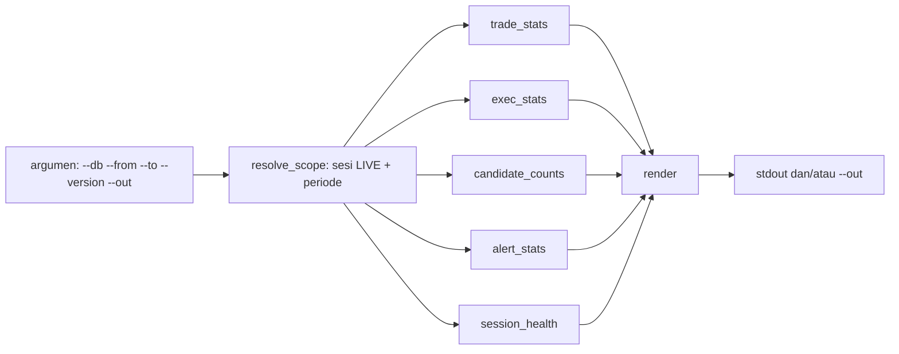

# Design — Laporan live (spec 28)

Status: Done (2026-10-10)
Requirements: [requirements.md](requirements.md) (Approved 2026-10-09)

## 1. Overview

`tools/live_report.py` adalah satu modul Python dengan fungsi murni yang menerima `sqlite3.Connection` dan sebuah `Scope` (periode dan daftar sesi), lalu satu fungsi `render` yang menyusun teks. Polanya sama dengan `exit_report.py`, dan alat ini tidak bergantung pada alat lain.

- **Read-only.** DB dibuka dengan `file:...?mode=ro`, sehingga aman saat EA sedang menulis (WAL/rollback journal SQLite mengizinkan pembaca).
- **Dalam R.** Semua perbandingan memakai R dari `closures.r_result`. Uang hanya untuk PF uang.
- **Tanpa dependensi baru.** Hanya standard library.

## 2. Alur

## 3. Komponen dan antarmuka

| Fungsi | Isi | Kriteria |
|---|---|---|
| `default_db() -> Path` | `%APPDATA%\MetaQuotes\Terminal\Common\Files\sdbot.sqlite` | 1.1 |
| `resolve_scope(conn, frm, to, version) -> Scope` | `Scope(start, end, session_ids)`; sesi `mode='LIVE'` (dan `ea_version` bila diisi); default `start` = `started_at` sesi LIVE pertama, `end` = sekarang | 1.1–1.3 |
| `trade_stats(conn, scope) -> TradeStats` | per simbol dan total: n, win%, total R, R/trade, PF uang, PF R, DD R (kumulatif menurut `closed_at`), alasan tutup (pengelompokan `exit_report.REASONS` disalin sebagai konstanta lokal); posisi terbuka (trade tanpa closure, `opened_at < end`) | 2.1–2.4 |
| `exec_stats(conn, scope) -> ExecStats` | slippage entry rata-rata dan maks (point; R = \|open − requested\| ÷ \|open − sl_initial\|, dilewati bila 0/kosong), spread entry rata-rata per simbol, slippage closure rata-rata per alasan | 3.1–3.3 |
| `candidate_counts(conn, scope) -> dict` | `signals` dalam periode (`time`) dan sesi scope: hitungan per `COALESCE(reject_stage, status)`, total dan per simbol | 4.1 |
| `alert_stats(conn, scope) -> AlertStats` | hitungan per (tipe, severity, status); daftar CRITICAL dan HIGH (waktu, simbol, tipe, pesan dipotong 80 karakter) | 4.2 |
| `session_health(conn, scope) -> SessionHealth` | daftar sesi; per simbol, gabungan interval sesi aktif dalam periode, lalu celah > 30 menit; simbol tanpa sesi aktif di `end` | 4.3, 4.4 |
| `render(...) -> str` | bagian: Periode, Hasil, Alasan tutup, Posisi terbuka, Eksekusi, Kandidat, Alert, Sesi | semua |
| `main(argv) -> int` | exit 0 sukses; 1 DB tidak ada/gagal dibuka; 2 argumen salah | 1.4 |

Konstanta: `GAP_MIN_SEC = 1800`, `MSG_MAX = 80`.

Trade masuk periode berdasarkan `closures.closed_at` (EC-03). Trade di sesi scope yang belum punya closure dihitung sebagai posisi terbuka. Sesi yang belum berakhir (`ended_at` NULL) dianggap aktif sampai `end`.

## 4. Penanganan error

| Kondisi | Perilaku |
|---|---|
| DB tidak ada / bukan SQLite | pesan `[live_report] ...`, exit 1 |
| Tanggal salah format, `--from` ≥ `--to` | exit 2 |
| Tidak ada sesi LIVE (atau versi tidak cocok) | laporan dengan pesan "tidak ada sesi LIVE", exit 0 |
| Pembagian dengan 0 (tanpa trade, tanpa R negatif) | nilai None → "-" |

## 5. Test case

Fixture: DB dari `shared/schema/data_db.sql` (pola `test_exit_report.py`) dengan sesi LIVE versi 1.24 dan 1.25 serta satu sesi TESTER.

| ID | Kasus | Harapan | Kriteria |
|---|---|---|---|
| TS-120 | Scope: periode dan `--version 1.25` | hanya sesi LIVE 1.25; sesi TESTER dan 1.24 tidak ikut; default periode mulai dari sesi LIVE pertama | 1.1–1.3 |
| TS-121 | 4 trade tutup (R +2, −1, +0,3, −1) urut waktu, satu dibuka sebelum `--from` tapi tutup di dalam, satu trade tanpa closure | n = 4; total R +0,3; PF R = 2,3 ÷ 2 = 1,15; DD R = 1,7; posisi terbuka 1 | 2.1, 2.3, EC-03 |
| TS-122 | Tanpa trade | n = 0, R/trade dan PF "-", tanpa exception | 2.4, EC-01 |
| TS-123 | Slippage: open 1,1005 requested 1,1000 SL 1,0955 → 0,1R; satu trade SL awal 0 | rata-rata slippage R = 0,1 (trade SL 0 dilewati); spread rata-rata per simbol | 3.1, 3.2, EC-06 |
| TS-124 | Kandidat: 3 ACCEPTED/ditolak campuran di dalam periode, 1 di luar periode, 1 dari sesi TESTER | hitungan per tahap hanya dari dalam scope | 4.1 |
| TS-125 | Alert: INFO SENT, HIGH FAILED, CRITICAL SENT | hitungan per (tipe, severity, status); daftar memuat HIGH dan CRITICAL saja, pesan dipotong 80 | 4.2 |
| TS-126 | Sesi EURUSDc 00:00–01:00 dan 02:00–(aktif); GBPUSDc berakhir 01:00 | celah EURUSDc 01:00–02:00; GBPUSDc ditandai tanpa sesi aktif di akhir | 4.3, 4.4, EC-05 |
| TS-127 | CLI: DB tidak ada → 1; `--from 2026-10-10 --to 2026-10-09` → 2; `--out` menulis file yang isinya sama dengan stdout | — | 1.4, keputusan |

DD R di TS-121 dihitung dari urutan R kumulatif +2, +1, +1,3, +0,3: puncak 2, lembah 0,3, jadi DD = 1,7.

Verifikasi manual (bukan pytest): jalankan pada DB live yang sebenarnya untuk periode sejak 2026-10-09, lalu cocokkan hitungan kandidat dengan query langsung.

## 6. Traceability

| Req | Fungsi | Uji |
|---|---|---|
| 1.1–1.4 | `default_db`, `resolve_scope`, `main` | TS-120, TS-127 |
| 2.1–2.4 | `trade_stats` | TS-121, TS-122 |
| 3.1–3.3 | `exec_stats` | TS-123 |
| 4.1–4.4 | `candidate_counts`, `alert_stats`, `session_health` | TS-124–98 |

## 7. Keputusan yang perlu disetujui

1. **Satu modul berdiri sendiri** (`live_report.py`), dengan konstanta alasan tutup disalin dari `exit_report.py`. Alternatifnya mengimpor `exit_report`; lebih kering, tetapi mengikat dua alat yang dipakai untuk DB berbeda.
2. **Trade masuk periode menurut waktu tutup**, posisi terbuka dilaporkan terpisah.
3. **Celah sesi > 30 menit per simbol** sebagai ukuran "EA tidak jalan".
4. **Belum ada commit** sampai spec 27 di sesi lain selesai (lihat overview).
