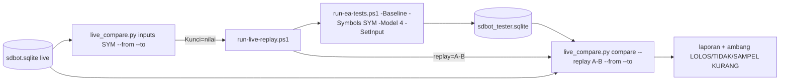

# Design — Replay tester periode live (spec 29)

Status: Approved (2026-10-09)
Requirements: [requirements.md](requirements.md) (Approved 2026-10-09)

## 1. Overview

Ada tiga bagian, tanpa perubahan EA:

1. **`tools/live_compare.py inputs`** membaca sesi live untuk satu simbol dan periode, lalu mencetak daftar `Kunci=nilai` untuk `-SetInput`. Nilai enum di `inputs_json` disimpan sebagai nama (misalnya `SDB_COMPONENT_SHADOW`), jadi diubah ke angka dengan memindai `ea/src/Include/SDBot/Core/Types.mqh`. Kunci yang tidak dipakai di replay dibuang: `InpAllowLiveTrading`, `InpTelegramConfigured`, `InpRiskPerTradePct`.
2. **`tools/run-live-replay.ps1`** memanggil `live_compare.py inputs` per simbol, lalu `run-ea-tests.ps1 -Baseline -Symbols <SYM> -FromDate -ToDate -Model 4 -SetInput ...`. Kalender diekspor dulu bila diminta (`-ExportCalendar`). Di akhir, skrip mencetak rentang sesi tester yang dibuat (`replay=A-B`).
3. **`tools/live_compare.py compare`** membaca DB live dan DB tester (read-only), lalu memasangkan kandidat dan trade dan menilai ambang.

`live_compare.py` memakai `live_report.resolve_scope` dan `live_report.session_health`. Keduanya alat Fase 6, jadi ketergantungan ini disengaja (berbeda dengan `exit_report`).

## 2. Alur

## 3. Komponen

### 3.1 `live_compare.py`

| Fungsi | Isi | Kriteria |
|---|---|---|
| `enum_values(types_path) -> dict[str, int]` | regex `(SDB_[A-Z0-9_]+)\s*=\s*(-?\d+)` | 1.1 |
| `replay_inputs(conn, symbol, start, end, enums, version=None) -> list[str]` | sesi LIVE simbol itu (dan `ea_version` bila diisi) yang tumpang tindih periode; satu `input_hash` → daftar `Kunci=nilai` (bool → `true/false`, enum → angka, angka apa adanya, string apa adanya); lebih dari satu hash → `ReplayInputError` berisi batas waktu tiap hash | 1.1, 1.2 |
| `live_windows(conn_live, scope) -> dict[str, list[(lo, hi)]]` | interval sesi aktif per simbol (dari `session_health`) | 2.1 |
| `pair_candidates(live_rows, replay_rows, windows) -> CandidatePairs` | kunci (simbol, time, direction); hanya kandidat yang `time` di jendela live; hasil: pasangan sama, pasangan beda (dikenal / tidak), hanya-live, hanya-replay | 2.1–2.3 |
| `pair_trades(live_rows, replay_rows) -> TradePairs` | per simbol dan arah, pasangan terdekat dengan selisih buka ≤ 900 detik (greedy menurut waktu); trade live yang dibuka sebelum periode dikecualikan | 3.1, 3.2 |
| `extra_inputs(live_json, replay_json) -> dict` | kunci yang ada di `inputs_json` replay tetapi tidak di live, beserta nilainya (default EA versi replay yang tidak bisa diatur dari live); ditampilkan sebagai peringatan bila `ea_version` berbeda | 1.1 |
| `assess(cands, trades) -> list[(nama, nilai, ambang, status)]` | empat ambang Req 4.1; SAMPEL KURANG bila pasangan trade < 10 | 4.1, 4.2 |
| `render(...)`, `main(argv)` | subperintah `inputs` dan `compare`; `--out`; exit 1 DB tidak ada, 2 argumen salah, 3 `ReplayInputError` | 4.3 |

Selisih harga buka dilaporkan dalam R (|buka live − buka replay| ÷ risiko awal live), karena tabel `trades` tidak menyimpan ukuran point; ini menggantikan "point" di Req 3.1.

Perbedaan dikenal: pasangan dengan tahap berbeda dan salah satu sisinya `SPREAD_TOO_WIDE` atau `NEWS_BLACKOUT`. Bila CSV kalender tidak mencakup periode (`--no-news`), semua kandidat `NEWS_BLACKOUT` di kedua sisi dikeluarkan dari penilaian.

Persentase kandidat:
- `match_live` = pasangan dengan tahap sama ÷ (kandidat live − perbedaan dikenal);
- `match_replay` sama, dengan penyebut dari sisi replay.

### 3.2 `run-live-replay.ps1`

Parameter: `-From`, `-To` (UTC `yyyy-MM-dd`), `-Symbols` (default 12 simbol preset), `-ExportCalendar`, `-DryRun` (hanya mencetak perintah).

Per simbol, skrip:
1. menjalankan `uv run python tools/live_compare.py inputs <SYM> --from --to`; exit 3 → simbol dilewati dengan pesan;
2. menjalankan `run-ea-tests.ps1 -Baseline -SkipBuild -Symbols <SYM> -FromDate <From> -ToDate <To> -Model 4 -SetInput <daftar>`;
3. mencatat id sesi tester sebelum dan sesudah.

Skrip berakhir dengan mencetak `replay=<min>-<max>`. Tester hanya dijalankan bila tidak ada `terminal64.exe` Broker A lain yang hidup; bila ada, skrip berhenti dengan pesan (melindungi sesi lain dan batas CPU).

Catatan versi (ditemukan saat task 1, 2026-10-09):
- `--version` di `inputs` dan `compare` membatasi sesi live ke satu versi. Live v1.25 dimulai 2026-10-09 07:39 UTC, sebelumnya 1.24, jadi tanpa filter periode itu ditolak sebagai input berubah.
- Replay memakai EA hasil build saat itu (1.26 atau lebih baru). Input yang tidak ada di `inputs_json` live memakai default versi replay; `compare` mendaftarnya lewat `extra_inputs` agar perbedaan default terlihat.

## 4. Penanganan error

| Kondisi | Perilaku |
|---|---|
| Input berubah di tengah periode | `inputs` exit 3 dengan batas waktu tiap hash; skrip melewati simbol itu |
| Tester sedang dipakai | skrip berhenti sebelum menjalankan apa pun |
| Run tester gagal | catat simbol gagal, lanjut ke simbol berikutnya; ringkasan akhir menyebutnya |
| Tidak ada trade berpasangan | ambang trade SAMPEL KURANG |

## 5. Test case

| ID | Kasus | Harapan | Kriteria |
|---|---|---|---|
| TS-128 | `enum_values` pada teks enum contoh (nilai eksplisit, komentar) | nama → angka benar | 1.1 |
| TS-129 | `replay_inputs`: satu hash → daftar tanpa `InpAllowLiveTrading`, `InpTelegramConfigured`, `InpRiskPerTradePct`; bool `true/false`; enum angka; dua hash dalam periode → `ReplayInputError` menyebut waktu | sesuai | 1.1, 1.2 |
| TS-130 | `pair_candidates`: 4 kandidat live, 4 replay; satu beda tahap (SCORE vs PA) = tidak dikenal, satu beda (SPREAD vs ACCEPTED) = dikenal, satu hanya-live di luar jendela live → diabaikan, satu hanya-replay di dalam jendela | hitungan dan persentase sesuai | 2.1–2.3 |
| TS-131 | `pair_trades`: selisih buka 10 menit → berpasangan; 20 menit → tidak; trade live dibuka sebelum periode → dikecualikan; alasan tutup beda → dihitung | sesuai | 3.1, 3.2 |
| TS-132 | `assess`: data di atas ambang → LOLOS; kandidat 94% → TIDAK; 5 pasangan trade → SAMPEL KURANG | sesuai | 4.1, 4.2 |
| TS-133 | `extra_inputs`: replay punya `InpSessionEndHourUtc=22` yang tidak ada di live → terdaftar; CLI: `compare` DB tester tidak ada → 1; `--replay 5-1` → 2; `inputs` dengan dua hash → 3; `--out` sama dengan stdout | sesuai | 4.3 |
| RUN-01 | `run-live-replay.ps1 -DryRun` untuk periode live v1.25 | mencetak 12 perintah dengan `-SetInput` lengkap | 1.1–1.3 |
| RUN-02 | Replay sebenarnya + `compare` (sesudah tester bebas) | laporan tercatat; setiap ketidakcocokan diberi penjelasan | 2–4 |

## 6. Traceability

| Req | Komponen | Uji |
|---|---|---|
| 1.1–1.5 | `enum_values`, `replay_inputs`, `run-live-replay.ps1` | TS-128, TS-129, RUN-01 |
| 2.1–2.3 | `live_windows`, `pair_candidates` | TS-130 |
| 3.1–3.2 | `pair_trades` | TS-131 |
| 4.1–4.3 | `assess`, `render`, `main` | TS-132, TS-133, RUN-02 |

## 7. Keputusan yang perlu disetujui

1. **Input replay dari `inputs_json`**, bukan dari file preset. Ini memastikan replay memakai nilai yang benar-benar aktif di live, termasuk default EA untuk input yang tidak ada di preset.
2. **Pasangan trade toleransi 15 menit** (1 bar LTF), greedy per simbol dan arah.
3. **Skrip menolak jalan bila terminal tester sedang hidup**, untuk melindungi sesi lain dan batas CPU.
4. **`live_compare.py` mengimpor `live_report.py`** (alat satu fase).
