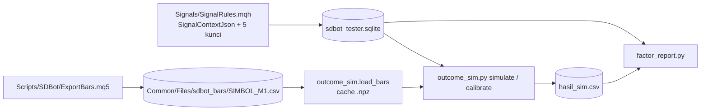

# Design — Hasil kandidat dan faktor profit

Status: Approved (2026-10-09)
Requirements: [requirements.md](requirements.md) (Approved 2026-10-09)

## 1. Overview

- **EA (1.29, telemetri saja).** `SignalContextJson` menambah lima kunci: `zone_prox`, `zone_dist`, `opp_prox`, `bid`, `ask`. Semua sudah ada di `SdbSignalFacts` (`f.zone`, `f.oppositeProximal`/`f.haveOpposite`, `f.bid`/`f.ask`), jadi engine tidak berubah. Kunci trendline (`tl_dist`, `tl_slope`, `tl_touches`) sudah ada.
- **Ekspor bar.** Script baru `Scripts/SDBot/ExportBars.mq5` di terminal uji menulis bar M1 (bid) dan spread per simbol ke CSV di Common/Files. Runner mendapat switch `-ExportBars`, dengan pola yang sama dengan `-ExportCalendar`.
- **Simulator.** `tools/outcome_sim.py` meniru `BuildStops` dan `CPositionManager` di atas bar M1: entry, SL/TP, BE, partial, trailing. Hasilnya untuk setiap kandidat ditulis ke file hasil (CSV) agar laporan tidak menghitung ulang.
- **Kalibrasi.** Sub-perintah `calibrate` mensimulasikan kandidat ACCEPTED dan membandingkannya dengan `closures` lewat `trades.signal_id`.
- **Laporan.** `tools/factor_report.py` membaca hasil simulasi + DB, lalu menampilkan bucket faktor dengan tanda konsistensi dan tabel per tahap tolak.

## 2. Arsitektur



Lapisan EA tidak berubah: `SignalRules` (Signals) tetap fungsi murni yang hanya menulis teks JSON. Script `ExportBars` hanya membaca harga dan menulis file. Script tidak memakai `CTrade` dan tidak menyentuh DB.

## 3. Komponen dan antarmuka

### 3.1 EA

| Komponen | Perubahan | Murni | Kriteria |
|---|---|---|---|
| `Signals/SignalRules.mqh` | `SignalContextJson`: `zone_prox`, `zone_dist` (`f.zone`), `opp_prox` (`f.haveOpposite ? f.oppositeProximal : null`), `bid`, `ask`; semua `DoubleToString(x, f.digits)`; urutan kanonik tetap dari `CanonicalJson` | ya | 1.1, 1.2, 1.4 |
| `Scripts/SDBot/ExportBars.mq5` | input `InpSymbols` (daftar dipisah koma, default 12 simbol preset), `InpFrom`, `InpTo`, `InpCloseTerminal`; per simbol `CopyRates(M1)` dalam potongan 100.000 bar, tulis `sdbot_bars\<SIMBOL>_M1.csv` (`time,open,high,low,close,spread`) dan file status | — | 2.1 |
| `tools/run-ea-tests.ps1` | switch `-ExportBars` (+ `-FromDate`/`-ToDate`), fungsi `Invoke-ExportBars` meniru `Invoke-ExportCalendar`; menolak jalan bila terminal uji sedang dipakai | — | 2.1 |
| Versi | 1.29 (EA + harness), CHANGELOG | — | 1.3 |

Script memakai terminal uji, jadi tidak bisa berjalan bersamaan dengan backtest. Runner memeriksa proses terminal uji sebelum mulai.

### 3.2 `tools/outcome_sim.py`

```python
@dataclass(frozen=True)
class Candidate:          # dari signals + context_json + inputs_json sesi
    signal_id: int; session_id: int; symbol: str; time: int; direction: str
    stage: str | None; zone_prox: float; zone_dist: float; opp_prox: float | None
    bid: float; ask: float; atr_mtf: float; point: float; digits: int

@dataclass(frozen=True)
class ExitRules:          # dari inputs_json sesi (bukan konstanta)
    sl_buffer_atr: float; min_rr: float; min_sl_atr: float; max_sl_atr: float
    be_r: float; be_buffer_pts: int; partial_r: float; partial_pct: float
    trail_atr_period: int; trail_atr_mult: float; min_sl_step_pts: int = 5

@dataclass
class Outcome:
    r: float; reason: str; mfe_r: float; passes_rules: bool; open_at_end: bool

def build_stops(c: Candidate, x: ExitRules) -> Stops            # meniru BuildStops (murni)
def simulate(c: Candidate, x: ExitRules, bars: Bars, atr15: Atr) -> Outcome   # murni
def load_bars(csv: Path) -> Bars                                 # cache .npz di samping CSV
def m15_atr(bars: Bars, period: int) -> Atr                      # ATR SMA dari TR M15 (sama dengan iATR)
def calibrate(conn, ranges, bars_dir) -> CalibrationReport
```

CLI:
- `simulate --db --runs NAMA=A-B --bars <dir> --out hasil.csv`
- `calibrate --db --runs ... --bars <dir>`

Format `--runs` sama dengan `exit_report.py`.

**Aturan simulasi per bar M1**, dalam harga bid. Harga ask = bid + spread kandidat dalam point.

1. Entry pada bar M1 pertama sesudah bar M15 kandidat tutup (`time + 900`). Harganya `ask` (BUY) atau `bid` (SELL) dari context. SL/TP dari `build_stops`.
2. Urutan dalam satu bar (konservatif, Req 2.4):
   - (a) gap: open melewati SL → keluar di open;
   - (b) low/high merugikan menyentuh SL → keluar di SL;
   - (c) baru sesudah itu, ekstrem menguntungkan memicu partial (1,5R, 50% di harga level), lalu TP (keluar sisa di TP);
   - (d) BE dan trailing dihitung dari ekstrem menguntungkan bar ini dan **baru berlaku mulai bar berikutnya**. Di EA, SL yang dipindah per tick bisa kena di bar yang sama; simulator menunda satu bar. Kalibrasi mengukur dampaknya.
3. BE: profit ≥ 1R → SL kandidat = entry ± (spread + 2) point. Trailing aktif sesudah SL ≥ titik BE: kandidat = harga ekstrem ∓ ATR15 × 2 (ATR bar M15 tertutup terakhir). Dari BE dan trailing dipilih yang terbaik, dan SL dipindah bila perbaikannya ≥ 5 point (meniru `PickBestSl`).
4. R = jumlah (harga keluar − entry) × arah × porsi volume ÷ risiko awal. Spread sudah termasuk karena harga keluar BUY memakai bid dan SELL memakai ask.
5. Alasan tutup mengikuti `closures`: `SL`, `BE_STOP` (SL di titik BE), `TRAIL_STOP` (SL di atas titik BE), `TP`, `END` (akhir data).

### 3.3 `tools/factor_report.py`

- `factors --db --sim hasil.csv --period IS=A-B --period OOS=C-D --period REAL=E-F [--source trades|candidates]`
- `stages --db --sim hasil.csv --period ... [--dedup-zone-day]`

Bucket (Req 4.1):

| Faktor | Bucket |
|---|---|
| status zona | FRESH, TESTED |
| trendline | tanpa garis, 2 sentuhan, 3+ sentuhan; jarak ≤ 0,1 / 0,1–0,2 ATR |
| pola PA | per kode pola |
| jam UTC | 08–13, 13–17, 17–22, lainnya |
| persen skor | < 65, 65–75, 75–85, ≥ 85 |
| alasan bias | per nilai |
| arah | BUY, SELL |
| R:R rencana / sumber TP | < 2, 2–3, ≥ 3 / ZONE, RR |
| rezim ATR | tersier per simbol per periode |
| simbol | per simbol |

Konsistensi (Req 4.2): untuk setiap bucket, `d = R/trade bucket − R/trade semua` di tiap periode. Labelnya:
- KONSISTEN+ bila d > 0 di ketiga periode;
- KONSISTEN− bila d < 0 di ketiga periode;
- SAMPEL KURANG bila ada periode dengan < 10 trade;
- selain itu TIDAK KONSISTEN.

Tahap tolak (Req 5): per `reject_stage` + ACCEPTED: kandidat, tersimulasi, R/trade, PF, % lolos SL/R:R. Dedup: kandidat pertama per (`symbol`, `zone_ref`, tanggal UTC).

## 4. Data dan error handling

- Tidak ada perubahan skema. `context_json` lama tanpa kunci baru → kandidat dilewati dan dihitung (Req 2.6).
- CSV bar tidak ada atau rentang tidak menutup kandidat → kandidat dilewati dan dihitung per simbol.
- `ExportBars`:
  - `CopyRates` kurang dari yang diminta → file status `PARTIAL` + log WARN;
  - simbol tidak ada → status `MISSING`, simbol lain tetap diekspor.
- Runner: terminal uji sedang dipakai → keluar kode 2 dengan pesan.
- Alat Python membuka DB `mode=ro`. Bila kalibrasi gagal, laporan tetap bisa dibuat tetapi menampilkan header "KALIBRASI GAGAL" (Req 3.4).

## 5. Test case

| ID | Kasus | Harapan | Kriteria |
|---|---|---|---|
| TC-SG-39 | `SignalContextJson` dengan zona 1.10000/1.09800, zona lawan 1.10500, bid 1.10010 ask 1.10020 | kunci baru bernilai sesuai digit; tanpa zona lawan → `"opp_prox":null`; kunci lama tidak berubah | 1.1, 1.2, EC-05 |
| TC-SG-40 | Harga JPY (3 digit) dan XAU (2 digit) | dinormalisasi ke digit simbol | 1.2, EC-02 |
| TS-100 | `build_stops` BUY/SELL vs angka `BuildStops` (TC-SG yang ada) | SL, TP, R:R sama; SELL termasuk spread | 2.1, EC-01 |
| TS-101 | Bar sintetis: BUY langsung kena SL; kena TP tanpa BE | R −1,00 / +R:R; alasan SL / TP | 2.1, 2.2 |
| TS-102 | BUY naik 1R lalu kembali ke entry | BE aktif bar berikutnya; keluar di entry + (spread+2) point; alasan BE_STOP | 2.2 |
| TS-103 | Naik 1,5R (partial 50%) lalu trailing | R = 0,5 × 1,5 + 0,5 × R trailing; alasan TRAIL_STOP | 2.2 |
| TS-104 | SL dan TP di bar M1 yang sama | SL (konservatif) | 2.4, EC-03 |
| TS-105 | Gap open melewati SL | keluar di open, R < −1 | EC-04 |
| TS-106 | SELL: keluar di ask (bid + spread) | R memasukkan spread | 2.3 |
| TS-107 | Kandidat tanpa kunci zona, bar habis sebelum tutup | dilewati dan dihitung; `END` ditandai | 2.6, 2.7, EC-08, EC-11 |
| TS-108 | `m15_atr` dari M1 sintetis | sama dengan ATR SMA 14 dari TR M15 yang dihitung tangan | 2.2 |
| TS-109 | `calibrate` fixture: 3 trade nyata, 2 cocok | % alasan sama 66,7, selisih R benar, status lolos/gagal sesuai ambang | 3.2, 3.3 |
| TS-110 | `factors`: bucket konsisten+/−, tidak konsisten, sampel kurang | label sesuai definisi | 4.2, EC-10 |
| TS-111 | `stages` + dedup zona per hari | jumlah dan R per tahap benar; dedup mengurangi kandidat beruntun | 5.1–5.3, EC-07 |
| SC-31 | **Given** harness pipeline EURUSDc 2026.06.01–2026.09.26. **Then** setiap kandidat punya `zone_prox`, `zone_dist`, `bid`, `ask` tidak null; `zone_dist` di sisi SL; ACCEPTED: `sl` = hasil `build_stops` dari kunci itu (dicek Python di TS-112) | sesuai | 1.1, 2.1 |
| REG | `-All` | semua PASS, trade identik | 1.3 |
| RUN-01 | Backtest ulang IS/OOS/REAL 1.29 | jumlah trade dan R/trade identik dengan acuan | 6.1, 6.2 |
| RUN-02 | `-ExportBars` periode IS..REAL; `calibrate` IS/OOS/REAL | lolos ambang Req 3.3 | 3.1–3.3 |
| RUN-03 | `simulate` semua kandidat; `factors` dan `stages` | laporan dicatat di spec + overview | 4, 5, 6.3 |

TS-112: `build_stops` dari kunci context SC-31 sama dengan `sl`/`tp` yang tercatat (fixture diambil dari DB harness).

ID TS mulai 100 agar tidak bentrok dengan spec 27 (TS-91..93) dan Fase 6 yang sedang disusun di sesi lain.

## 6. Traceability

| Req | Komponen | Uji |
|---|---|---|
| 1.1–1.4 | `SignalContextJson` | TC-SG-39, TC-SG-40, SC-31, REG, RUN-01 |
| 2.1–2.7 | `ExportBars`, `outcome_sim` (`build_stops`, `simulate`, `m15_atr`) | TS-100..108, TS-112 |
| 3.1–3.4 | `calibrate` | TS-109, RUN-02 |
| 4.1–4.3 | `factor_report factors` | TS-110, RUN-03 |
| 5.1–5.3 | `factor_report stages` | TS-111, RUN-03 |
| 6.1–6.3 | runner, spec, overview | RUN-01..03 |

## 7. Keputusan yang perlu disetujui

1. **BE/trailing berlaku mulai bar M1 berikutnya** (§3.2 langkah 2d). Lebih sederhana dan konservatif daripada menebak urutan tick. Kalibrasi menentukan apakah ini cukup.
2. **Aturan exit dibaca dari `inputs_json` sesi**, bukan konstanta. Simulasi otomatis mengikuti konfigurasi run, termasuk varian spec 27.
3. **Ekspor bar lewat script di terminal uji + cache `.npz`.** CSV M1 12 simbol × ~30 bulan berukuran sekitar 350 MB. Cache dibuat sekali, dan file bar tidak di-commit.
4. **Bucket faktor seperti tabel §3.3.** Batasnya dipilih sebelum melihat hasil agar tidak disetel ke data.
5. **Simulasi kandidat sendiri-sendiri** (tanpa batas 1 posisi per instance). Laporan tahap `POSITION_OPEN` ditandai sebagai kandidat yang memang tidak mungkin dientry.
6. **ID TS mulai 100.**
