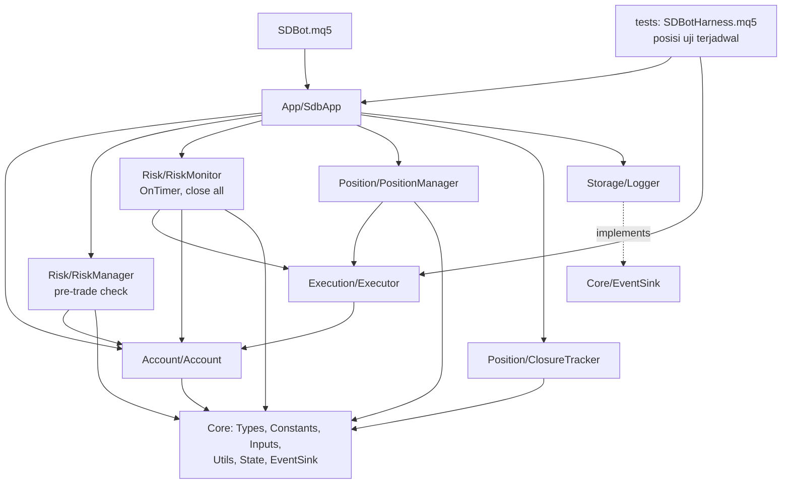

# Design — EA Foundation (Fase 1)

> **SUPERSEDED (2026-09-29)**: dipecah menjadi spec `ea-01` … `ea-07`, lihat [../README.md](../README.md). Dokumen ini hanya sumber pemindahan isi dan akan dihapus.

Status: Draft revisi 2
Requirements: [requirements.md](requirements.md) (revisi 2)

## 1. Overview

Fase 1 dibangun sebagai modul `.mqh` berlapis sesuai RULES. `SDBot.mq5` hanya mengatur event. Semua perhitungan (lot, R, BE, trailing, drawdown, rugi harian) adalah fungsi murni yang diuji tanpa pasar. Kelas yang menyentuh terminal hanya membungkus panggilan MQL5 dan memanggil fungsi murni itu.

Tiga keputusan desain utama:

1. **Terminal adalah sumber kebenaran.** Status posisi (BE, partial, R awal, volume awal) disimpulkan dari posisi dan history MT5. Status akun (puncak equity, STOPPED, pause, flag lot × 0.5, balance awal hari) disimpan di Global Variables. Database hanya log.
2. **Modul tidak memanggil Storage langsung.** RULES membatasi penulis DB ke Storage, dan hanya `SDBot.mq5` yang boleh memakai Storage. Modul lain menulis event lewat interface `ISdbEventSink` yang didefinisikan di Core. `CLogger` mengimplementasikan interface itu, dan EA menyambungkannya saat init. Modul tetap hanya bergantung pada Core (dependency inversion).
3. **Orkestrasi dipakai bersama EA dan harness.** Urutan init, tick, timer, dan transaksi ada di satu kelas `CSdbApp` (folder baru `App/`). `SDBot.mq5` dan harness uji hanya meneruskan event ke kelas ini, sehingga yang diuji di tester sama dengan yang jalan live.

## 2. Architecture



Garis putus-putus: `CLogger` mengimplementasikan `ISdbEventSink`. Modul lain memegang pointer `ISdbEventSink*` yang diisi `CSdbApp` saat init.

`App/` adalah lapisan baru di atas semua modul. Isinya hanya orkestrasi yang tadinya ada di `SDBot.mq5`. RULES perlu ditambah satu baris untuk lapisan ini (lihat §8).

Pemetaan event:

| Event MQL5 | `CSdbApp` memanggil |
|---|---|
| `OnInit` | validasi input → validasi akun → buka DB → muat/reset state GV → buat handle ATR → rekonsiliasi → `EventSetTimer(1)` |
| `OnTick` | `CPositionManager::OnTick()` |
| `OnTimer` | `CAccount::CheckConnection()` → `CRiskMonitor::Run()` → `CAccount` snapshot ke `accounts` (tiap 60 detik) |
| `OnTradeTransaction` | `CClosureTracker::OnTransaction()` |
| `OnTester` | `CSdbApp::TesterMetric()` |
| `OnDeinit` | lepas handle, `EventKillTimer`, tutup DB |

## 3. Components and interfaces

Tanda **[murni]** berarti fungsi tanpa panggilan terminal, diuji di unit test.

### Core

| File | Isi |
|---|---|
| `Core/Types.mqh` | Enum dan struct di §4 |
| `Core/Constants.mqh` | Angka tetap dari PRD di §4.4 |
| `Core/Inputs.mqh` | Input Fase 1 di §4.3 |
| `Core/Utils.mqh` | Log terminal dan fungsi murni umum |
| `Core/State.mqh` | `CState`: baca/tulis Global Variables `SDB_<login>_*` |
| `Core/EventSink.mqh` | `interface ISdbEventSink` |

`Core/Utils.mqh`:

```cpp
void   LogDebug(string module, string symbol, string msg);   // juga LogInfo, LogWarn, LogError, LogCritical
double RoundLotDown(double lot, double step);                 // [murni] 5.2
double NormalizePriceTo(double price, int digits);            // [murni] 6.2
double ProfitInR(double entry, double initialSl, double price, bool isBuy); // [murni] 7.1, 8.1
bool   IsSlBetter(double oldSl, double newSl, bool isBuy);     // [murni] 7.3, 10.2
string BuildOrderComment(double initialSl, int digits);       // [murni] 4.4, "SDB|<sl>"
bool   ParseInitialSl(string comment, double &initialSl);     // [murni] 4.4
bool   ValidateInputs(string &reason);                        // [murni atas nilai input] 2.5
```

Log terminal memakai format `[SDB][LEVEL][Modul][Simbol] pesan | kunci=nilai` (18.1). DEBUG hanya jika `InpLogLevel = SDB_LOG_DEBUG` (18.2). Utils tidak menulis DB. Baris untuk SQLite adalah event terstruktur lewat `ISdbEventSink`.

`Core/State.mqh`, kelas `CState`:

```cpp
bool   Init(long login);                 // nama kunci SDB_<login>_<NAMA>
double PeakEquity();  void SetPeakEquity(double v);          // 11.2
bool   IsStopped();   void SetStopped(bool v);               // 13.3
bool   IsDailyPaused(); void SetDailyPaused(bool v);         // 12.2
bool   IsLotReduced(); void SetLotReduced(bool v);           // 5.5, 11.4
double DayStartBalance(); datetime DayStartDate(); void SetDayStart(double bal, datetime day); // 12.3
```

`Core/EventSink.mqh`:

```cpp
interface ISdbEventSink
  {
   void OnAccount(const AccountSnapshot &a);
   void OnTradeOpened(const TradeRecord &t);
   void OnPositionEvent(const PositionEvent &e);
   void OnClosure(const ClosureRecord &c);
   void OnAlert(const AlertEvent &a);
   bool FindInitialSl(ulong ticket, double &sl);   // cadangan terakhir untuk 4.4, dibaca dari tabel trades
  };
```

### Account — `Account/Account.mqh`, `CAccount`

```cpp
bool   Validate(bool allowLive, string suffix, string &reason);  // 2.1–2.4
bool   CheckConnection();          // dipanggil tiap OnTimer; true = boleh entry. 3.1–3.3
bool   IsTradingAllowed();         // koneksi + izin terminal + izin EA
string TradeSymbol();              // simbol chart (+ suffix bila perlu)
AccountSnapshot Snapshot();        // login, server, tipe, mata uang, balance, equity, margin level
```

Aturan validasi dipisah sebagai fungsi murni `EvaluateAccount(tradeMode, marginMode, allowLive, symbolExists, reason)` [murni] agar kasus akun real dan netting bisa diuji tanpa akun sungguhan. Tipe akun: `DEMO` bila `ACCOUNT_TRADE_MODE_DEMO`. `CENT` bila real dan mata uang ada di `SDB_CENT_CURRENCIES` (`USC`, `EUC`). Selain itu `REAL`.

Koneksi: `CheckConnection` menyimpan waktu mulai terputus. Setelah ≥ `SDB_DISCONNECT_ALERT_SEC` (300) dicatat alert Medium, lalu diulang paling cepat tiap 300 detik. Saat pulih dicatat alert Info sekali.

### Execution — `Execution/Executor.mqh`, `CExecutor`

Satu-satunya pemilik objek `CTrade` (6.8).

```cpp
bool Init(long magic, string symbol, ISdbEventSink *sink);
bool OpenMarket(const OrderRequest &req, OrderResult &res);   // 6.1–6.7
bool ModifySl(ulong ticket, double newSl, string &reason);    // 10.2, 10.3
bool ClosePartial(ulong ticket, double volume, string &reason); // 8.1
bool ClosePosition(ulong ticket, string &reason);             // 13.1
int  CloseAllOwn(string &reason);                             // posisi magic+simbol ini; jumlah yang tersisa
```

Langkah `OpenMarket`:
1. Tolak jika `req.sl == 0` atau `req.tp == 0` (6.1).
2. Ambil harga ask/bid terbaru, normalisasi SL/TP ke `SYMBOL_DIGITS` (6.2).
3. `CheckStops(price, sl, tp, stopsLevel, freezeLevel, spread)` [murni]: jarak ≥ stops level + spread dan di luar freeze level (6.3).
4. Filling mode dari `SYMBOL_FILLING_MODE`, dengan urutan FOK → IOC → RETURN yang didukung (6.4).
5. Komentar = `BuildOrderComment(req.sl, digits)`.
6. Kirim, cek `ResultRetcode()`. Retcode sementara (`REQUOTE`, `PRICE_CHANGED`, `PRICE_OFF`, `TIMEOUT`, `CONNECTION`) di-retry maksimal `SDB_MAX_RETRY` (3) dengan jeda `SDB_RETRY_DELAY_MS` (500 ms) dan harga baru (6.5). Retcode lain permanen (6.6).
7. Sukses: isi `OrderResult` (harga isi, slippage point, spread point), hitung ulang risiko uang dari harga isi, lalu kirim `TradeRecord` ke sink (6.7).

`ModifySl` menolak SL yang tidak lebih baik (`IsSlBetter`) atau melanggar stops/freeze level. SL yang tidak lebih baik tidak dianggap gagal, hanya dilewati.

### Risk

`Risk/RiskMath.mqh` [murni]:

```cpp
double CalcLotSize(double balance, double riskPct, double moneyPerLot,
                   double volStep, double volMin, double volMax, bool &belowMin); // 5.1–5.4
double DrawdownPct(double peakEquity, double equity);                              // 11.x
double DailyLossPct(double dayStartBalance, double equity);                        // 12.1
double EffectiveRiskPct(double riskPct, bool lotReduced);                          // 5.5
double PositionOpenRiskPct(double riskMoney, bool beActive, double balance);       // 14.2
ENUM_SDB_DD_LEVEL DrawdownLevel(double ddPct, ENUM_SDB_DD_LEVEL current,
                                double reducePct, double stopPct);                 // 11.3–11.6, histeresis 8%
double AdjustForBalanceOp(double value, double amount);                            // 21.1, dipakai untuk puncak equity dan balance awal hari
```

`moneyPerLot` dihitung di `CRiskManager` dengan `OrderCalcProfit()` pada harga yang akan dieksekusi dan harga SL.

`Risk/RiskManager.mqh`, `CRiskManager` (dipanggil oleh strategi di Fase 3):

```cpp
bool PreTradeCheck(const OrderRequest &req, string &rejectReason);  // 14.1–14.3
bool CalcVolume(OrderRequest &req, string &rejectReason);          // 5.1–5.5, isi req.volume + req.riskMoney
```

Urutan `PreTradeCheck`: STOPPED/pause harian/koneksi → risiko per trade ≤ `InpRiskPerTradePct` → total risiko terbuka + order baru ≤ `InpMaxOpenRiskPct` (posisi BE = 0%) → eksposur mata uang (selalu lolos sampai Fase 4) → margin level ≥ 200%. Alasan tolak memakai kode dari `enums.md` (misalnya `STOPPED`, `DAILY_PAUSE`, `MAX_OPEN_RISK`, `MARGIN_LOW`, `LOT_BELOW_MIN`).

`Risk/RiskMonitor.mqh`, `CRiskMonitor::Run()` tiap detik:
0. Operasi saldo baru? `ProcessBalanceOps()` membaca deal `DEAL_TYPE_BALANCE`/`DEAL_TYPE_CREDIT` setelah tiket terakhir yang tersimpan di `SDB_<login>_LAST_BAL_DEAL`. Setiap deal diklaim dengan `GlobalVariableSetOnCondition` (compare-and-set dari tiket lama ke tiket baru), jadi hanya satu instance yang memprosesnya (21.3). Instance pemenang menyesuaikan puncak equity dan balance awal hari, lalu mencatat alert Info (21.1, 21.4). Fungsi yang sama dipanggil di `OnInit` untuk operasi yang terjadi saat EA mati (21.2).
1. Ganti hari server? Jika ya: `SetDayStart(balance, hari)`, cabut pause harian (12.3).
2. Perbarui puncak equity bila equity lebih tinggi (11.2).
3. `DrawdownLevel(...)`. Transisi level memicu alert dan flag (11.3–11.5). Level STOP memicu emergency (11.6).
4. `DailyLossPct` ≥ `InpDailyLossPct` → pause harian + alert High, sekali per hari (12.1).
5. Margin level < 300% → alert High saat status berubah (11.7). Blokir < 200% dibaca `PreTradeCheck` (11.8).
6. Jika STOPPED dan masih ada posisi milik instance ini: `CloseAllOwn()` paling cepat tiap `SDB_CLOSE_ALL_RETRY_SEC` (5 detik). Tiga kegagalan berturut-turut → alert Critical (13.1, 13.2, 15.3).

Reset emergency (13.4): di `OnInit`, jika `InpResetEmergencyStop = true` dan STOPPED aktif, set STOPPED = false, puncak equity = equity sekarang, alert Info. Log WARN mengingatkan input dikembalikan ke `false`. Tidak ada jalur lain yang membuka STOPPED (13.5).

### Position

`Position/PositionMath.mqh` [murni]:

```cpp
bool   IsBreakevenActive(double entry, double sl, bool isBuy);                    // 4.3
double BreakevenSl(double entry, double spreadPts, double bufferPts, double point, bool isBuy); // 7.1, 7.2
bool   ShouldPartial(double profitR, double partialR, double curVol, double initVol); // 8.1, 4.3
double PartialVolume(double initVol, double pct, double step, double volMin,
                     double curVol, bool &skip);                                  // 8.1, 8.2
double TrailingSl(double price, double atr, double mult, bool isBuy);             // 9.1
bool   IsTrailStepEnough(double oldSl, double newSl, double minStepPts, double point, bool isBuy); // 9.2
```

`Position/PositionManager.mqh`, `CPositionManager`:

```cpp
bool Init(long magic, string symbol, ENUM_TIMEFRAMES ltf, CExecutor *exe, ISdbEventSink *sink); // handle ATR(ltf) di sini
void OnTick();       // 10.1
void Deinit();       // IndicatorRelease
```

`OnTick` untuk setiap posisi dengan magic dan simbol ini:
1. Bangun `PositionContext`: entry, SL, volume sekarang, `initialSl`, `initialVolume` (dari deal `DEAL_ENTRY_IN` di history posisi), R, profit dalam R. `initialSl` dicari berurutan: komentar posisi (`ParseInitialSl`) → `ORDER_SL` order pembuka di history MT5 → `ISdbEventSink::FindInitialSl` (tabel `trades`). Hasilnya di-cache per ticket.
2. BE, partial, dan trailing dicek terpisah, tidak sebagai rantai `else` (10.1).
3. ATR dibaca dari bar tutup (`CopyBuffer(handle, 0, 1, 1, ...)`, cek jumlah = 1) (9.3).
4. Kegagalan modify disimpan per ticket (jumlah, waktu terakhir). Retry setelah `SDB_MODIFY_COOLDOWN_SEC` (30 detik), maksimal 3, lalu event `MODIFY_FAILED` + alert Medium (10.4).
5. Partial yang dilewati karena lot minimum dicatat sekali per ticket (8.2).

`Position/ClosureTracker.mqh`, `CClosureTracker::OnTransaction(trans, request, result)`:
- Hanya `TRADE_TRANSACTION_DEAL_ADD` dengan magic dan simbol ini.
- Deal `DEAL_ENTRY_OUT` atau `OUT_BY`: jika posisi masih ada, itu partial dan sudah dicatat PositionManager. Jika posisi sudah tidak ada, jumlahkan profit, komisi, dan swap semua deal posisi itu, ambil alasan dari `DEAL_REASON` deal terakhir, hitung R hasil, lalu kirim `ClosureRecord` (16.1–16.3).
- Pemetaan alasan: `DEAL_REASON_SL` → `SL`, `TP` → `TP`, `CLIENT`/`MOBILE`/`WEB` → `MANUAL`, `SO` → `STOP_OUT`, `EXPERT` → `EA`, lainnya → `OTHER`. Pemetaan ini fungsi murni `MapDealReason()`.
- Tracker juga menyimpan jumlah trade dan total R di memori. Nilai ini dipakai `OnTester`, karena DB mati saat optimasi (17.3, 19.2).

### Storage

`Storage/Schema.mqh`: string DDL yang sama persis dengan `shared/schema/data_db.sql`, plus `SDB_DATA_SCHEMA_VERSION = 1`.

`Storage/Logger.mqh`, `CLogger : public ISdbEventSink`:

```cpp
bool Open();    // DATABASE_OPEN_READWRITE|CREATE|COMMON, PRAGMA journal_mode=WAL, busy_timeout=2000, jalankan DDL
void Close();
bool FindInitialSl(long login, ulong ticket, double &sl);  // cadangan 4.4
void Reconcile(long login, long magic, string symbol);     // 4.1, 4.2
// + implementasi ISdbEventSink
```

- Mode optimasi: `Open()` tidak membuka apa pun dan semua metode tidak melakukan apa-apa (17.3).
- Setiap query memakai `DatabasePrepare` + `DatabaseBind`, tanpa menyambung string.
- Gagal query: log ERROR dengan `GetLastError()` lalu lanjut (17.4). Tidak ada error yang dilempar ke pemanggil.

### App dan EA

`App/SdbApp.mqh`, `CSdbApp`: memiliki semua objek di atas (dibuat dengan `new` di `Init`, dihapus di destruktor) dan menjalankan pemetaan event di §2. `SDBot.mq5` berisi `#property version "1.0"`, satu instance `CSdbApp`, dan enam handler event yang meneruskan ke instance itu.

`CSdbApp::TesterMetric()` = `TesterMetric(totalR, trades, maxDdPct)` [murni] dengan R dari `CClosureTracker` dan max DD dari `TesterStatistics(STAT_EQUITY_DDREL_PERCENT)`. Tanpa trade atau DD = 0, metriknya 0 agar optimasi tidak memilih pass kosong.

### Harness uji — `ea/tests/Experts/SDBotTests/SDBotHarness.mq5`

- Include `App/SdbApp.mqh` dan `Core/Inputs.mqh` yang sama, ditambah input khusus harness (`HarnessEveryBars`, `HarnessSlPoints`, `HarnessTpPoints`, `HarnessDirection`, `HarnessMaxOpen`).
- `OnInit`: jika `!MQLInfoInteger(MQL_TESTER)` → `INIT_FAILED` dengan log CRITICAL (19.4).
- Setiap N bar baru LTF, harness membangun `OrderRequest`, memanggil `CRiskManager::PreTradeCheck` dan `CalcVolume`, lalu `CExecutor::OpenMarket`. Jalur entry-nya sama dengan yang akan dipakai strategi Fase 3.
- **Simulasi restart**: input `HarnessRestartAtBar` menghapus instance `CSdbApp` lalu membuat dan meng-init yang baru di tengah run. Global Variables dan posisi tetap ada, sama seperti restart sungguhan. Dengan ini kriteria restart (4.x, 13.3) bisa diuji di tester.
- **Simulasi penarikan**: input `HarnessWithdrawAtBar` dan `HarnessWithdrawPct` memanggil `TesterWithdrawal()` untuk menguji Requirement 21.
- **Assert skenario**: harness mencatat observasi (urutan event per ticket, SL sebelumnya per ticket, alasan tolak, status risiko) dan di `OnDeinit` mengecek harapan skenario yang dipilih input `HarnessScenario`. Hasil `SC-xx PASS/FAIL` dicetak ke log dan ditulis ke `Common/Files/sdbot_test_results.txt`.

## 4. Data models

### 4.1 Enum (`Core/Types.mqh`)

| Enum | Nilai |
|---|---|
| `ENUM_SDB_LOG_LEVEL` | `SDB_LOG_DEBUG`, `SDB_LOG_INFO`, `SDB_LOG_WARN`, `SDB_LOG_ERROR`, `SDB_LOG_CRITICAL` |
| `ENUM_SDB_SEVERITY` | `SDB_SEV_INFO`, `SDB_SEV_MEDIUM`, `SDB_SEV_HIGH`, `SDB_SEV_CRITICAL` |
| `ENUM_SDB_TRADING_STYLE` | `SDB_STYLE_SCALPING`, `SDB_STYLE_DAY`, `SDB_STYLE_SWING`, `SDB_STYLE_POSITION` |
| `ENUM_SDB_DD_LEVEL` | `SDB_DD_NORMAL`, `SDB_DD_INFO`, `SDB_DD_REDUCE`, `SDB_DD_STOP` |
| `ENUM_SDB_ACCOUNT_TYPE` | `SDB_ACC_DEMO`, `SDB_ACC_REAL`, `SDB_ACC_CENT` |
| `ENUM_SDB_POS_EVENT` | `SDB_EVT_BE`, `SDB_EVT_PARTIAL`, `SDB_EVT_TRAILING`, `SDB_EVT_MODIFY_FAILED` |
| `ENUM_SDB_CLOSE_REASON` | `SDB_CLOSE_SL`, `SDB_CLOSE_TP`, `SDB_CLOSE_MANUAL`, `SDB_CLOSE_STOP_OUT`, `SDB_CLOSE_EA`, `SDB_CLOSE_OTHER` |

Timeframe per gaya diambil dari fungsi murni `StyleTimeframes(style, htf, mtf, ltf)` dengan tabel PRD. Fase 1 hanya memakai LTF untuk ATR.

### 4.2 Struct

| Struct | Field utama |
|---|---|
| `OrderRequest` | `symbol`, `isBuy`, `sl`, `tp`, `volume`, `riskMoney`, `riskPct`, `signalId` |
| `OrderResult` | `ticket`, `priceRequested`, `priceFilled`, `slippagePts`, `spreadPts`, `retcode` |
| `PositionContext` | `ticket`, `isBuy`, `entry`, `sl`, `tp`, `initialSl`, `volume`, `initialVolume`, `rDistance`, `profitR`, `beActive`, `partialDone` |
| `AccountSnapshot` | `login`, `server`, `type`, `currency`, `balance`, `equity`, `peakEquity`, `marginLevel`, `time` |
| `TradeRecord` | kolom tabel `trades` |
| `PositionEvent` | kolom tabel `position_events` |
| `ClosureRecord` | kolom tabel `closures` |
| `AlertEvent` | `type`, `severity`, `message`, `time` |

### 4.3 Input Fase 1 (`Core/Inputs.mqh`)

| Input | Default | Batas validasi (2.5) |
|---|---|---|
| `InpMagicNumber` | 20260919 | > 0 |
| `InpTradingStyle` | `SDB_STYLE_DAY` | — |
| `InpSymbolSuffix` | `""` | — |
| `InpAllowLiveTrading` | `false` | — |
| `InpRiskPerTradePct` | 0.5 | 0 < x ≤ 1.0 |
| `InpMaxOpenRiskPct` | 3.0 | ≥ risk per trade, ≤ 10 |
| `InpDailyLossPct` | 3.0 | 0 < x ≤ 10 |
| `InpDDReducePct` / `InpDDStopPct` | 10 / 15 | 0 < reduce < stop ≤ 50 |
| `InpResetEmergencyStop` | `false` | — |
| `InpBreakevenR` / `InpBreakevenBufferPoints` | 1.0 / 2 | R > 0, buffer ≥ 0 |
| `InpPartialR` / `InpPartialPct` | 1.5 / 50 | R > BreakevenR, 0 < pct < 100 |
| `InpTrailATRPeriod` / `InpTrailATRMult` | 14 / 2.0 | period ≥ 2, mult > 0 |
| `InpLogLevel` | `SDB_LOG_INFO` | — |

Input PRD lain (`EntryMode`, `MinConfluenceScore`, `MinRR`, `MaxZoneAgeBars`, filter, Telegram, heartbeat, backoffice) ditambahkan di fase yang memakainya.

`InpSymbolSuffix`: EA dipasang di chart simbol broker (misalnya `EURUSDc`), jadi suffix dipakai untuk memvalidasi dan membangun nama simbol lain (eksposur di Fase 4). Di Fase 1 cukup dicek bahwa simbol chart berakhiran suffix.

### 4.4 Konstanta (`Core/Constants.mqh`)

`SDB_MAX_RETRY` 3 · `SDB_RETRY_DELAY_MS` 500 · `SDB_MODIFY_COOLDOWN_SEC` 30 · `SDB_MIN_SL_STEP_POINTS` 5 · `SDB_DISCONNECT_ALERT_SEC` 300 · `SDB_CLOSE_ALL_RETRY_SEC` 5 · `SDB_CLOSE_ALL_ALERT_FAILS` 3 · `SDB_DD_INFO_PCT` 5 · `SDB_DD_RECOVER_PCT` 8 · `SDB_MARGIN_ALERT_PCT` 300 · `SDB_MARGIN_BLOCK_PCT` 200 · `SDB_TIMER_SEC` 1 · `SDB_SNAPSHOT_SEC` 60 · `SDB_DB_BUSY_TIMEOUT_MS` 2000 · `SDB_DB_FILE` "sdbot.sqlite" · `SDB_COMMENT_PREFIX` "SDB|" · `SDB_CENT_CURRENCIES` "USC,EUC".

### 4.5 Global Variables (per akun)

| Nama | Isi |
|---|---|
| `SDB_<login>_PEAK_EQUITY` | puncak equity |
| `SDB_<login>_STOPPED` | 1 = STOPPED |
| `SDB_<login>_DAILY_PAUSE` | 1 = pause harian |
| `SDB_<login>_LOT_REDUCED` | 1 = flag lot × 0.5 |
| `SDB_<login>_DAY_START_BAL` | balance awal hari server |
| `SDB_<login>_DAY_START_DATE` | tanggal hari server (epoch 00:00) |
| `SDB_<login>_LAST_BAL_DEAL` | tiket deal operasi saldo terakhir yang sudah diproses (21.2, 21.3) |

Semua instance di akun yang sama membaca dan menulis kunci yang sama (15.1, 15.2). Global Variable di Strategy Tester terpisah dari terminal, sehingga backtest tidak mengganggu status live.

### 4.6 Skema `shared/schema/data_db.sql` (versi 1)

Semua tabel punya `id INTEGER PRIMARY KEY` dan `login INTEGER NOT NULL` (17.6). Waktu dalam UTC epoch detik (17.5). Harga dan uang `REAL`, point `INTEGER`.

| Tabel | Kolom |
|---|---|
| `schema_version` | `version` |
| `accounts` | `login` (unik), `server`, `type`, `currency`, `balance`, `equity`, `peak_equity`, `updated_at` |
| `signals` | `time`, `symbol`, `direction`, `style`, `score_zone`, `score_fib`, `score_trendline`, `score_trend`, `score_breakout`, `score_pa`, `score_rsi`, `score_total`, `spread_points`, `status`, `reject_reason` (diisi mulai Fase 3) |
| `trades` | `ticket`, `magic`, `symbol`, `direction`, `volume`, `price_requested`, `price_filled`, `slippage_points`, `spread_points`, `sl`, `tp`, `initial_sl`, `risk_money`, `risk_pct`, `signal_id`, `ea_version`, `opened_at` |
| `position_events` | `ticket`, `time`, `type`, `sl_old`, `sl_new`, `volume`, `spread_points` |
| `closures` | `ticket`, `time`, `reason`, `level_price`, `price_filled`, `slippage_points`, `profit`, `commission`, `swap`, `r_result` |
| `alerts` | `time`, `type`, `severity`, `message`, `status` (`PENDING`, `SENT`, `FAILED`, `SKIPPED`) |

`ea_version` di `trades` memenuhi RULES "versi EA ikut dicatat di tabel trades". Nilai teks enum ditulis di `shared/schema/enums.md` dan harus sama persis di MQL5 dan Python.

## 5. Error handling

| Kegagalan | Deteksi | Tindakan | Log / alert |
|---|---|---|---|
| Input di luar batas | `ValidateInputs` di OnInit | `INIT_PARAMETERS_INCORRECT` | CRITICAL, sebut input dan batas |
| Akun real + AllowLive false, akun netting, simbol tidak ada | `CAccount::Validate` | `INIT_FAILED` | CRITICAL + alert Critical |
| Handle ATR invalid | `INVALID_HANDLE` di Init | `INIT_FAILED` | ERROR + kode error |
| `CopyBuffer` kurang data | jumlah ≠ 1 | lewati trailing tick ini | DEBUG |
| Terputus | `CheckConnection` | tahan entry | Medium setelah 5 menit, Info saat pulih |
| Retcode sementara | daftar retcode | retry 3x, jeda 500 ms, harga baru | WARN per retry |
| Retcode permanen / retry habis | selain daftar | berhenti | ERROR + alert Medium |
| Modify gagal | `ModifySl` false | cooldown 30 detik, maks 3, lalu event `MODIFY_FAILED` | ERROR + alert Medium |
| Close all gagal | posisi tersisa > 0 | ulang tiap 5 detik | Critical setelah 3 kali |
| DB tidak bisa dibuka / query gagal / terkunci | return `false` | lanjut trading tanpa DB | ERROR, tanpa retry di tick yang sama |
| Komentar SL awal hilang atau diubah broker | `ParseInitialSl` false | cari di `trades` (`FindInitialSl`) | WARN |
| SL awal tidak ditemukan sama sekali | kedua sumber gagal | BE dan partial untuk posisi itu dilewati, trailing tetap jalan bila SL sudah di atas entry | ERROR sekali per ticket |
| Partial tidak mungkin karena lot minimum | `PartialVolume` skip | lewati | INFO sekali per ticket |

## 6. Testing strategy (TDD)

### 6.1 Alur TDD per task

Setiap task di `tasks.md` mengikuti Red → Green → Refactor:

1. **Red**: tulis test case dari katalog §6.3 ke suite yang sesuai. Buat stub fungsi yang mengembalikan nilai salah (misalnya `return 0;`) agar compile lolos. Jalankan suite: test case baru harus **FAIL**. Test yang langsung lulus berarti tidak menguji apa-apa.
2. **Green**: tulis implementasi minimum sampai suite **ALL PASS**, dengan compile 0 error dan 0 warning.
3. **Refactor**: rapikan (fungsi ≤ 50 baris, tanpa angka ajaib) sambil suite tetap ALL PASS.
4. Untuk kelas yang menyentuh terminal (Executor, PositionManager, RiskMonitor, ClosureTracker, Logger), skenario §6.4 ditulis dulu di harness beserta assert-nya dan terbukti FAIL (atau belum bisa jalan), lalu diimplementasikan sampai PASS.

Bug yang ditemukan kemudian dimulai dengan test case baru yang mereproduksinya (RULES §Testing).

### 6.2 Struktur uji

```
sdbot/ea/tests/
  Include/SDBotTests/
    TestFramework.mqh        AssertEq(tol), AssertTrue, BeginSuite/EndSuite, ringkasan PASS/FAIL,
                             tulis hasil ke Common/Files/sdbot_test_results.txt
    Suites/TestCoreUtils.mqh, TestRiskMath.mqh, TestPositionMath.mqh, TestAccountRules.mqh
  Scripts/SDBotTests/RunUnitTests.mq5   script: jalankan semua suite di chart (manual)
  Experts/SDBotTests/RunUnitTestsEA.mq5 EA: jalankan semua suite di OnInit (untuk runner otomatis)
  Experts/SDBotTests/SDBotHarness.mq5   harness skenario (§3)
  scenarios/SC-xx_<nama>.ini            konfigurasi Strategy Tester per skenario
  manual-checklist.md                   uji yang hanya bisa manual (§6.5)
```

Suite ditulis sekali sebagai `.mqh`, lalu dipakai oleh script (dijalankan manual di chart) dan EA runner (dijalankan otomatis di tester). Junction ditambah `Include/SDBotTests` agar suite bisa di-include.

**Runner otomatis (usulan, dicek di task 1).** `tools/run-ea-tests.ps1` meng-compile lewat `metaeditor64.exe /compile`, menjalankan `RunUnitTestsEA` atau skenario harness di Strategy Tester lewat `terminal64.exe /config:<ini>` dengan `ShutdownTerminal=1`, lalu membaca `sdbot_test_results.txt` dan keluar dengan kode 0 atau 1. Dengan ini siklus Red/Green bisa saya jalankan sendiri tanpa Anda membuka MT5. Syaratnya ada instalasi MT5 terpisah (mode portable) khusus uji, karena terminal yang sedang login dipakai untuk trading. Jika mekanisme ini tidak jalan di mesin ini, fallback-nya manual: saya compile, Anda jalankan script dan menempelkan hasilnya.

### 6.3 Katalog test case fungsi murni

Toleransi perbandingan harga 1e-8 dan volume 1e-9. Point EURUSDc 0.00001, JPY 0.001.

**TestCoreUtils**

| ID | Fungsi | Input | Harapan | Req |
|---|---|---|---|---|
| TC-CU-01 | `RoundLotDown` | 0.0379, step 0.01 | 0.03 | 5.2 |
| TC-CU-02 | `RoundLotDown` | 0.29, step 0.01 | 0.29 (jebakan floating point) | 5.2 |
| TC-CU-03 | `RoundLotDown` | 0.10, step 0.01 | 0.10 | 5.2 |
| TC-CU-04 | `ProfitInR` | buy, entry 1.10000, SL awal 1.09800, harga 1.10200 | 1.0 | 7.1 |
| TC-CU-05 | `ProfitInR` | sell, entry 1.10000, SL awal 1.10200, harga 1.09700 | 1.5 | 8.1 |
| TC-CU-06 | `ProfitInR` | buy, entry 1.10000, SL awal 1.09800, harga 1.09900 | −0.5 | 7.1 |
| TC-CU-07 | `IsSlBetter` | buy, lama 1.09900, baru 1.10010 | true | 10.2 |
| TC-CU-08 | `IsSlBetter` | buy, lama 1.09900, baru 1.09800 | false | 10.2 |
| TC-CU-09 | `IsSlBetter` | buy, lama = baru 1.09900 | false | 10.2 |
| TC-CU-10 | `IsSlBetter` | sell, lama 1.10100, baru 1.10050 | true | 10.2 |
| TC-CU-11 | `IsSlBetter` | sell, lama 1.10100, baru 1.10200 | false | 10.2 |
| TC-CU-12 | `BuildOrderComment` | 1.08234, digits 5 | `SDB\|1.08234` | 4.4 |
| TC-CU-13 | `BuildOrderComment` | 161.234, digits 3 | `SDB\|161.234` | 4.4 |
| TC-CU-14 | `ParseInitialSl` | `SDB\|1.08234` | true, 1.08234 | 4.4 |
| TC-CU-15 | `ParseInitialSl` | `""`, `SDB\|`, `SDB\|abc`, `[sl 1.08234]` | false untuk semua | 4.4 |
| TC-CU-16 | `ValidateInputs` | semua default | true | 2.5 |
| TC-CU-17 | `ValidateInputs` | risk per trade 1.5 | false, alasan menyebut `InpRiskPerTradePct` | 2.5 |
| TC-CU-18 | `ValidateInputs` | risk per trade 0 | false | 2.5 |
| TC-CU-19 | `ValidateInputs` | DD reduce 15, DD stop 10 | false | 2.5 |
| TC-CU-20 | `ValidateInputs` | partial R 1.0, BE R 1.0 | false | 2.5 |
| TC-CU-21 | `StyleTimeframes` | day trading | H4, H1, M15 | 9.1 |

**TestRiskMath**

| ID | Fungsi | Input | Harapan | Req |
|---|---|---|---|---|
| TC-RM-01 | `CalcLotSize` | balance 1000, risk 0.5%, money/lot 20, step 0.01, min 0.01, max 100 | 0.25 | 5.1 |
| TC-RM-02 | `CalcLotSize` | sama, money/lot 30 | 0.16 (dibulatkan ke bawah dari 0.1667) | 5.2 |
| TC-RM-03 | `CalcLotSize` | balance 100, risk 0.5%, money/lot 100 | 0, `belowMin = true` | 5.3 |
| TC-RM-04 | `CalcLotSize` | balance 100000, risk 1%, money/lot 10, max 50 | 50 | 5.4 |
| TC-RM-05 | `EffectiveRiskPct` | 0.5, flag aktif | 0.25 | 5.5 |
| TC-RM-06 | `EffectiveRiskPct` | 0.5, flag tidak aktif | 0.5 | 5.5 |
| TC-RM-07 | `DrawdownPct` | puncak 1000, equity 900 | 10.0 | 11.x |
| TC-RM-08 | `DrawdownPct` | puncak 1000, equity 1100 | 0 (tidak negatif) | 11.x |
| TC-RM-09 | `DrawdownLevel` | 4.9, NORMAL | NORMAL | 11.3 |
| TC-RM-10 | `DrawdownLevel` | 5.0, NORMAL | INFO | 11.3 |
| TC-RM-11 | `DrawdownLevel` | 10.0, INFO | REDUCE | 11.4 |
| TC-RM-12 | `DrawdownLevel` | 9.0, REDUCE | REDUCE (histeresis) | 11.5 |
| TC-RM-13 | `DrawdownLevel` | 7.9, REDUCE | INFO | 11.5 |
| TC-RM-14 | `DrawdownLevel` | 15.0, REDUCE | STOP | 11.6 |
| TC-RM-15 | `DrawdownLevel` | 0, STOP | STOP (hanya reset manual) | 13.5 |
| TC-RM-16 | `DailyLossPct` | awal hari 1000, equity 970 | 3.0 | 12.1 |
| TC-RM-17 | `DailyLossPct` | awal hari 1000, equity 1010 | −1.0 | 12.1 |
| TC-RM-18 | `PositionOpenRiskPct` | risk 5, BE tidak aktif, balance 1000 | 0.5 | 14.2 |
| TC-RM-19 | `PositionOpenRiskPct` | risk 5, BE aktif | 0 | 14.2 |
| TC-RM-20 | `AdjustForBalanceOp` | 1000, −200 (penarikan) | 800 | 21.1 |
| TC-RM-21 | `AdjustForBalanceOp` | 1000, +100 (deposit) | 1100 | 21.1 |
| TC-RM-22 | `TesterMetric` | total R 30, 100 trade, DD 10% | 0.03 | 19.2 |
| TC-RM-23 | `TesterMetric` | 0 trade atau DD 0 | 0 | 19.2 |

**TestPositionMath**

| ID | Fungsi | Input | Harapan | Req |
|---|---|---|---|---|
| TC-PM-01 | `IsBreakevenActive` | buy, entry 1.10000, SL 1.10010 | true | 4.3 |
| TC-PM-02 | `IsBreakevenActive` | buy, entry 1.10000, SL 1.09800 | false | 4.3 |
| TC-PM-03 | `IsBreakevenActive` | sell, entry 1.10000, SL 1.09990 | true | 4.3 |
| TC-PM-04 | `BreakevenSl` | buy, entry 1.10000, spread 8, buffer 2, point 0.00001 | 1.10010 | 7.2 |
| TC-PM-05 | `BreakevenSl` | sell, sama | 1.09990 | 7.2 |
| TC-PM-06 | `BreakevenSl` | buy, entry 161.500, spread 35, buffer 2, point 0.001 | 161.537 | 7.2 |
| TC-PM-07 | `ShouldPartial` | profit 1.6R, ambang 1.5, vol 0.10 = awal 0.10 | true | 8.1 |
| TC-PM-08 | `ShouldPartial` | profit 1.4R | false | 8.1 |
| TC-PM-09 | `ShouldPartial` | profit 2.0R, vol 0.05, awal 0.10 | false (sudah partial) | 4.3 |
| TC-PM-10 | `PartialVolume` | awal 0.10, 50%, step 0.01, min 0.01, sekarang 0.10 | 0.05 | 8.1 |
| TC-PM-11 | `PartialVolume` | awal 0.03 | 0.01 | 8.1 |
| TC-PM-12 | `PartialVolume` | awal 0.02 | 0.01 (sisa 0.01 = min) | 8.2 |
| TC-PM-13 | `PartialVolume` | awal 0.01 | `skip = true` | 8.2 |
| TC-PM-14 | `TrailingSl` | buy, harga 1.10500, ATR 0.00100, mult 2 | 1.10300 | 9.1 |
| TC-PM-15 | `TrailingSl` | sell, sama | 1.10700 | 9.1 |
| TC-PM-16 | `IsTrailStepEnough` | buy, lama 1.10280, baru 1.10300, min 5 point | true (20 point) | 9.2 |
| TC-PM-17 | `IsTrailStepEnough` | buy, lama 1.10298, baru 1.10300 | false (2 point) | 9.2 |
| TC-PM-18 | `IsTrailStepEnough` | sell, lama 1.10720, baru 1.10700 | true | 9.2 |

**TestAccountRules**

| ID | Fungsi | Input | Harapan | Req |
|---|---|---|---|---|
| TC-AR-01 | `EvaluateAccount` | demo, hedging, allowLive false, simbol ada | lolos | 2.2 |
| TC-AR-02 | `EvaluateAccount` | real, hedging, allowLive false | tolak, alasan menyebut `InpAllowLiveTrading` | 2.2 |
| TC-AR-03 | `EvaluateAccount` | real, hedging, allowLive true | lolos | 2.2 |
| TC-AR-04 | `EvaluateAccount` | real, netting, allowLive true | tolak, alasan menyebut mode margin | 2.3 |
| TC-AR-05 | `EvaluateAccount` | demo, hedging, simbol tidak ada | tolak, alasan menyebut simbol | 2.4 |
| TC-AR-06 | `AccountTypeOf` | real + USC | CENT | 2.6 |
| TC-AR-07 | `AccountTypeOf` | real + USD | REAL | 2.6 |
| TC-AR-08 | `AccountTypeOf` | demo + USC | DEMO | 2.6 |
| TC-AR-09 | `MapDealReason` | SL, TP, CLIENT, MOBILE, WEB, SO, EXPERT, lainnya | SL, TP, MANUAL ×3, STOP_OUT, EA, OTHER | 16.1 |
| TC-AR-10 | `CheckStops` | buy di 1.10000, SL 1.09995, stops 0, spread 8 | tolak (5 < 8 point) | 6.3 |
| TC-AR-11 | `CheckStops` | buy di 1.10000, SL 1.09900, stops 0, spread 8 | lolos | 6.3 |
| TC-AR-12 | `CheckStops` | buy di 1.10000, SL 1.09980, stops 20, spread 8 | tolak (20 < 28 point) | 6.3 |
| TC-AR-13 | `CheckStops` | TP di dalam freeze level | tolak | 6.3 |

### 6.4 Skenario Strategy Tester (harness, assert otomatis)

Semua memakai EURUSDc M15, *Every tick based on real ticks*, periode 1 bulan data akun cent, kecuali disebut lain. Ambang risiko diturunkan lewat input agar cepat tercapai.

| ID | Given (input harness) | When | Then (assert di `OnDeinit`) | Req |
|---|---|---|---|---|
| SC-01 BE-partial-trailing | buy/sell bergantian tiap 20 bar, SL 200 point, TP 1000 point | posisi mencapai 1R, 1.5R, lalu trailing | ada posisi dengan urutan BE → partial → trailing; tiap ticket paling banyak 1 BE dan 1 partial; SL tidak pernah memburuk; closure tercatat dengan alasan SL/TP dan R hasil | 7–10, 16 |
| SC-02 Rugi harian | `InpDailyLossPct` 0.5, SL 100 point, TP 1000 point | rugi hari itu ≥ 0.5% | pause aktif; semua entry harness sesudahnya di hari yang sama ditolak `DAILY_PAUSE`; entry diterima lagi di hari server berikutnya | 12, 14 |
| SC-03 DD reduce dan stop | `InpDDReducePct` 1, `InpDDStopPct` 2, SL 100 point | drawdown 1% lalu 2% | risk efektif setengah setelah 1%; STOPPED di 2%; posisi EA habis dalam ≤ 5 detik simulasi; tidak ada entry sampai akhir run | 5.5, 11, 13 |
| SC-04 Restart | `HarnessRestartAtBar` setelah posisi sudah BE dan partial; run kedua setelah STOPPED | app dibuat ulang | tidak ada BE atau partial kedua; SL awal dan R tetap sama; STOPPED tetap aktif setelah restart | 4.3–4.5, 13.3 |
| SC-05 Lot di bawah minimum | `InpRiskPerTradePct` 0.01 | harness mencoba entry | semua ditolak `LOT_BELOW_MIN`; 0 order terkirim | 5.3 |
| SC-06 Stops level | SL 3 point | harness mencoba entry | semua ditolak sebelum dikirim; 0 order terkirim | 6.1–6.3 |
| SC-07 Penarikan | `HarnessWithdrawAtBar`, `HarnessWithdrawPct` 20 | `TesterWithdrawal()` | puncak equity dan balance awal hari turun sebesar nominalnya; tidak ada perubahan level DD, pause, atau STOPPED | 21 |
| SC-08 Optimasi tanpa DB | optimasi 2 pass | optimasi selesai | `sdbot.sqlite` tidak berubah; `OnTester` mengembalikan metrik | 17.3, 19.2 |

### 6.5 Uji manual (`ea/tests/manual-checklist.md`)

Hanya yang tidak bisa disimulasikan di tester:

| ID | Langkah | Harapan | Req |
|---|---|---|---|
| MC-01 | Pasang EA di akun cent dengan `InpAllowLiveTrading = false` | EA menolak jalan dengan pesan CRITICAL | 2.2 |
| MC-02 | Pasang EA di akun cent dengan `.set` day trading | inisialisasi tanpa error, baris `accounts` tipe CENT | 2.6, 17 |
| MC-03 | Matikan jaringan > 5 menit | alert Medium tercatat, lalu Info saat pulih | 3 |
| MC-04 | Dua chart di akun cent, set STOPPED dari satu instance lewat skenario reset | instance lain ikut memblokir entry | 15 |
| MC-05 | (Fase 3) Tutup posisi manual | `closures.reason = MANUAL` | 16.1 |
| MC-06 | (Fase 3) Cek `ORDER_SL` order pembuka di Exness | SL awal terbaca dari history, bukan 0 | 4.4 |

## 7. Traceability

| Requirement | Komponen | Uji |
|---|---|---|
| 1 | `tools/link-mt5.ps1`, semua file | compile 0/0 |
| 2 | `CAccount`, `ValidateInputs`, `EvaluateAccount`, `AccountTypeOf` | TC-CU-16..20, TC-AR-01..08, MC-01, MC-02 |
| 3 | `CAccount::CheckConnection` | MC-03 |
| 4 | `CPositionManager`, `ParseInitialSl`, `CLogger::Reconcile` | TC-CU-12..15, TC-PM-01..03, SC-04, MC-06 |
| 5 | `CalcLotSize`, `EffectiveRiskPct`, `CRiskManager::CalcVolume` | TC-CU-01..03, TC-RM-01..06, SC-05, SC-03 |
| 6 | `CExecutor::OpenMarket`, `CheckStops` | TC-AR-10..13, SC-06 |
| 7, 8, 9, 10 | `CPositionManager`, `PositionMath`, `CExecutor::ModifySl/ClosePartial` | TC-CU-04..11, TC-PM-04..18, SC-01 |
| 11, 13 | `CRiskMonitor`, `DrawdownPct`, `DrawdownLevel`, `CState` | TC-RM-07..15, SC-03, SC-04 |
| 12 | `CRiskMonitor`, `DailyLossPct`, `CState` | TC-RM-16..17, SC-02 |
| 14 | `CRiskManager::PreTradeCheck`, `PositionOpenRiskPct` | TC-RM-18..19, SC-02, SC-03, SC-05 |
| 15 | `CState` | MC-04 |
| 16 | `CClosureTracker`, `MapDealReason` | TC-AR-09, SC-01, MC-05 |
| 17 | `CLogger`, `Schema.mqh`, `data_db.sql` | SC-01 (isi DB), SC-08, MC-02 |
| 18 | `Core/Utils` log, `ISdbEventSink::OnAlert` | review log SC-01..07 |
| 19 | `CSdbApp::TesterMetric`, harness | TC-RM-22..23, SC-08 |
| 20 | `ea/tests/**`, alur TDD §6.1 | semua di atas |
| 21 | `CRiskMonitor::ProcessBalanceOps`, `AdjustForBalanceOp` | TC-RM-20..21, SC-07 |

## 8. Keputusan yang perlu disetujui

1. **Folder `App/` untuk `CSdbApp`.** Lapisan baru di atas semua modul, hanya berisi orkestrasi. RULES perlu ditambah satu baris: *App: orkestrasi event, boleh memakai semua modul, tidak boleh berisi logika trading.* Tanpa ini, harness harus menyalin orkestrasi `SDBot.mq5`, dan yang diuji bisa berbeda dari yang jalan live.
2. **`ISdbEventSink` di Core.** Modul menulis dan membaca log DB lewat interface ini, bukan dengan memanggil Storage. Aturan "hanya Storage menulis DB" dan "Position/Risk tidak memanggil Storage" tetap terjaga.
3. **Struktur uji dan revisi kriteria 20.1–20.2.** Suite unit test menjadi `.mqh` di `ea/tests/Include/SDBotTests/` (dipakai script dan EA runner), dan skenario memakai assert otomatis di harness. Restart dan penarikan kini diuji di tester (SC-04, SC-07). Yang tetap manual hanya MC-01..06.
4. **Runner otomatis dengan MT5 portable khusus uji.** Siklus TDD jadi cepat karena compile dan uji bisa saya jalankan sendiri. Butuh satu instalasi MT5 tambahan (sekitar 1 GB) yang login ke akun demo atau cent yang sama hanya untuk data historis. Task 1 memverifikasi mekanismenya dulu. Jika gagal, uji dijalankan manual.
5. **SL awal: komentar → `ORDER_SL` history → tabel `trades`.** Cadangan kedua tetap ada walau DB hilang. Perilaku `ORDER_SL` di Exness dicek di MC-06.
6. **Tabel `signals` dibuat sekarang**, diisi mulai Fase 3, agar versi skema tidak naik hanya untuk tabel yang sudah diketahui.
7. **Operasi saldo diproses tepat sekali** lewat compare-and-set di Global Variable (`GlobalVariableSetOnCondition`), tanpa perlu instance "pemimpin".
8. **Emergency close lintas pair** mengikuti jawaban R2-1 di requirements. Jika disetujui: `CExecutor::CloseAllSdbot(magicFrom, magicTo)` dipakai hanya oleh `CRiskMonitor` saat STOPPED, dan RULES mencatat pengecualian ini.
