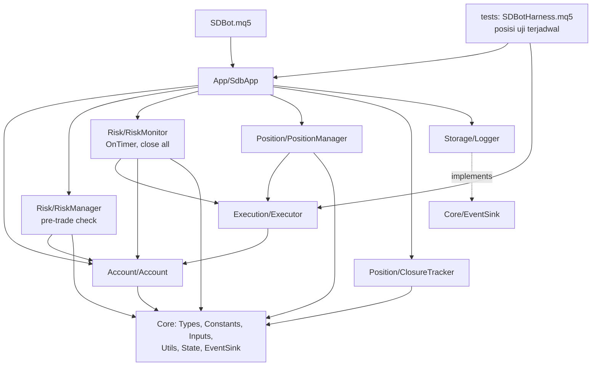

# Design — EA Foundation (Fase 1)

Status: Draft
Requirements: [requirements.md](requirements.md) (Approved 2026-09-28)

## 1. Overview

Fase 1 dibangun sebagai modul `.mqh` berlapis sesuai RULES. `SDBot.mq5` hanya mengatur event. Semua perhitungan (lot, R, BE, trailing, drawdown, rugi harian) adalah fungsi murni yang diuji tanpa pasar. Kelas yang menyentuh terminal hanya membungkus panggilan MQL5 dan memanggil fungsi murni itu.

Tiga keputusan desain utama:

1. **Terminal adalah sumber kebenaran.** Status posisi (BE, partial, R awal, volume awal) disimpulkan dari posisi dan history MT5. Status akun (puncak equity, STOPPED, pause, flag lot × 0.5, balance awal hari) disimpan di Global Variables. Database hanya log.
2. **Modul tidak memanggil Storage langsung.** RULES membatasi penulis DB ke Storage, dan hanya `SDBot.mq5` yang boleh memakai Storage. Modul lain menulis event lewat interface `ISdbEventSink` yang didefinisikan di Core. `CLogger` mengimplementasikan interface itu, dan EA menyambungkannya saat init. Modul tetap hanya bergantung pada Core (dependency inversion).
3. **Orkestrasi dipakai bersama EA dan harness.** Urutan init, tick, timer, dan transaksi ada di satu kelas `CSdbApp` (folder baru `App/`). `SDBot.mq5` dan harness uji hanya meneruskan event ke kelas ini, sehingga yang diuji di tester sama dengan yang jalan live.

## 2. Architecture



Garis putus-putus: `CLogger` mengimplementasikan `ISdbEventSink`. Modul lain memegang pointer `ISdbEventSink*` yang diisi `CSdbApp` saat init.

`App/` adalah lapisan baru di atas semua modul. Isinya hanya orkestrasi yang tadinya ada di `SDBot.mq5`. RULES perlu ditambah satu baris untuk lapisan ini (lihat §8).

Pemetaan event:

| Event MQL5 | `CSdbApp` memanggil |
|---|---|
| `OnInit` | validasi input → validasi akun → buka DB → muat/reset state GV → buat handle ATR → rekonsiliasi → `EventSetTimer(1)` |
| `OnTick` | `CPositionManager::OnTick()` |
| `OnTimer` | `CAccount::CheckConnection()` → `CRiskMonitor::Run()` → `CAccount` snapshot ke `accounts` (tiap 60 detik) |
| `OnTradeTransaction` | `CClosureTracker::OnTransaction()` |
| `OnTester` | `CSdbApp::TesterMetric()` |
| `OnDeinit` | lepas handle, `EventKillTimer`, tutup DB |

## 3. Components and interfaces

Tanda **[murni]** berarti fungsi tanpa panggilan terminal, diuji di unit test.

### Core

| File | Isi |
|---|---|
| `Core/Types.mqh` | Enum dan struct di §4 |
| `Core/Constants.mqh` | Angka tetap dari PRD di §4.4 |
| `Core/Inputs.mqh` | Input Fase 1 di §4.3 |
| `Core/Utils.mqh` | Log terminal dan fungsi murni umum |
| `Core/State.mqh` | `CState`: baca/tulis Global Variables `SDB_<login>_*` |
| `Core/EventSink.mqh` | `interface ISdbEventSink` |

`Core/Utils.mqh`:

```cpp
void   LogDebug(string module, string symbol, string msg);   // juga LogInfo, LogWarn, LogError, LogCritical
double RoundLotDown(double lot, double step);                 // [murni] 5.2
double NormalizePriceTo(double price, int digits);            // [murni] 6.2
double ProfitInR(double entry, double initialSl, double price, bool isBuy); // [murni] 7.1, 8.1
bool   IsSlBetter(double oldSl, double newSl, bool isBuy);     // [murni] 7.3, 10.2
string BuildOrderComment(double initialSl, int digits);       // [murni] 4.4, "SDB|<sl>"
bool   ParseInitialSl(string comment, double &initialSl);     // [murni] 4.4
bool   ValidateInputs(string &reason);                        // [murni atas nilai input] 2.5
```

Log terminal memakai format `[SDB][LEVEL][Modul][Simbol] pesan | kunci=nilai` (18.1). DEBUG hanya jika `InpLogLevel = SDB_LOG_DEBUG` (18.2). Utils tidak menulis DB. Baris untuk SQLite adalah event terstruktur lewat `ISdbEventSink`.

`Core/State.mqh`, kelas `CState`:

```cpp
bool   Init(long login);                 // nama kunci SDB_<login>_<NAMA>
double PeakEquity();  void SetPeakEquity(double v);          // 11.2
bool   IsStopped();   void SetStopped(bool v);               // 13.3
bool   IsDailyPaused(); void SetDailyPaused(bool v);         // 12.2
bool   IsLotReduced(); void SetLotReduced(bool v);           // 5.5, 11.4
double DayStartBalance(); datetime DayStartDate(); void SetDayStart(double bal, datetime day); // 12.3
```

`Core/EventSink.mqh`:

```cpp
interface ISdbEventSink
  {
   void OnAccount(const AccountSnapshot &a);
   void OnTradeOpened(const TradeRecord &t);
   void OnPositionEvent(const PositionEvent &e);
   void OnClosure(const ClosureRecord &c);
   void OnAlert(const AlertEvent &a);
  };
```

### Account — `Account/Account.mqh`, `CAccount`

```cpp
bool   Validate(bool allowLive, string suffix, string &reason);  // 2.1–2.4
bool   CheckConnection();          // dipanggil tiap OnTimer; true = boleh entry. 3.1–3.3
bool   IsTradingAllowed();         // koneksi + izin terminal + izin EA
string TradeSymbol();              // simbol chart (+ suffix bila perlu)
AccountSnapshot Snapshot();        // login, server, tipe, mata uang, balance, equity, margin level
```

Aturan validasi dipisah sebagai fungsi murni `EvaluateAccount(tradeMode, marginMode, allowLive, symbolExists, reason)` [murni] agar kasus akun real dan netting bisa diuji tanpa akun sungguhan. Tipe akun: `DEMO` bila `ACCOUNT_TRADE_MODE_DEMO`. `CENT` bila real dan mata uang ada di `SDB_CENT_CURRENCIES` (`USC`, `EUC`). Selain itu `REAL`.

Koneksi: `CheckConnection` menyimpan waktu mulai terputus. Setelah ≥ `SDB_DISCONNECT_ALERT_SEC` (300) dicatat alert Medium, lalu diulang paling cepat tiap 300 detik. Saat pulih dicatat alert Info sekali.

### Execution — `Execution/Executor.mqh`, `CExecutor`

Satu-satunya pemilik objek `CTrade` (6.8).

```cpp
bool Init(long magic, string symbol, ISdbEventSink *sink);
bool OpenMarket(const OrderRequest &req, OrderResult &res);   // 6.1–6.7
bool ModifySl(ulong ticket, double newSl, string &reason);    // 10.2, 10.3
bool ClosePartial(ulong ticket, double volume, string &reason); // 8.1
bool ClosePosition(ulong ticket, string &reason);             // 13.1
int  CloseAllOwn(string &reason);                             // posisi magic+simbol ini; jumlah yang tersisa
```

Langkah `OpenMarket`:
1. Tolak jika `req.sl == 0` atau `req.tp == 0` (6.1).
2. Ambil harga ask/bid terbaru, normalisasi SL/TP ke `SYMBOL_DIGITS` (6.2).
3. `CheckStops(price, sl, tp, stopsLevel, freezeLevel, spread)` [murni]: jarak ≥ stops level + spread dan di luar freeze level (6.3).
4. Filling mode dari `SYMBOL_FILLING_MODE`, dengan urutan FOK → IOC → RETURN yang didukung (6.4).
5. Komentar = `BuildOrderComment(req.sl, digits)`.
6. Kirim, cek `ResultRetcode()`. Retcode sementara (`REQUOTE`, `PRICE_CHANGED`, `PRICE_OFF`, `TIMEOUT`, `CONNECTION`) di-retry maksimal `SDB_MAX_RETRY` (3) dengan jeda `SDB_RETRY_DELAY_MS` (500 ms) dan harga baru (6.5). Retcode lain permanen (6.6).
7. Sukses: isi `OrderResult` (harga isi, slippage point, spread point), hitung ulang risiko uang dari harga isi, lalu kirim `TradeRecord` ke sink (6.7).

`ModifySl` menolak SL yang tidak lebih baik (`IsSlBetter`) atau melanggar stops/freeze level. SL yang tidak lebih baik tidak dianggap gagal, hanya dilewati.

### Risk

`Risk/RiskMath.mqh` [murni]:

```cpp
double CalcLotSize(double balance, double riskPct, double moneyPerLot,
                   double volStep, double volMin, double volMax, bool &belowMin); // 5.1–5.4
double DrawdownPct(double peakEquity, double equity);                              // 11.x
double DailyLossPct(double dayStartBalance, double equity);                        // 12.1
double EffectiveRiskPct(double riskPct, bool lotReduced);                          // 5.5
double PositionOpenRiskPct(double riskMoney, bool beActive, double balance);       // 14.2
ENUM_SDB_DD_LEVEL DrawdownLevel(double ddPct, ENUM_SDB_DD_LEVEL current,
                                double reducePct, double stopPct);                 // 11.3–11.6, histeresis 8%
```

`moneyPerLot` dihitung di `CRiskManager` dengan `OrderCalcProfit()` pada harga yang akan dieksekusi dan harga SL.

`Risk/RiskManager.mqh`, `CRiskManager` (dipanggil oleh strategi di Fase 3):

```cpp
bool PreTradeCheck(const OrderRequest &req, string &rejectReason);  // 14.1–14.3
bool CalcVolume(OrderRequest &req, string &rejectReason);          // 5.1–5.5, isi req.volume + req.riskMoney
```

Urutan `PreTradeCheck`: STOPPED/pause harian/koneksi → risiko per trade ≤ `InpRiskPerTradePct` → total risiko terbuka + order baru ≤ `InpMaxOpenRiskPct` (posisi BE = 0%) → eksposur mata uang (selalu lolos sampai Fase 4) → margin level ≥ 200%. Alasan tolak memakai kode dari `enums.md` (misalnya `STOPPED`, `DAILY_PAUSE`, `MAX_OPEN_RISK`, `MARGIN_LOW`, `LOT_BELOW_MIN`).

`Risk/RiskMonitor.mqh`, `CRiskMonitor::Run()` tiap detik:
1. Ganti hari server? Jika ya: `SetDayStart(balance, hari)`, cabut pause harian (12.3).
2. Perbarui puncak equity bila equity lebih tinggi (11.2).
3. `DrawdownLevel(...)`. Transisi level memicu alert dan flag (11.3–11.5). Level STOP memicu emergency (11.6).
4. `DailyLossPct` ≥ `InpDailyLossPct` → pause harian + alert High, sekali per hari (12.1).
5. Margin level < 300% → alert High saat status berubah (11.7). Blokir < 200% dibaca `PreTradeCheck` (11.8).
6. Jika STOPPED dan masih ada posisi milik instance ini: `CloseAllOwn()` paling cepat tiap `SDB_CLOSE_ALL_RETRY_SEC` (5 detik). Tiga kegagalan berturut-turut → alert Critical (13.1, 13.2, 15.3).

Reset emergency (13.4): di `OnInit`, jika `InpResetEmergencyStop = true` dan STOPPED aktif, set STOPPED = false, puncak equity = equity sekarang, alert Info. Log WARN mengingatkan input dikembalikan ke `false`. Tidak ada jalur lain yang membuka STOPPED (13.5).

### Position

`Position/PositionMath.mqh` [murni]:

```cpp
bool   IsBreakevenActive(double entry, double sl, bool isBuy);                    // 4.3
double BreakevenSl(double entry, double spreadPts, double bufferPts, double point, bool isBuy); // 7.1, 7.2
bool   ShouldPartial(double profitR, double partialR, double curVol, double initVol); // 8.1, 4.3
double PartialVolume(double initVol, double pct, double step, double volMin,
                     double curVol, bool &skip);                                  // 8.1, 8.2
double TrailingSl(double price, double atr, double mult, bool isBuy);             // 9.1
bool   IsTrailStepEnough(double oldSl, double newSl, double minStepPts, double point, bool isBuy); // 9.2
```

`Position/PositionManager.mqh`, `CPositionManager`:

```cpp
bool Init(long magic, string symbol, ENUM_TIMEFRAMES ltf, CExecutor *exe, ISdbEventSink *sink); // handle ATR(ltf) di sini
void OnTick();       // 10.1
void Deinit();       // IndicatorRelease
```

`OnTick` untuk setiap posisi dengan magic dan simbol ini:
1. Bangun `PositionContext`: entry, SL, volume sekarang, `initialSl` (dari komentar, cadangan `trades` lewat callback sink, lihat §5), `initialVolume` (dari deal `DEAL_ENTRY_IN` di history posisi), R, profit dalam R.
2. BE, partial, dan trailing dicek terpisah, tidak sebagai rantai `else` (10.1).
3. ATR dibaca dari bar tutup (`CopyBuffer(handle, 0, 1, 1, ...)`, cek jumlah = 1) (9.3).
4. Kegagalan modify disimpan per ticket (jumlah, waktu terakhir). Retry setelah `SDB_MODIFY_COOLDOWN_SEC` (30 detik), maksimal 3, lalu event `MODIFY_FAILED` + alert Medium (10.4).
5. Partial yang dilewati karena lot minimum dicatat sekali per ticket (8.2).

`Position/ClosureTracker.mqh`, `CClosureTracker::OnTransaction(trans, request, result)`:
- Hanya `TRADE_TRANSACTION_DEAL_ADD` dengan magic dan simbol ini.
- Deal `DEAL_ENTRY_OUT` atau `OUT_BY`: jika posisi masih ada, itu partial dan sudah dicatat PositionManager. Jika posisi sudah tidak ada, jumlahkan profit, komisi, dan swap semua deal posisi itu, ambil alasan dari `DEAL_REASON` deal terakhir, hitung R hasil, lalu kirim `ClosureRecord` (16.1–16.3).
- Pemetaan alasan: `DEAL_REASON_SL` → `SL`, `TP` → `TP`, `CLIENT`/`MOBILE`/`WEB` → `MANUAL`, `SO` → `STOP_OUT`, `EXPERT` → `EA`, lainnya → `OTHER`. Pemetaan ini fungsi murni `MapDealReason()`.

### Storage

`Storage/Schema.mqh`: string DDL yang sama persis dengan `shared/schema/data_db.sql`, plus `SDB_DATA_SCHEMA_VERSION = 1`.

`Storage/Logger.mqh`, `CLogger : public ISdbEventSink`:

```cpp
bool Open();    // DATABASE_OPEN_READWRITE|CREATE|COMMON, PRAGMA journal_mode=WAL, busy_timeout=2000, jalankan DDL
void Close();
bool FindInitialSl(long login, ulong ticket, double &sl);  // cadangan 4.4
void Reconcile(long login, long magic, string symbol);     // 4.1, 4.2
// + implementasi ISdbEventSink
```

- Mode optimasi: `Open()` tidak membuka apa pun dan semua metode tidak melakukan apa-apa (17.3).
- Setiap query memakai `DatabasePrepare` + `DatabaseBind`, tanpa menyambung string.
- Gagal query: log ERROR dengan `GetLastError()` lalu lanjut (17.4). Tidak ada error yang dilempar ke pemanggil.

### App dan EA

`App/SdbApp.mqh`, `CSdbApp`: memiliki semua objek di atas (dibuat dengan `new` di `Init`, dihapus di destruktor) dan menjalankan pemetaan event di §2. `SDBot.mq5` berisi `#property version "1.0"`, satu instance `CSdbApp`, dan enam handler event yang meneruskan ke instance itu.

### Harness uji — `ea/tests/Experts/SDBotTests/SDBotHarness.mq5`

- Include `App/SdbApp.mqh` dan `Core/Inputs.mqh` yang sama, ditambah input khusus harness (`HarnessEveryBars`, `HarnessSlPoints`, `HarnessTpPoints`, `HarnessDirection`, `HarnessMaxOpen`).
- `OnInit`: jika `!MQLInfoInteger(MQL_TESTER)` → `INIT_FAILED` dengan log CRITICAL (19.4).
- Setiap N bar baru LTF, harness membangun `OrderRequest`, memanggil `CRiskManager::PreTradeCheck` dan `CalcVolume`, lalu `CExecutor::OpenMarket`. Jalur entry-nya sama dengan yang akan dipakai strategi Fase 3.

## 4. Data models

### 4.1 Enum (`Core/Types.mqh`)

| Enum | Nilai |
|---|---|
| `ENUM_SDB_LOG_LEVEL` | `SDB_LOG_DEBUG`, `SDB_LOG_INFO`, `SDB_LOG_WARN`, `SDB_LOG_ERROR`, `SDB_LOG_CRITICAL` |
| `ENUM_SDB_SEVERITY` | `SDB_SEV_INFO`, `SDB_SEV_MEDIUM`, `SDB_SEV_HIGH`, `SDB_SEV_CRITICAL` |
| `ENUM_SDB_TRADING_STYLE` | `SDB_STYLE_SCALPING`, `SDB_STYLE_DAY`, `SDB_STYLE_SWING`, `SDB_STYLE_POSITION` |
| `ENUM_SDB_DD_LEVEL` | `SDB_DD_NORMAL`, `SDB_DD_INFO`, `SDB_DD_REDUCE`, `SDB_DD_STOP` |
| `ENUM_SDB_ACCOUNT_TYPE` | `SDB_ACC_DEMO`, `SDB_ACC_REAL`, `SDB_ACC_CENT` |
| `ENUM_SDB_POS_EVENT` | `SDB_EVT_BE`, `SDB_EVT_PARTIAL`, `SDB_EVT_TRAILING`, `SDB_EVT_MODIFY_FAILED` |
| `ENUM_SDB_CLOSE_REASON` | `SDB_CLOSE_SL`, `SDB_CLOSE_TP`, `SDB_CLOSE_MANUAL`, `SDB_CLOSE_STOP_OUT`, `SDB_CLOSE_EA`, `SDB_CLOSE_OTHER` |

Timeframe per gaya diambil dari fungsi murni `StyleTimeframes(style, htf, mtf, ltf)` dengan tabel PRD. Fase 1 hanya memakai LTF untuk ATR.

### 4.2 Struct

| Struct | Field utama |
|---|---|
| `OrderRequest` | `symbol`, `isBuy`, `sl`, `tp`, `volume`, `riskMoney`, `riskPct`, `signalId` |
| `OrderResult` | `ticket`, `priceRequested`, `priceFilled`, `slippagePts`, `spreadPts`, `retcode` |
| `PositionContext` | `ticket`, `isBuy`, `entry`, `sl`, `tp`, `initialSl`, `volume`, `initialVolume`, `rDistance`, `profitR`, `beActive`, `partialDone` |
| `AccountSnapshot` | `login`, `server`, `type`, `currency`, `balance`, `equity`, `peakEquity`, `marginLevel`, `time` |
| `TradeRecord` | kolom tabel `trades` |
| `PositionEvent` | kolom tabel `position_events` |
| `ClosureRecord` | kolom tabel `closures` |
| `AlertEvent` | `type`, `severity`, `message`, `time` |

### 4.3 Input Fase 1 (`Core/Inputs.mqh`)

| Input | Default | Batas validasi (2.5) |
|---|---|---|
| `InpMagicNumber` | 20260919 | > 0 |
| `InpTradingStyle` | `SDB_STYLE_DAY` | — |
| `InpSymbolSuffix` | `""` | — |
| `InpAllowLiveTrading` | `false` | — |
| `InpRiskPerTradePct` | 0.5 | 0 < x ≤ 1.0 |
| `InpMaxOpenRiskPct` | 3.0 | ≥ risk per trade, ≤ 10 |
| `InpDailyLossPct` | 3.0 | 0 < x ≤ 10 |
| `InpDDReducePct` / `InpDDStopPct` | 10 / 15 | 0 < reduce < stop ≤ 50 |
| `InpResetEmergencyStop` | `false` | — |
| `InpBreakevenR` / `InpBreakevenBufferPoints` | 1.0 / 2 | R > 0, buffer ≥ 0 |
| `InpPartialR` / `InpPartialPct` | 1.5 / 50 | R > BreakevenR, 0 < pct < 100 |
| `InpTrailATRPeriod` / `InpTrailATRMult` | 14 / 2.0 | period ≥ 2, mult > 0 |
| `InpLogLevel` | `SDB_LOG_INFO` | — |

Input PRD lain (`EntryMode`, `MinConfluenceScore`, `MinRR`, `MaxZoneAgeBars`, filter, Telegram, heartbeat, backoffice) ditambahkan di fase yang memakainya.

`InpSymbolSuffix`: EA dipasang di chart simbol broker (misalnya `EURUSDc`), jadi suffix dipakai untuk memvalidasi dan membangun nama simbol lain (eksposur di Fase 4). Di Fase 1 cukup dicek bahwa simbol chart berakhiran suffix.

### 4.4 Konstanta (`Core/Constants.mqh`)

`SDB_MAX_RETRY` 3 · `SDB_RETRY_DELAY_MS` 500 · `SDB_MODIFY_COOLDOWN_SEC` 30 · `SDB_MIN_SL_STEP_POINTS` 5 · `SDB_DISCONNECT_ALERT_SEC` 300 · `SDB_CLOSE_ALL_RETRY_SEC` 5 · `SDB_CLOSE_ALL_ALERT_FAILS` 3 · `SDB_DD_INFO_PCT` 5 · `SDB_DD_RECOVER_PCT` 8 · `SDB_MARGIN_ALERT_PCT` 300 · `SDB_MARGIN_BLOCK_PCT` 200 · `SDB_TIMER_SEC` 1 · `SDB_SNAPSHOT_SEC` 60 · `SDB_DB_BUSY_TIMEOUT_MS` 2000 · `SDB_DB_FILE` "sdbot.sqlite" · `SDB_COMMENT_PREFIX` "SDB|" · `SDB_CENT_CURRENCIES` "USC,EUC".

### 4.5 Global Variables (per akun)

| Nama | Isi |
|---|---|
| `SDB_<login>_PEAK_EQUITY` | puncak equity |
| `SDB_<login>_STOPPED` | 1 = STOPPED |
| `SDB_<login>_DAILY_PAUSE` | 1 = pause harian |
| `SDB_<login>_LOT_REDUCED` | 1 = flag lot × 0.5 |
| `SDB_<login>_DAY_START_BAL` | balance awal hari server |
| `SDB_<login>_DAY_START_DATE` | tanggal hari server (epoch 00:00) |

Semua instance di akun yang sama membaca dan menulis kunci yang sama (15.1, 15.2). Global Variable di Strategy Tester terpisah dari terminal, sehingga backtest tidak mengganggu status live.

### 4.6 Skema `shared/schema/data_db.sql` (versi 1)

Semua tabel punya `id INTEGER PRIMARY KEY` dan `login INTEGER NOT NULL` (17.6). Waktu dalam UTC epoch detik (17.5). Harga dan uang `REAL`, point `INTEGER`.

| Tabel | Kolom |
|---|---|
| `schema_version` | `version` |
| `accounts` | `login` (unik), `server`, `type`, `currency`, `balance`, `equity`, `peak_equity`, `updated_at` |
| `signals` | `time`, `symbol`, `direction`, `style`, `score_zone`, `score_fib`, `score_trendline`, `score_trend`, `score_breakout`, `score_pa`, `score_rsi`, `score_total`, `spread_points`, `status`, `reject_reason` (diisi mulai Fase 3) |
| `trades` | `ticket`, `magic`, `symbol`, `direction`, `volume`, `price_requested`, `price_filled`, `slippage_points`, `spread_points`, `sl`, `tp`, `initial_sl`, `risk_money`, `risk_pct`, `signal_id`, `ea_version`, `opened_at` |
| `position_events` | `ticket`, `time`, `type`, `sl_old`, `sl_new`, `volume`, `spread_points` |
| `closures` | `ticket`, `time`, `reason`, `level_price`, `price_filled`, `slippage_points`, `profit`, `commission`, `swap`, `r_result` |
| `alerts` | `time`, `type`, `severity`, `message`, `status` (`PENDING`, `SENT`, `FAILED`, `SKIPPED`) |

`ea_version` di `trades` memenuhi RULES "versi EA ikut dicatat di tabel trades". Nilai teks enum ditulis di `shared/schema/enums.md` dan harus sama persis di MQL5 dan Python.

## 5. Error handling

| Kegagalan | Deteksi | Tindakan | Log / alert |
|---|---|---|---|
| Input di luar batas | `ValidateInputs` di OnInit | `INIT_PARAMETERS_INCORRECT` | CRITICAL, sebut input dan batas |
| Akun real + AllowLive false, akun netting, simbol tidak ada | `CAccount::Validate` | `INIT_FAILED` | CRITICAL + alert Critical |
| Handle ATR invalid | `INVALID_HANDLE` di Init | `INIT_FAILED` | ERROR + kode error |
| `CopyBuffer` kurang data | jumlah ≠ 1 | lewati trailing tick ini | DEBUG |
| Terputus | `CheckConnection` | tahan entry | Medium setelah 5 menit, Info saat pulih |
| Retcode sementara | daftar retcode | retry 3x, jeda 500 ms, harga baru | WARN per retry |
| Retcode permanen / retry habis | selain daftar | berhenti | ERROR + alert Medium |
| Modify gagal | `ModifySl` false | cooldown 30 detik, maks 3, lalu event `MODIFY_FAILED` | ERROR + alert Medium |
| Close all gagal | posisi tersisa > 0 | ulang tiap 5 detik | Critical setelah 3 kali |
| DB tidak bisa dibuka / query gagal / terkunci | return `false` | lanjut trading tanpa DB | ERROR, tanpa retry di tick yang sama |
| Komentar SL awal hilang atau diubah broker | `ParseInitialSl` false | cari di `trades` (`FindInitialSl`) | WARN |
| SL awal tidak ditemukan sama sekali | kedua sumber gagal | BE dan partial untuk posisi itu dilewati, trailing tetap jalan bila SL sudah di atas entry | ERROR sekali per ticket |
| Partial tidak mungkin karena lot minimum | `PartialVolume` skip | lewati | INFO sekali per ticket |

## 6. Testing strategy

### Unit test (script, cetak `ALL PASS`)

| Script | Menguji |
|---|---|
| `TestCoreUtils.mq5` | `RoundLotDown`, `ProfitInR`, `IsSlBetter`, `BuildOrderComment`/`ParseInitialSl` (termasuk digit 3 dan 5), `ValidateInputs` |
| `TestRiskMath.mq5` | `CalcLotSize` (normal, di bawah min, di atas max, flag 0.5), `DrawdownPct`, `DrawdownLevel` (naik, turun, histeresis 8%), `DailyLossPct`, `PositionOpenRiskPct` (BE = 0) |
| `TestPositionMath.mq5` | `IsBreakevenActive`, `BreakevenSl` buy/sell, `ShouldPartial`, `PartialVolume` (0.01 skip, 0.03 → 0.01, 0.10 → 0.05), `TrailingSl`, `IsTrailStepEnough` |
| `TestAccountRules.mq5` | `EvaluateAccount` (demo, real + allowLive false/true, netting, simbol tidak ada), `MapDealReason`, `CheckStops` |

### Skenario Strategy Tester (`ea/tests/scenarios/*.ini`, Expert = harness)

Semua memakai EURUSDc M15, real ticks. Ambang risiko diturunkan lewat input agar cepat tercapai.

| File | Kriteria |
|---|---|
| `be_partial_trail.ini` | 7.x, 8.x, 9.x, 10.1, 10.5 |
| `daily_loss.ini` (`InpDailyLossPct` kecil, SL rapat) | 12.x |
| `dd_reduce_stop.ini` (`InpDDReducePct`/`InpDDStopPct` kecil) | 11.4–11.6, 13.1, 13.3 dalam satu sesi |
| `lot_below_min.ini` (`InpRiskPerTradePct` sangat kecil) | 5.3 |
| `retcode_and_stops.ini` (SL lebih dekat dari stops + spread) | 6.3 |

### Tidak bisa di Strategy Tester

Kriteria berikut bergantung pada restart terminal, aksi manual, atau akun sungguhan. Logikanya diuji lewat unit test, dan perilaku nyatanya lewat checklist manual:

| Kriteria | Unit test | Cek manual |
|---|---|---|
| 2.2, 2.3 akun real / netting | `EvaluateAccount` | Pasang EA di akun cent dengan `InpAllowLiveTrading = false`: EA menolak jalan |
| 4.x, 13.3 restart | `IsBreakevenActive`, `ShouldPartial`, parse komentar | Fase 3 di akun cent: ubah satu input (EA re-init) saat ada posisi BE + partial |
| 16.1 close manual | `MapDealReason` | Fase 3 di akun cent: tutup posisi manual, cek `closures.reason = MANUAL` |
| 3.x putus koneksi | — | Matikan jaringan > 5 menit dengan EA terpasang di akun cent |

Karena itu **kriteria 20.2 perlu diubah**: file `.ini` hanya untuk skenario yang bisa jalan di tester, dan sisanya masuk checklist manual `ea/tests/manual-checklist.md` (lihat §8).

## 7. Traceability

| Requirement | Komponen | Uji |
|---|---|---|
| 1 | `tools/link-mt5.ps1`, semua file | compile 0/0 |
| 2 | `CAccount`, `ValidateInputs`, `EvaluateAccount` | `TestAccountRules`, `TestCoreUtils`, manual |
| 3 | `CAccount::CheckConnection` | manual |
| 4 | `PositionManager`, `ParseInitialSl`, `CLogger::Reconcile`, `FindInitialSl` | `TestCoreUtils`, `TestPositionMath`, manual |
| 5 | `RiskMath::CalcLotSize`, `CRiskManager::CalcVolume` | `TestRiskMath`, `lot_below_min.ini` |
| 6 | `CExecutor::OpenMarket`, `CheckStops` | `TestAccountRules`, `retcode_and_stops.ini` |
| 7, 8, 9, 10 | `CPositionManager`, `PositionMath`, `CExecutor::ModifySl/ClosePartial` | `TestPositionMath`, `be_partial_trail.ini` |
| 11, 13 | `CRiskMonitor`, `RiskMath`, `CState` | `TestRiskMath`, `dd_reduce_stop.ini` |
| 12 | `CRiskMonitor`, `DailyLossPct`, `CState` | `TestRiskMath`, `daily_loss.ini` |
| 14 | `CRiskManager::PreTradeCheck` | `TestRiskMath`, harness (semua skenario melewati pintu ini) |
| 15 | `CState` | manual (dua chart di akun cent) |
| 16 | `CClosureTracker`, `MapDealReason` | `TestAccountRules`, `be_partial_trail.ini` (SL/TP), manual |
| 17 | `CLogger`, `Schema.mqh`, `data_db.sql` | semua skenario (cek isi DB dengan DB Browser) |
| 18 | `Core/Utils` log, `ISdbEventSink::OnAlert` | review log skenario |
| 19 | `CSdbApp::TesterMetric`, harness | skenario mana pun, cek hasil `OnTester` |
| 20 | `ea/tests/**` | semua di atas |

## 8. Keputusan yang perlu disetujui

1. **Folder `App/` untuk `CSdbApp`.** Ini lapisan baru di atas semua modul. RULES (struktur folder dan tabel lapisan) perlu ditambah satu baris: *App: orkestrasi event, boleh memakai semua modul, tidak boleh berisi logika trading.* Alternatifnya orkestrasi tetap di `SDBot.mq5` dan harness menyalinnya, dengan risiko keduanya berbeda.
2. **`ISdbEventSink` di Core.** Modul menulis log DB lewat interface ini, bukan dengan memanggil Storage. Ini menjaga aturan "hanya Storage menulis DB" dan "Position/Risk tidak memanggil Storage".
3. **Perubahan kriteria 20.2.** Skenario restart, close manual, putus koneksi, dan akun real dipindah dari `.ini` ke unit test + `ea/tests/manual-checklist.md`, karena Strategy Tester tidak bisa me-restart terminal atau menerima aksi manual. Uji restart dan close manual yang sungguhan baru bisa dilakukan di Fase 3, saat EA punya jalur entry di akun cent.
4. **SL awal di komentar dengan format `SDB|<harga SL>`**, misalnya `SDB|1.08234` (maks 31 karakter). Jika broker mengubah komentar, cadangannya tabel `trades` (sudah disetujui). Opsi cadangan tambahan yang lebih tahan: `ORDER_SL` dari order pembuka di history MT5, karena tetap ada di terminal walau DB hilang. Usulan saya: urutan komentar → history order → `trades`.
5. **Tabel `signals` dibuat sekarang, diisi mulai Fase 3**, supaya `schema_version` tidak perlu naik hanya untuk menambah tabel yang sudah diketahui di PRD.
