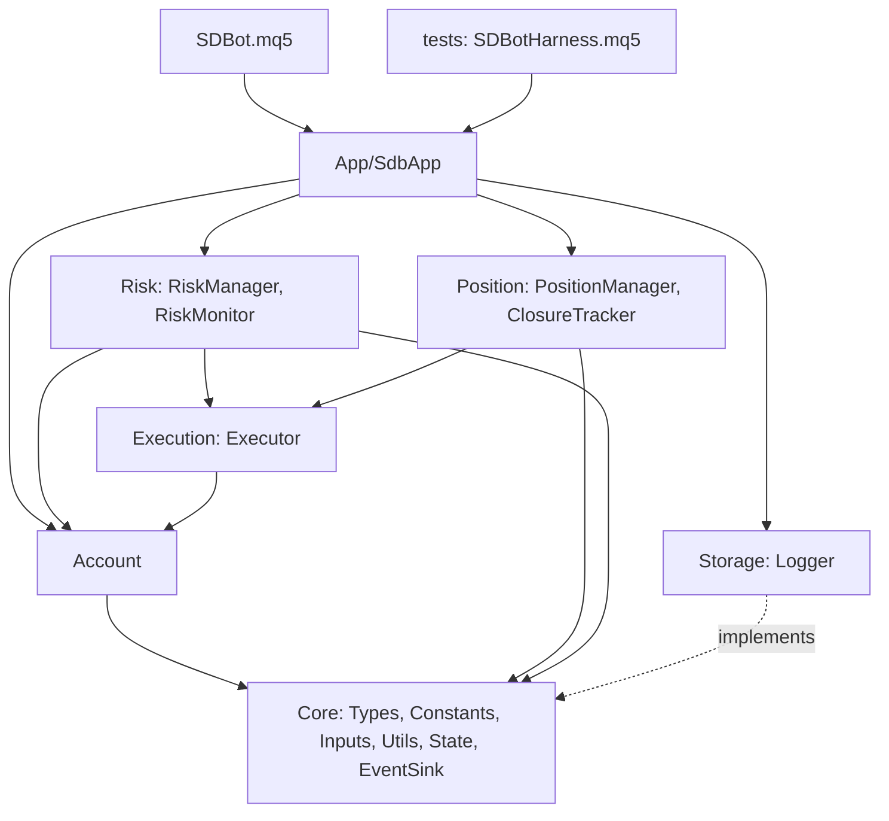

# Fase 1 — Fondasi EA: overview

Status: Draft
Sumber: PRD-EA (Roadmap Fase 1 dan bagian terkait), RULES, keputusan 2026-09-28

Dokumen ini adalah pintu masuk Fase 1. Isinya use case lengkap, lalu bagaimana use case itu dipecah jadi tujuh spec yang dikerjakan berurutan. Detail aturan (EARS), desain, dan task ada di masing-masing spec.

## 1. Tujuan dan batas

Fase 1 selesai jika fondasi pengaman EA terbukti bekerja di Strategy Tester: validasi akun, eksekusi order aman, BE/partial/trailing, batas risiko dan emergency stop, log SQLite, serta alat bantu build, uji, dan migrasi skema.

Di luar Fase 1: notifikasi Telegram dan push HP (Fase 2), analisis dan entry dari sinyal (Fase 3), filter berita/sesi/spread/eksposur (Fase 4), modul Control dan tabel backoffice (B1+). Di Fase 1, entry hanya berasal dari harness uji di Strategy Tester.

Konteks tetap: day trading (H4/H1/M15), EURUSDc, GBPUSDc, EURJPYc, GBPJPYc, akun cent Exness mode hedging, mata uang USC.

## 2. Aktor

| Aktor | Peran |
|---|---|
| Trader | Pemilik akun. Memasang EA, mengatur input, membuka emergency stop, melakukan deposit/penarikan |
| EA | Satu instance SDBot di satu chart pair |
| Broker | Server MT5: eksekusi order, menutup posisi di SL/TP, stop out |
| Developer | Menulis kode, menjalankan build, uji, backtest, dan perubahan skema |
| Backoffice | (Fase B) membaca `sdbot.sqlite`. Di Fase 1 hanya jadi alasan skema harus rapi dan stabil |

## 3. Use case

Setiap use case punya alur utama dan alur alternatif. Kolom "Spec" menunjukkan spec yang mewujudkannya.

| ID | Use case | Aktor | Spec |
|---|---|---|---|
| UC-01 | Menyiapkan lingkungan pengembangan (junction, build, runner uji) | Developer | 01 |
| UC-02 | Build dan menjalankan unit test | Developer | 01 |
| UC-03 | Memasang EA pertama kali di akun cent | Trader | 02, 03, 04 |
| UC-04 | Koneksi internet putus saat EA berjalan | EA | 02 |
| UC-05 | Mengubah skema database | Developer | 03 |
| UC-06 | Menjalankan backtest tanpa mencemari data live | Developer | 03, 07 |
| UC-07 | Membuka posisi dengan aman (harness di Fase 1, strategi di Fase 3) | EA, Broker | 04, 05 |
| UC-08 | Order ditolak broker | EA, Broker | 04 |
| UC-09 | Rugi harian mencapai batas | EA | 05 |
| UC-10 | Drawdown naik ke 10% lalu 15% | EA | 05 |
| UC-11 | Membuka emergency stop | Trader | 05 |
| UC-12 | Empat pair jalan bersamaan di satu akun | Trader, EA | 05 |
| UC-13 | Deposit atau penarikan | Trader | 05 |
| UC-14 | Posisi berjalan sampai BE, partial, trailing, lalu tertutup | EA, Broker | 06 |
| UC-15 | Posisi kena SL sebelum BE, atau ditutup manual | Broker, Trader | 06 |
| UC-16 | Restart atau update EA saat ada posisi terbuka | Trader, EA | 06, 05 |
| UC-17 | Optimasi parameter di Strategy Tester | Developer | 07 |
| UC-18 | Menyatakan Fase 1 selesai (regresi penuh) | Developer | 07 |
| UC-19 | Menganalisis hasil trading dan penolakan sinyal | Trader, Developer | 03, 07 |

### UC-01: Menyiapkan lingkungan pengembangan

- **Prasyarat**: repo ter-clone, MT5 terinstal dan login.
- **Alur utama**:
    1. Developer menjalankan `tools/link-mt5.ps1` dengan path folder data MT5.
    2. Skrip membuat junction folder EA dan folder uji di dalam `MQL5/`.
    3. Developer mengisi `tools/mt5-paths.local.json` (path MetaEditor, terminal uji). File ini tidak di-commit.
    4. Developer menjalankan `tools/build-ea.ps1`: EA kerangka compile 0 error 0 warning.
- **Alternatif**:
    - 2a. Junction sudah ada: dilewati tanpa menghapus apa pun.
    - 3a. Terminal uji terpisah belum ada: runner otomatis menampilkan langkah pemasangan dan keluar dengan kode "tidak dijalankan", bukan "lulus".
- **Hasil**: MetaEditor membaca kode langsung dari repo, dan build bisa dijalankan dari command line.

### UC-02: Build dan menjalankan unit test

- **Alur utama**:
    1. Developer (atau Claude) menulis test case baru, lalu menjalankan `tools/run-ea-tests.ps1 unit`.
    2. Skrip meng-compile, menjalankan EA runner di Strategy Tester terminal uji, lalu membaca file hasil.
    3. Output: daftar suite dengan PASS/FAIL per test case, dan kode keluar 0 jika semua lulus.
- **Alternatif**:
    - 2a. Compile gagal atau ada warning: skrip berhenti dan menampilkan baris error.
    - 2b. Tester tidak selesai dalam batas waktu: kode keluar gagal dengan pesan timeout.
    - 2c. Runner otomatis tidak tersedia: developer menjalankan script `RunUnitTests` di chart dan membaca tab Experts.
- **Hasil**: siklus TDD Red → Green bisa diulang dalam hitungan menit.

### UC-03: Memasang EA pertama kali di akun cent

- **Prasyarat**: MT5 login ke akun cent, EA sudah di-build.
- **Alur utama**:
    1. Trader memasang SDBot di chart EURUSDc dan memuat `.set` day trading dengan `InpAllowLiveTrading = true`.
    2. EA memvalidasi input, koneksi, tipe akun, mode margin hedging, dan simbol.
    3. EA membuka `sdbot.sqlite`, menerapkan migrasi yang belum ada, dan menyimpan baris akun.
    4. EA membaca status risiko akun dari Global Variables.
    5. EA siap. Log terminal mencatat inisialisasi tanpa error.
- **Alternatif**:
    - 2a. `InpAllowLiveTrading = false` di akun cent (terbaca real): EA berhenti dengan pesan CRITICAL.
    - 2b. Akun netting, atau simbol tidak ada: EA berhenti dan menyebut penyebabnya.
    - 2c. Input di luar batas: EA berhenti dan menyebut input serta batasnya.
    - 3a. DB terkunci atau migrasi gagal: EA tetap jalan tanpa DB, log ERROR.
    - 3b. DB berversi lebih baru dari yang dikenal EA (EA lama dipasang ulang): EA tidak menulis ke DB, log ERROR.
- **Hasil**: EA aktif, atau berhenti dengan alasan jelas tanpa mengirim order.

### UC-04: Koneksi internet putus

- **Alur utama**: terminal kehilangan koneksi. EA menahan entry. Setelah 5 menit, alert Medium dicatat. Koneksi pulih: alert Info, EA lanjut tanpa restart.
- **Catatan**: SL/TP tetap aman di server. BE, partial, dan trailing tertunda sampai koneksi pulih.

### UC-05: Mengubah skema database

- **Alur utama**:
    1. Developer menjalankan `python sdbot/tools/schema.py new data "tambah kolom x"`. Skrip membuat file migrasi bernomor berikutnya dari template.
    2. Developer menulis SQL perubahan di file itu.
    3. Developer menjalankan `schema.py build`. Skrip menerapkan semua migrasi ke DB kosong, lalu menghasilkan `Storage/Migrations.mqh`, snapshot `shared/schema/data_db.sql`, fixture DB, dan lock checksum.
    4. Commit memicu `schema.py check` di pre-commit.
    5. Saat EA baru dipasang, EA menerapkan migrasi baru itu sendiri ke `sdbot.sqlite`.
- **Alternatif**:
    - 2a. Developer mengedit migrasi yang sudah pernah dirilis: `check` gagal karena checksum berbeda dengan lock.
    - 3a. SQL tidak valid atau nilai CHECK enum tidak cocok dengan `enums.md`: `build` gagal dan tidak menghasilkan file apa pun.
    - 4a. File hasil generate diedit tangan atau tidak sinkron: `check` gagal.
- **Hasil**: skema berubah tanpa langkah manual di MT5 atau di DB, dan riwayatnya tercatat di `schema_migrations`.

### UC-06: Menjalankan backtest tanpa mencemari data live

- **Alur utama**:
    1. Developer menjalankan backtest EA (atau harness).
    2. EA mendeteksi `MQL_TESTER` dan menulis ke `sdbot_tester.sqlite`, bukan `sdbot.sqlite`.
    3. Setiap run tercatat di tabel `runs` (versi EA, simbol, periode, rentang tanggal, waktu mulai), dan semua baris run itu membawa `run_id`.
- **Alternatif**:
    - 2a. Optimasi (`MQL_OPTIMIZATION`): tidak ada penulisan DB sama sekali.
- **Hasil**: backoffice dan statistik live hanya membaca data live.

### UC-07: Membuka posisi dengan aman

- **Prasyarat**: tidak STOPPED, tidak pause, terkoneksi.
- **Alur utama**:
    1. Pemanggil (harness di Fase 1, strategi di Fase 3) membuat permintaan order: arah, SL, TP.
    2. Pre-trade check lolos: risiko per trade, total risiko terbuka, margin.
    3. Lot dihitung dari balance × risiko% ÷ nilai uang jarak SL, dibulatkan ke bawah.
    4. Executor memvalidasi SL/TP terhadap stops dan freeze level, lalu mengirim market order dengan magic, SL, TP, dan komentar SL awal.
    5. Order terisi. Harga isi, slippage, spread, dan risiko aktual dicatat.
- **Alternatif**:
    - 2a. Pre-trade check menolak: alasan dicatat, tidak ada order.
    - 3a. Lot di bawah minimum: ditolak, tidak dibulatkan ke atas.
    - 4a. SL terlalu dekat: ditolak sebelum dikirim.
- **Hasil**: posisi terbuka yang selalu punya SL dan TP, atau penolakan dengan alasan tercatat.

### UC-08: Order ditolak broker

- **Alur utama**: broker membalas requote atau harga berubah. Executor mencoba ulang maksimal 3 kali dengan harga baru.
- **Alternatif**: retcode permanen (volume invalid, pasar tutup) atau retry habis: log ERROR dengan retcode dan alert Medium, tanpa retry lagi.

### UC-09: Rugi harian mencapai batas

- **Alur utama**:
    1. Rugi realized + floating mencapai 3% dari balance saat pergantian hari server.
    2. EA menyetel pause harian dan mencatat alert High.
    3. Semua instance menolak entry baru. Posisi yang ada tetap dikelola.
    4. Hari server berganti: pause dicabut, balance saat itu jadi dasar hari baru.

### UC-10: Drawdown naik ke 10% lalu 15%

- **Alur utama**:
    1. Drawdown dari puncak equity 10%: risiko per trade dikali 0.5, alert High.
    2. Turun di bawah 8%: kembali normal, alert Info.
    3. Mencapai 15%: status STOPPED, semua posisi SDBot ditutup, alert Critical.
- **Alternatif**: 3a. Close gagal: diulang tiap 5 detik. Tiga kali gagal: alert Critical.

### UC-11: Membuka emergency stop

- **Alur utama**: trader mengevaluasi penyebab, mengubah `InpResetEmergencyStop = true`. EA re-init, membuka STOPPED, menyetel puncak equity ke equity saat ini, dan mengingatkan agar input dikembalikan ke `false`.

### UC-12: Empat pair jalan bersamaan di satu akun

- **Alur utama**: empat chart, masing-masing satu instance dengan MagicNumber berbeda. Semua berbagi status risiko lewat Global Variables. Pause atau STOPPED dari satu instance menghentikan entry semua instance pada detik berikutnya.
- **Alternatif**: 1a. Chart salah satu pair tertutup saat drawdown 15%: posisinya tetap ditutup instance lain (keputusan R2-1 di spec 05).

### UC-13: Deposit atau penarikan

- **Alur utama**: trader menarik 20% saldo. EA menurunkan puncak equity dan balance awal hari sebesar nominalnya, sehingga drawdown dan rugi harian tidak berubah.
- **Alternatif**: penarikan saat EA mati: diproses saat start dari history. Empat instance berjalan: tetap diproses tepat sekali.

### UC-14: Posisi berjalan sampai BE, partial, trailing, lalu tertutup

- **Alur utama**:
    1. Profit ≥ 1R: SL ke entry + spread + 2 point.
    2. Profit ≥ 1.5R: tutup 50% volume awal.
    3. Selama BE aktif: SL = harga − ATR(14, M15) × 2, maju minimal 5 point.
    4. Broker menutup sisa posisi di SL/TP. EA mencatat closure dengan alasan yang dibedakan: `TP`, `TRAIL_STOP` (SL kena setelah trailing aktif), `BE_STOP` (SL kena di titik impas), atau `SL` (SL awal), beserta R hasil, MFE, dan MAE dalam R.
- **Alternatif**: modify ditolak (retry 3x tiap 30 detik lalu alert), volume 0.01 (partial dilewati), harga dalam freeze level (ditunda).

### UC-15: Posisi kena SL sebelum BE, atau ditutup manual

- **Alur utama**: broker menutup di SL, atau trader menutup manual. EA mencatat closure dengan alasan `SL` atau `MANUAL`, R hasil, MFE, dan MAE.
- **Catatan**: MFE rendah (posisi tidak pernah profit) menandakan entry salah arah, bukan exit buruk. Pembedaan ini adalah pelajaran utama bot Python.

### UC-16: Restart atau update EA saat ada posisi terbuka

- **Alur utama**:
    1. EA di-compile ulang, atau MT5/PC restart.
    2. EA membaca Global Variables, mencatat closure yang terjadi saat EA mati, dan mencatat posisi yang belum ada di DB.
    3. Untuk setiap posisi: BE disimpulkan dari posisi SL, partial dari volume, R dari SL awal.
    4. Manajemen posisi lanjut tanpa mengulang BE atau partial. STOPPED tetap berlaku.
- **Alternatif**: SL awal tidak ada di komentar: diambil dari history order MT5, lalu dari DB. Tidak ditemukan sama sekali: BE dan partial dilewati untuk posisi itu, log ERROR sekali.

### UC-19: Menganalisis hasil trading dan penolakan sinyal

- **Alur utama**:
    1. Trader membuka `sdbot.sqlite` (DB Browser, nanti panel backoffice) atau menjalankan query di `tools/queries/`.
    2. Query standar menjawab: win rate, profit factor, expectancy dalam R per simbol dan per versi EA; distribusi alasan tutup (berapa banyak BE-stop yang menyimpan < 0.5R padahal MFE > 1R); MFE/MAE loser; alasan tolak sinyal terbanyak; performa per sesi input (`input_hash`).
- **Hasil**: keputusan tuning berdasarkan data, bukan asumsi (pelajaran bot Python: skor konfluensi ternyata tidak memprediksi profit).
- **Catatan**: Fase 1 menyiapkan skema dan query dasar. Sinyal baru terisi di Fase 3.

### UC-17: Optimasi parameter di Strategy Tester

- **Alur utama**: developer menjalankan optimasi. Tidak ada penulisan DB. Setiap pass mengembalikan metrik expectancy R ÷ max drawdown dari `OnTester`.

### UC-18: Menyatakan Fase 1 selesai

- **Alur utama**: semua suite unit test ALL PASS, skenario SC-01..08 PASS, checklist manual Fase 1 dicek, CHANGELOG dan diagram diperbarui, versi EA 1.0.

## 4. Dari use case ke spec

Spec dibagi menurut lapisan yang bisa dibangun dan diuji sendiri, berurutan dari yang tidak bergantung pada apa pun:

| Spec | Use case | Alasan urutan |
|---|---|---|
| 01 tooling | UC-01, UC-02 | Alat build dan uji harus ada sebelum kode pertama (TDD) |
| 02 core-account | UC-03 (validasi), UC-04 | Tipe, input, log, dan state dipakai semua modul |
| 03 storage-migrations | UC-03 (DB), UC-05, UC-06, UC-19 (skema) | Modul berikutnya mencatat event, jadi skema dan migrasi harus siap |
| 04 execution-harness | UC-07 (kirim order), UC-08 | Risk dan position butuh posisi sungguhan dari harness |
| 05 risk | UC-07 (lot, pre-trade), UC-09..13, UC-16 (STOPPED) | Butuh executor untuk close all |
| 06 position | UC-14, UC-15, UC-16 | Butuh executor dan status risiko |
| 07 integration | UC-06 (verifikasi), UC-17, UC-18, UC-19 (query dasar) | Penutup: metrik, preset, regresi penuh |

Requirement dari draft lama `ea-foundation` dipetakan ke spec baru lewat baris "Asal" di awal setiap `requirements.md`. Folder `ea-foundation` dihapus setelah spec 04–07 selesai ditulis.

## 5. Arsitektur bersama

Keputusan lintas spec (detail di design spec terkait):

1. **Terminal adalah sumber kebenaran.** Status posisi disimpulkan dari posisi dan history MT5; status akun di Global Variables; DB hanya log.
2. **`ISdbEventSink` di Core** (spec 02). Modul mencatat event lewat interface ini, tidak memanggil Storage. `CLogger` (spec 03) mengimplementasikannya. Di unit test, sink palsu menangkap event untuk di-assert.
3. **Folder `App/` untuk `CSdbApp`** (spec 04). Orkestrasi event dipakai bersama `SDBot.mq5` dan harness, sehingga yang diuji di tester sama dengan yang jalan live. RULES perlu tambahan satu lapisan.
4. **DB live dan tester terpisah** (spec 03): `sdbot.sqlite` hanya ditulis EA live, `sdbot_tester.sqlite` untuk backtest dengan `run_id`.

## 6. Strategi uji (TDD)

Berlaku untuk semua spec:

1. **Red**: test case dari katalog di design spec ditulis dulu. Fungsi dibuat sebagai stub yang mengembalikan nilai salah, lalu suite dijalankan dan test case baru harus FAIL.
2. **Green**: implementasi minimum sampai ALL PASS, compile 0 error 0 warning.
3. **Refactor**: rapikan sambil tetap ALL PASS.
4. Kelas yang menyentuh terminal diuji lewat skenario harness dengan assert otomatis (SC-xx), ditulis sebelum implementasinya.
5. Yang tidak bisa disimulasikan di tester masuk checklist manual (MC-xx).
6. Setiap bug baru dimulai dengan test case yang mereproduksinya.

Penamaan: `TC-<suite>-nn` unit test MQL5, `TS-nn` test Python untuk skrip skema, `SC-nn` skenario Strategy Tester, `MC-nn` uji manual. Katalog lengkap ada di `design.md` spec masing-masing.
