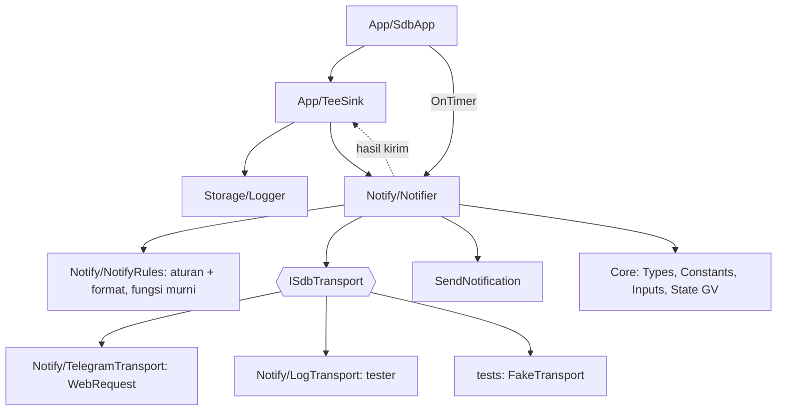

# Fase 2 — Notifikasi: overview

Status: Approved (2026-10-01)
Sumber: PRD-EA §Notifikasi, §Instalasi 3–4, §Roadmap Fase 2; keputusan PC-06; catatan Fase 2 di [README.md](README.md); `NotificationManager` bot Python (`packages/worker/src/trading_worker/utils/notification_manager.py`); [python-bot-lessons.md](python-bot-lessons.md) §2–3

Dokumen ini adalah pintu masuk Fase 2: use case, pembagian spec, arsitektur bersama, dan strategi uji. Detail aturan (EARS), desain, dan task ada di masing-masing spec.

## 1. Tujuan dan batas

Fase 2 selesai jika semua event di tabel notifikasi PRD terkirim sesuai aturannya (severity, cooldown, kuota, prioritas Critical, push HP saat Telegram gagal), heartbeat dan laporan harian berjalan, dan semua itu terbukti di Strategy Tester lewat transport palsu, ditambah uji manual ke Telegram sungguhan di akun cent.

Di luar Fase 2: perintah dari Telegram ke EA (EA hanya mengirim, tidak membaca pesan masuk), notifikasi sinyal dan penolakan sinyal (Fase 3–4, memakai jalur yang sama), panel dan kontrol dari backoffice (B1+), email.

Konteks tetap dari Fase 1: sampai 12 instance SDBot di satu akun cent (PC-10), status bersama di Global Variables akun, semua modul sudah mengirim `AlertEvent` lewat event sink, tabel `alerts` sudah punya `status` / `attempts` / `sent_at`. Telegram memakai bot dan chat yang sama dengan bot Python (PC-06).

## 2. Aktor

| Aktor | Peran |
|---|---|
| Trader | Menerima pesan di Telegram dan push di HP; mengisi token dan chat ID; mengizinkan URL WebRequest |
| EA | Satu instance SDBot; menghasilkan event dan mengirim pesan |
| Telegram Bot API | `https://api.telegram.org`, bot yang sama dengan bot Python |
| MetaQuotes push | `SendNotification` ke aplikasi MT5 di HP |
| Bot Python | Berbagi bot, chat, dan batas kirim Telegram yang sama |
| Developer | Menguji notifikasi di Strategy Tester dan memeriksa log |

## 3. Use case

Nomor melanjutkan Fase 1 (UC-01..19).

| ID | Use case | Aktor | Spec |
|---|---|---|---|
| UC-20 | Menerima alert risiko sesuai severity | Trader, EA | 08 |
| UC-21 | Menerima event trade (open, close, BE, partial, SL dipasang kembali) | Trader, EA | 08 |
| UC-22 | Banjir event: cooldown, kuota, pesan basi | EA | 08 |
| UC-23 | Restart EA saat ada pesan tertunda | EA | 08 |
| UC-24 | Backtest: notifikasi hanya di log dan bisa di-assert | Developer | 08 |
| UC-25 | Mengirim ke Telegram dengan aman (antrean di timer, rate limit bersama) | EA, Telegram, Bot Python | 09 |
| UC-26 | Telegram gagal: Critical lewat push HP | EA, MetaQuotes push | 09 |
| UC-27 | Konfigurasi salah: URL belum diizinkan, token atau chat ID salah | Trader, EA | 09 |
| UC-28 | Heartbeat, laporan harian, pesan start dan stop | Trader, EA | 09 |
| UC-29 | Mengisi kredensial dari `.env` bot Python | Trader | 09 |
| UC-30 | Menyatakan Fase 2 selesai | Developer | 09 |

### UC-20: Menerima alert risiko sesuai severity

- **Alur utama**:
    1. Modul (risk monitor, account, executor, position) mengirim `AlertEvent` lewat event sink, seperti di Fase 1.
    2. Notifier menerima event itu, memeriksa aturan kirim PRD (Critical langsung; High saat status berubah; Medium cooldown 5 menit per tipe; Info cooldown per tipe).
    3. Pesan lolos diformat (emoji level, penanda `SDBot` + simbol + tipe akun + versi, HTML ter-escape) lalu masuk antrean; Critical di depan antrean.
    4. Pengiriman terjadi di `OnTimer` berikutnya.
- **Alternatif**: event ditahan aturan → tidak masuk antrean, status `alerts` menjadi `SKIPPED` dengan alasannya di log.

### UC-21: Menerima event trade

- **Alur utama**: posisi dibuka (`TradeRecord`), BE, partial, SL dipasang kembali, posisi tutup (`ClosureRecord`) → satu pesan per event dengan simbol, arah, volume, harga, SL/TP, R hasil, profit dalam mata uang akun (USC), dan alasan tutup.
- **Alternatif**: posisi tutup profit → level SUCCESS ✅; rugi → level INFO dengan emoji rugi; SL dipasang kembali → High; tanpa SL setelah 3 gagal → Critical (PRD).

### UC-22: Banjir event

- **Alur utama**: banyak event non-Critical dalam waktu singkat (misalnya 12 instance kena DD bersamaan) → kuota 20 pesan per jam non-Critical dipatuhi, pesan non-Critical lebih tua dari 30 menit dibuang, Critical tetap lolos.
- **Alternatif**: kuota habis → pesan non-Critical berikutnya `SKIPPED`, satu ringkasan "N pesan ditahan" saat kuota pulih.

### UC-23: Restart EA saat ada pesan tertunda

- **Alur utama**: EA dimatikan dengan antrean berisi pesan → saat init berikutnya, baris `alerts` `PENDING` yang lebih tua dari 30 menit ditandai `SKIPPED`; Critical yang lebih muda dikirim ulang.

### UC-24: Backtest

- **Alur utama**: di Strategy Tester tidak ada `WebRequest`; pesan yang akan dikirim dicetak ke log tester dengan format akhirnya. Harness memakai transport palsu untuk meng-assert urutan dan isi pesan.
- **Alternatif**: mode optimasi → tidak ada notifikasi sama sekali (tidak ada log dan DB, seperti Fase 1).

### UC-25: Mengirim ke Telegram dengan aman

- **Alur utama**: di `OnTimer`, notifier mengambil paling banyak N pesan dari antrean, mengirim `sendMessage` (HTML, `disable_notification` untuk heartbeat) dengan timeout 3 detik, menjaga jarak kirim minimal 1 detik per chat yang dibagi semua instance SDBot di akun (Global Variable), lalu melaporkan hasilnya (`SENT`, `attempts`, `sent_at`).
- **Alternatif**: HTTP 429 → patuhi `retry_after`; gagal sementara (timeout, 5xx) → coba lagi di siklus timer berikutnya, maksimal 3 kali; pesan > 4096 karakter dipotong dengan penanda.

### UC-26: Telegram gagal

- **Alur utama**: pesan Critical gagal 3 kali ke Telegram → dikirim lewat `SendNotification` (teks polos, dipotong ke batas push) dan status `FAILED` dengan catatan push terkirim.
- **Alternatif**: push juga gagal (MetaQuotes ID belum diisi) → log CRITICAL sekali.

### UC-27: Konfigurasi salah

- **Alur utama**: token atau chat ID kosong → notifikasi Telegram nonaktif dengan satu WARN saat init; EA tetap trading.
- **Alternatif**: URL belum diizinkan (error 4014), token salah (401), chat salah (400 "chat not found") → error permanen, Telegram dinonaktifkan untuk sesi itu, satu push HP dan satu log CRITICAL, tidak diulang tiap detik.

### UC-28: Heartbeat, laporan harian, start dan stop

- **Alur utama**:
    1. Satu instance per akun (dipilih lewat Global Variable) mengirim heartbeat tiap `HeartbeatMinutes` (default 60) tanpa bunyi: balance, equity, drawdown dari puncak, posisi SDBot terbuka di akun, status (normal / pause / lot × 0.5 / STOPPED), jumlah instance hidup.
    2. Instance yang sama mengirim laporan harian saat hari server berganti: P&L hari sebelumnya, jumlah trade, win rate, total R, balance akhir.
    3. Setiap instance mengirim pesan start (🚀) saat init dan stop (🛑) saat deinit beserta alasannya.
- **Alternatif**: instance pemimpin dilepas (chart ditutup) → instance lain mengambil alih setelah lease habis, tanpa heartbeat ganda.

### UC-29: Mengisi kredensial dari `.env` bot Python

- **Alur utama**: trader menjalankan skrip di `sdbot/tools/` yang membaca `TELEGRAM_BOT_TOKEN` dan `TELEGRAM_CHAT_ID` dari `.env` bot Python dan membuat `SDBot_DAY_<SIMBOL>c.local.set` dari preset repo. File `*.local.set` diabaikan git.
- **Alternatif**: `.env` tidak ada atau nilai kosong → skrip berhenti dengan pesan jelas, tidak menulis file.

### UC-30: Menyatakan Fase 2 selesai

- **Alur utama**: semua suite ALL PASS, skenario Fase 1 dan Fase 2 PASS, checklist manual Telegram dicek di akun cent, PRD tabel notifikasi terpenuhi, CHANGELOG dan diagram alur diperbarui.

## 4. Dari use case ke spec

Fase 2 dibagi dua spec agar bagian yang bisa diuji penuh tanpa jaringan selesai dulu:

| # | Spec | Use case | Isi | Butuh | Bukti selesai | Versi |
|---|---|---|---|---|---|---|
| 8 | `ea-08-notifier-core` | UC-20..24 | `CNotifier`: terima event dari sink, aturan kirim (severity, cooldown, status berubah, kuota, pesan basi), antrean prioritas, format pesan (emoji, penanda, HTML escape, potong 4096), pesan event trade, status `alerts` lewat Logger, transport log di tester | 1–7 | suite NotifyRules ALL PASS; skenario SC-10 (urutan dan isi pesan dari event risiko dan trade) PASS | 1.07 |
| 9 | `ea-09-notifier-telegram` | UC-25..30 | Transport Telegram (`WebRequest`), klasifikasi respons (sukses, sementara, 429, permanen), rate limit bersama antar instance, push HP, heartbeat, laporan harian, start/stop, pemimpin per akun, skrip `.local.set`, DoD Fase 2 | 8 | suite TelegramRules ALL PASS; SC-11 (heartbeat dan laporan harian dari satu instance) PASS; pytest skrip kredensial; MC Telegram dicek | 1.08 |

Akibatnya nomor spec fase berikutnya bergeser satu: Fase 3 menjadi `ea-10`–`ea-12`, Fase 4 menjadi `ea-13-filters-news`.

## 5. Arsitektur bersama

Keputusan lintas spec (detail di design spec terkait):

1. **Notifier adalah sink.** `CNotifier` mengimplementasikan `ISdbEventSink` dan dipasang di `CTeeSink` di samping `CLogger`. Modul Fase 1 tidak berubah: alert, trade, dan closure yang sudah dikirim ke sink otomatis sampai ke notifier.
2. **Notifier tidak menulis DB.** Hasil kirim (`SENT`, `FAILED`, `SKIPPED`, `attempts`, `sent_at`) dilaporkan lewat event sink baru ke `CLogger`, sesuai aturan "hanya Storage yang menulis `sdbot.sqlite`".
3. **Transport di balik interface.** Hanya `Notify/` yang memanggil `WebRequest` dan `SendNotification` (RULES). Tester memakai transport log; unit test dan harness memakai transport palsu yang bisa diprogram (sukses, 429, timeout, 401).
4. **Kuota dan jarak kirim per akun.** Kuota non-Critical 20 per jam dan jarak 1 detik dihitung untuk semua instance SDBot di akun lewat Global Variables dengan compare-and-set, karena sampai 12 instance berbagi satu chat dan satu token dengan bot Python.
5. **Pemimpin per akun** (spec 09) untuk heartbeat dan laporan harian, dengan lease di Global Variable, agar 12 instance tidak mengirim 12 heartbeat.
6. **Satu siklus timer tidak boleh tertahan lama**: maksimal N pesan per `OnTimer` (N kecil, misalnya 2, karena `WebRequest` blocking hingga 3 detik), sisanya di siklus berikutnya. Risk monitor tetap jalan duluan di `OnTimer`.

Perubahan PRD yang mungkin muncul (dicatat sebagai PC baru setelah disetujui di requirements): kuota dan jarak kirim per akun, pemimpin per akun untuk heartbeat dan laporan harian, isi heartbeat dan laporan harian, nilai N per siklus timer.

## 6. Strategi uji (TDD)

Sama dengan Fase 1 (Red → Green → Refactor; skenario sebelum implementasi kelas yang menyentuh terminal; bug dimulai dengan test case). Tambahan untuk Fase 2:

1. **Fungsi murni dulu**: aturan kirim, format, escape, potong pesan, klasifikasi respons HTTP, parsing `retry_after`, pemilihan pemimpin, semuanya fungsi murni dengan waktu sebagai parameter (tidak memanggil `TimeCurrent` di dalamnya), sehingga cooldown dan kuota bisa diuji tanpa menunggu.
2. **Transport palsu** di harness: skenario SC-10/SC-11 memicu event nyata (DD, posisi buka/tutup, hari berganti) dan meng-assert pesan yang "terkirim" ke transport palsu.
3. **Tidak ada jaringan di uji otomatis.** Telegram sungguhan hanya di checklist manual (`MC-NT-xx`): pesan sampai, HTML tampil benar, URL belum diizinkan, token salah, push HP saat Telegram mati, heartbeat satu per akun dengan dua chart.
4. Skrip `.local.set` diuji pytest dengan `.env` palsu di folder sementara; tidak pernah membaca `.env` sungguhan.

Penamaan: `TC-NT-nn` (aturan dan format), `TC-TG-nn` (Telegram), `SC-10`, `SC-11`, `TS-nn` (pytest), `MC-NT-nn`.

## 7. Pertanyaan terbuka (diputuskan di requirements spec terkait)

1. Pesan start/stop: per instance tanpa bunyi (12 pesan saat MT5 restart), atau satu ringkasan per akun oleh pemimpin? Usulan: per instance tanpa bunyi, karena trader perlu tahu instance mana yang mati.
2. Posisi tutup rugi: level INFO (usulan, sesuai PRD "Open, close = Info") atau WARNING?
3. Pesan Critical `PENDING` yang lebih muda dari 30 menit saat restart: dikirim ulang (usulan) atau dibuang seperti non-Critical?
4. Laporan harian dihitung dari history deal MT5 (usulan, terminal sumber kebenaran) atau dari tabel `closures` (butuh baca DB dari Notify)?
