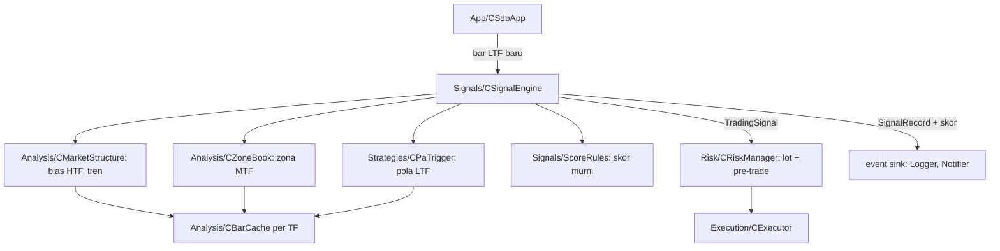

# Fase 3 — Strategi inti: overview

Status: Approved (2026-10-02)
Sumber: PRD-EA §Pipeline analisis (timeframe, alur, aturan zona, skor), §Eksekusi order, §Roadmap Fase 3, §Temuan review; [python-bot-lessons.md](python-bot-lessons.md) §1–2, §4; katalog parameter di [README.md](README.md#katalog-parameter-strategi-draf-difinalkan-di-spec-fase-3-dan-5)

Dokumen ini adalah pintu masuk Fase 3: use case, pembagian spec, arsitektur bersama, strategi uji, dan keputusan yang perlu diambil sebelum requirements. Fase ini membuat EA **membuka posisi sendiri untuk pertama kali**.

## 1. Tujuan dan batas

Fase 3 selesai jika pipeline inti berjalan dari bar LTF sampai order: bias HTF, zona Supply & Demand di MTF, trigger price action di LTF, skor, SL/TP dari zona, lalu eksekusi lewat jalur risiko Fase 1. Setiap kandidat sinyal, lolos maupun ditolak, tercatat dengan alasan dan skor per komponen. Backtest dasar berjalan untuk 12 simbol tanpa lapisan konfirmasi.

Di luar Fase 3:
- Filter berita, sesi, spread, dan eksposur mata uang (Fase 4). Pre-filter risiko yang sudah ada (STOPPED, pause harian, batas posisi, margin) tetap berlaku.
- Komponen skor konfirmasi Fibonacci, trendline, breakout-retest, RSI (Fase 5).
- Tuning ambang dan bobot (Fase 5–6, dari data yang dikumpulkan Fase 3).
- Gaya trading selain day trading. Kode menerima gaya dari input, tetapi hanya H4/H1/M15 yang diuji.

Konteks tetap: day trading (HTF H4, MTF H1, LTF M15), 12 simbol cent, satu instance per simbol, manajemen posisi dan risiko Fase 1, notifikasi Fase 2.

## 2. Aktor

| Aktor | Peran |
|---|---|
| EA | Satu instance per simbol: analisis tiap bar baru, sinyal, eksekusi |
| Broker | Harga, histori bar, eksekusi order |
| Trader | Memasang EA dengan preset, memantau sinyal dan posisi |
| Developer | Backtest, membaca telemetri sinyal, mengkalibrasi ambang |

## 3. Use case

Nomor melanjutkan Fase 2 (UC-20..30).

| ID | Use case | Aktor | Spec |
|---|---|---|---|
| UC-31 | Menentukan bias HTF dan keselarasan tren | EA | 10 |
| UC-32 | Mendeteksi zona S&D di MTF dan merawat statusnya | EA | 11 |
| UC-33 | Restart atau ganti chart: zona dibangun ulang dari histori, zona terpakai tetap terpakai | EA, Trader | 11 |
| UC-34 | Mengenali trigger price action di LTF | EA | 12 |
| UC-35 | Menghasilkan kandidat sinyal, menilai gerbang dan skor | EA | 13 |
| UC-36 | Menghitung entry, SL, TP dari zona dan membuka posisi | EA, Broker | 13 |
| UC-37 | Kandidat ditolak: alasan dan skor tercatat | EA | 13 |
| UC-38 | Backtest dasar dan analisis telemetri sinyal | Developer | 13 |
| UC-39 | Menyatakan Fase 3 selesai | Developer | 13 |

### UC-31: Menentukan bias HTF

- **Alur utama**: saat bar HTF baru tutup, EA menghitung struktur (swing dari Fractals berjeda, break of structure) dan EMA 50 di HTF. Bias = bullish atau bearish bila struktur dan EMA searah, netral bila tidak. Hasil disimpan di memori sampai bar HTF berikutnya.
- **Alternatif**: histori HTF kurang dari yang dibutuhkan (simbol baru, awal backtest) → bias netral dengan alasan "data kurang", bukan bias palsu.

### UC-32: Mendeteksi zona S&D

- **Alur utama**: saat bar MTF baru tutup, EA mencari pola zona (base sebelum impuls) dari swing terkonfirmasi, memberi status Fresh, lalu memperbarui status zona yang ada: Tested (1 sentuhan), Invalid (ditembus close), kedaluwarsa (lebih dari 100 bar MTF), Used (sudah dipakai entry).
- **Alternatif**: zona terlalu sempit atau terlalu lebar terhadap ATR → tidak dipakai; zona tumpang tindih → digabung atau yang lama diutamakan (keputusan di spec 11).

### UC-33: Restart atau ganti chart

- **Alur utama**: saat init, zona dibangun ulang dari histori MTF (tidak dari DB, agar backtest tidak bocor). Zona yang sudah menghasilkan entry dikenali dari history deal MT5 instance itu, sehingga tetap Used setelah restart.
- **Alternatif**: histori belum lengkap saat terminal baru start → analisis ditunda sampai bar tersedia, entry ditahan.

### UC-34: Trigger price action

- **Alur utama**: saat bar LTF tutup di dalam atau menyentuh zona searah bias, EA memeriksa pola candle terarah (engulfing, pin bar, dan pola lain dari daftar) dari yang paling spesifik ke yang netral, lalu memberi kekuatan pola.
- **Alternatif**: tidak ada pola → kandidat ditolak `NO_PA_TRIGGER` (gerbang wajib PRD; pelajaran bot Python: ~45% candle tanpa pola, jadi frekuensinya wajib terukur).

### UC-35: Kandidat sinyal, gerbang, skor

- **Alur utama**: tiap bar LTF baru, setelah pre-filter risiko, EA menilai tiga gerbang (bias, zona valid searah, trigger) lalu skor konfluensi dari komponen yang ada. Lolos ambang → eksekusi.
- **Alternatif**: gagal gerbang atau skor → tolak dengan alasan; kandidat tetap tercatat.

### UC-36: Entry, SL, TP, eksekusi

- **Alur utama**: entry = harga saat ini (market) atau batas dekat zona (limit, opsi input); SL = batas jauh zona + buffer; TP = zona lawan terdekat; R:R ≥ 2 dan jarak SL valid; lot dan pre-trade check lewat `CRiskManager`; order lewat `CExecutor` dengan `signal_id`; zona menjadi Used.
- **Alternatif**: tidak ada zona lawan → TP dari R:R minimum (keputusan di spec 13); R:R < 2 → `RR_TOO_LOW`; SL terlalu dekat → `SL_TOO_CLOSE`; lot di bawah minimum → `LOT_BELOW_MIN` (Fase 1).

### UC-37: Kandidat ditolak

- **Alur utama**: setiap kandidat yang ditolak tercatat di `signals` dengan `reject_stage`, detail, spread, dan skor per komponen di `signal_scores` sejauh sudah dihitung.

### UC-38: Backtest dasar dan telemetri

- **Alur utama**: developer menjalankan backtest per simbol, lalu query analisis membaca `signals`/`signal_scores`/`trades`/`closures`: distribusi alasan tolak per gerbang, skor vs hasil, frekuensi trigger, hasil per zona Fresh/Tested.

### UC-39: Fase 3 selesai

- **Alur utama**: semua suite dan skenario PASS, backtest dasar 12 simbol berjalan tanpa error kritis dan menghasilkan trade serta telemetri, query kalibrasi tersedia, checklist manual Fase 3 (posisi sungguhan di akun cent) bisa dimulai.

## 4. Dari use case ke spec

Dibagi empat spec menurut lapisan yang bisa diuji sendiri dengan data histori tetap:

| # | Spec | Use case | Isi | Butuh | Bukti selesai | Versi |
|---|---|---|---|---|---|---|
| 10 | `ea-10-market-structure` | UC-31 | Cache bar per TF (hitung ulang hanya saat bar baru), swing dari Fractals berjeda, BOS, EMA, bias HTF, komponen skor keselarasan tren | 1–9 | suite StructureRules ALL PASS; SC-12 (bias di tester = bias dihitung ulang dari histori, tanpa repaint) | 1.09 |
| 11 | `ea-11-zones` | UC-32, UC-33 | Deteksi zona MTF, status Fresh/Tested/Invalid/Used/kedaluwarsa, ukuran zona relatif ATR, ID zona deterministik, rebuild saat init, Used dari history deal, komponen skor kualitas zona | 10 | suite ZoneRules ALL PASS; SC-13 (zona sama antara jalan terus dan restart di tengah run) | 1.10 |
| 12 | `ea-12-pa-trigger` | UC-34 | Detektor pola candle LTF berurutan spesifik → netral, kekuatan pola, aturan khusus logam/crypto bila perlu, komponen skor PA | 10 | suite PatternRules ALL PASS (kasus nyata dari data bar, termasuk kasus bug urutan bot Python) | 1.11 |
| 13 | `ea-13-signal-entry` | UC-35..39 | Pipeline per bar LTF, gerbang, skor, `signals` + `signal_scores`, SL/TP dari zona, R:R, mode market/limit, `signal_id` di trade, zona Used, query kalibrasi, EA utama mulai membuka posisi, DoD Fase 3 | 10–12 | suite SignalRules ALL PASS; SC-14 (sinyal → posisi → closure lengkap dengan `signal_id`); backtest dasar 12 simbol | 1.12 |

Akibatnya Fase 4 (filter) menjadi `ea-14-filters-news`.

## 5. Arsitektur bersama

Keputusan lintas spec (detail di design spec terkait):

1. **Hanya bar tertutup** (shift ≥ 1) dan hitung ulang per TF hanya saat bar TF itu baru (PRD). Tidak ada indikator repaint (ZigZag); swing dari Fractals dengan jeda bar.
2. **Fungsi murni di atas array bar** (`MqlRates[]`), sehingga deteksi swing, bias, zona, dan pola diuji dengan data tetap, dan kelas yang membaca terminal hanya menyalin bar.
3. **ID zona deterministik** (MTF + waktu candle base + jenis), sama antara jalan terus dan rebuild setelah restart. Status Used disimpulkan dari history deal MT5 instance itu (terminal sumber kebenaran), bukan dari DB.
4. **Satu catatan per kandidat**, bukan per bar: kandidat = bar LTF tutup yang menyentuh zona valid searah bias (atau, untuk menghitung frekuensi gerbang, bar dengan bias tapi tanpa zona dicatat secara agregat). Detailnya diputuskan di requirements spec 13, agar tabel `signals` tidak berisi 96 baris per hari per simbol tanpa nilai analisis.
5. **Komponen skor wajib terbukti terpanggil** di pipeline lewat uji (pelajaran: layer breakout bot Python tidak pernah dipanggil).
6. **Harness tetap ada** untuk uji Fase 1–2; EA utama baru memanggil pipeline di spec 13.

## 6. Strategi uji

Sama dengan Fase 1–2 (Red → Green; skenario sebelum kelas yang menyentuh terminal; bug dimulai dari test case). Tambahan:

1. **Data bar tetap untuk unit test**: potongan `MqlRates` kecil yang ditulis di suite (dan beberapa disalin dari histori nyata EURUSDc/XAUUSDc/USDJPYc), dengan hasil yang dihitung tangan.
2. **Tanpa repaint**: skenario membandingkan hasil analisis yang dihitung bar demi bar selama run dengan hasil rebuild dari histori di akhir run; harus identik.
3. **Telemetri sebagai uji**: skenario sinyal memeriksa setiap trade punya `signal_id`, setiap kandidat punya baris `signals`, dan setiap komponen skor muncul di `signal_scores`.
4. **Backtest dasar bukan uji lulus/gagal profit**: Fase 3 menilai kebenaran pipeline dan kelengkapan data. Kriteria profit PRD (PF ≥ 1.3, DD ≤ 15%, ≥ 300 trade) dinilai di Fase 5–6.

Penamaan: `TC-MS-nn` (struktur), `TC-ZN-nn` (zona), `TC-PA-nn` (pola), `TC-SG-nn` (sinyal), `SC-12..14`, `MC-PS-*` dan `MC-SG-*` untuk checklist manual.

## 7. Keputusan yang perlu diambil

Usulan saya dalam kurung; finalnya di requirements spec terkait.

1. **Ambang skor di Fase 3.** Komponen yang ada hanya zona (30), tren (15), dan PA (10), jadi skor maksimal 55 dan ambang 65 tidak pernah tercapai. Usulan: di Fase 3 skor dicatat lengkap tetapi **gerbang skor memakai ambang yang dinormalkan ke komponen aktif** (65% dari 55 ≈ 36), lewat input `InpMinConfluenceScore` yang diartikan sebagai persen dari maksimum aktif. Alternatif: gerbang skor dimatikan sampai Fase 5 (hanya tiga gerbang wajib).
2. **Kriteria "backtest dasar lolos" (Roadmap Fase 3).** Usulan: backtest 12 simbol × 12 bulan terakhir berjalan tanpa error kritis, menghasilkan ≥ 30 trade per simbol dengan `signal_id` lengkap, dan semua query kalibrasi menghasilkan data. Profit belum menjadi syarat.
3. **Angka yang PRD belum tentukan** (katalog README, "perlu keputusan"): ukuran zona minimum/maksimum, buffer SL di luar zona, jarak SL minimum/maksimum per simbol, filter candle klimaks. Usulan: semuanya relatif ATR MTF (bukan pip), sebagai input dengan default dari distribusi histori 12 simbol yang saya ukur saat requirements spec 11 dan 13; filter klimaks ditunda ke Fase 5.
4. **TP bila tidak ada zona lawan** dalam jangkauan. Usulan: TP = entry ± `MinRR` × risiko (2R), dicatat di `context_json`, agar sinyal tidak hilang hanya karena peta zona kosong.
5. **Empat spec** (10 struktur, 11 zona, 12 pola, 13 sinyal+entry) alih-alih tiga di README lama, karena zona adalah bagian terbesar dan paling rawan bug; nomor Fase 4 bergeser menjadi `ea-14`.
