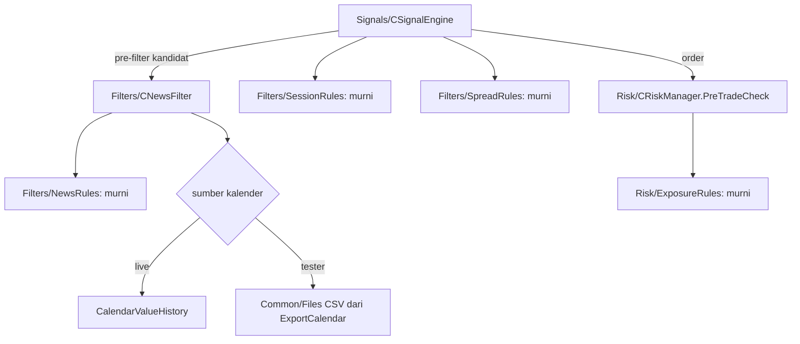

# Fase 4 — Filter: overview

Status: Done (2026-10-05)
Sumber: PRD-EA §Pipeline analisis (pre-filter), §Risk management (eksposur per mata uang), §Parameter input EA (`MaxSpreadPoints`, `NewsBlockMinutes`, `TradingSessions`), §Roadmap Fase 4; [python-bot-lessons.md](python-bot-lessons.md) §2–3; catatan Fase 4 di [README.md](README.md#fase-4--filter-spec-ea-14-filters-news); backtest dasar Fase 3 (12 simbol, 2025-10..2026-10)

Fase 4 menambahkan empat filter PRD di depan entry Fase 3: sesi trading, spread, eksposur mata uang, dan berita. Setiap penolakan tercatat di `signals` dengan alasan, sehingga efek tiap filter terukur.

## 1. Tujuan dan batas

Fase 4 selesai jika (PRD Roadmap): keempat filter berjalan di EA utama dan tester, setiap kandidat yang diblokir tercatat di `signals` dengan `reject_stage` dan detail, dan backtest dasar 12 simbol tetap berjalan tanpa error kritis dengan filter aktif.

Di luar Fase 4:
- komponen skor konfirmasi (Fase 5);
- modifier kepercayaan dari hasil rilis berita (surprise), sama dengan urutan bot Python;
- filter candle klimaks (keputusan PC-15: Fase 5);
- tuning ambang dari data live (Fase 6).

## 2. Ukuran dari backtest dasar Fase 3 (tanpa filter)

351 trade, 12 simbol, 12 bulan, OHLC M1. Waktu = waktu buka bar M15 (UTC).

| Sesi (UTC, batas bot Python) | Trade | Win | Expectancy |
|---|---|---|---|
| Tokyo 00:00–08:00 | 87 | 48% | +0,012R |
| London 08:00–13:00 | 74 | 50% | −0,015R |
| Overlap London–NY 13:00–17:00 | 110 | 56% | **+0,105R** |
| New York 17:00–22:00 | 61 | 51% | +0,055R |
| Di luar sesi 22:00–24:00 (rollover) | 19 | 32% | **−0,329R** |

- **Sesi:** jam 22:00–24:00 UTC (rollover, spread lebar) paling buruk. Filter PRD "London + New York" (08:00–22:00) menyisakan sekitar 245 dari 351 trade dengan expectancy sekitar +0,06R.
- **Eksposur:** sampai 4 posisi searah USD terbuka bersamaan. Aturan PRD "maks 2 posisi searah per mata uang" akan menolak 22 dari 351 entry.
- **Spread:** di tester, spread kandidat hampir tetap per simbol (p50 = p90), dengan lonjakan sesekali (maks 10–30× p50). Spread tester tidak mewakili spread live, jadi default `MaxSpreadPoints` harus dari data live (keputusan 3).

## 3. Use case

Nomor melanjutkan Fase 3 (UC-31..39).

| ID | Use case | Aktor | Spec |
|---|---|---|---|
| UC-40 | Entry hanya di sesi trading yang diizinkan | EA, Trader | 14 |
| UC-41 | Kandidat ditolak saat spread melebar | EA | 14 |
| UC-42 | Membatasi posisi searah per mata uang di akun | EA | 15 |
| UC-43 | Memblokir entry di sekitar berita berdampak | EA | 16 |
| UC-44 | Menyiapkan kalender historis untuk backtest | Developer | 16 |
| UC-45 | Kalender tidak tersedia: entry tetap jalan, operator diberi tahu | EA, Trader | 16 |
| UC-46 | Mengukur efek tiap filter dan menyatakan Fase 4 selesai | Developer | 14–16 |

### UC-40: Sesi trading

- **Alur utama:** kandidat yang bar-nya di luar sesi yang diizinkan input `TradingSessions` ditolak `OUTSIDE_SESSION`. Jam sesi dalam UTC, dikonversi dari waktu server dengan selisih server–UTC yang sudah dicatat EA.
- **Alternatif:** selisih waktu server berubah (pergantian DST broker) → batas sesi tetap benar dalam UTC.

### UC-41: Spread

- **Alur utama:** saat kandidat dinilai, spread saat itu (point) dibandingkan `MaxSpreadPoints` simbol; lebih lebar → `SPREAD_TOO_WIDE`, dengan spread dan batasnya di detail.
- **Alternatif:** preset tanpa batas (0) → filter mati untuk simbol itu.

### UC-42: Eksposur mata uang

- **Alur utama:** pre-trade check menghitung posisi SDBot terbuka di akun per mata uang **dengan arah** (BUY EURUSD = long EUR + short USD; XAU/BTC = mata uang dasar vs USD). Order yang membuat suatu mata uang punya lebih dari 2 posisi searah ditolak `CURRENCY_EXPOSURE`.
- **Alternatif:** posisi lawan arah tidak dihitung bersama (long USD dan short USD dihitung terpisah).

### UC-43: Berita

- **Alur utama:** EA membaca kalender MT5 (`CalendarValueHistory`). Kandidat untuk simbol yang mata uangnya punya berita berdampak dalam jendela blackout ditolak `NEWS_BLACKOUT`, dengan nama event dan menit ke/dari rilis.
- **Alternatif:** trade yang lolos menyimpan event terdekat di konteks sinyal.

### UC-44: Kalender historis

- **Alur utama:** developer menjalankan script `ExportCalendar` di terminal live; kalender 12+ bulan ditulis ke CSV di Common\Files. Di tester, filter berita membaca CSV itu, hanya event dengan waktu ≤ waktu bar (tanpa lookahead).

### UC-45: Kalender tidak tersedia

- **Alur utama:** kalender gagal dibaca (terminal belum sinkron, CSV tidak ada di tester) → entry tidak diblokir, satu alert "proteksi berita OFF" per sesi EA, dan kandidat mencatat bahwa berita tidak diperiksa (pelajaran bot Python: degrade aman tapi terlihat).

### UC-46: Efek filter dan Fase 4 selesai

- **Alur utama:** backtest dasar dijalankan ulang setelah tiap spec; query `signal_rejects.sql` menunjukkan frekuensi tiap tahap baru, dan laporan membandingkan expectancy sebelum dan sesudah filter.

## 4. Dari use case ke spec

| # | Spec | Use case | Isi | Butuh | Bukti selesai | Versi |
|---|---|---|---|---|---|---|
| 14 | `ea-14-session-spread` | UC-40, 41, 46 | Lapisan Filters, filter sesi (UTC) dan spread per simbol, input, preset, tahap tolak di pipeline | 13 | suite FilterRules ALL PASS; SC-15 (kandidat di luar sesi dan spread lebar ditolak dengan alasan) | 1.15 |
| 15 | `ea-15-currency-exposure` | UC-42, 46 | Eksposur per mata uang dengan arah, langkah `CURRENCY_EXPOSURE` di pre-trade check | 13 | suite ExposureRules ALL PASS (termasuk SELL dan pair JPY, bug bot Python); SC-16 | 1.16 |
| 16 | `ea-16-news` | UC-43..46 | Kalender live, script `ExportCalendar` + CSV tester, blackout per dampak, pemetaan mata uang, degrade aman + alert, telemetri, DoD Fase 4 | 14 | suite NewsRules ALL PASS; SC-17 (blackout dari CSV tanpa lookahead); backtest dasar dengan semua filter | 1.17 |

Urutan dari yang paling sederhana dan paling berpengaruh (sesi) ke yang paling banyak bagian bergeraknya (berita).

## 5. Arsitektur bersama

Keputusan lintas spec:

1. **Lapisan baru `Filters/`** (RULES sudah menyediakan folder). Aturan murni (sesi, spread, berita) diuji tanpa terminal. Kelas tipis hanya membaca waktu, spread, dan kalender.
2. **Urutan pre-filter kandidat:** STOPPED → pause harian → tidak bisa trading → `NEWS_BLACKOUT` → `OUTSIDE_SESSION` → `SPREAD_TOO_WIDE` → `POSITION_OPEN` → trigger PA → skor → SL/TP. Filter murah dan pasti di depan, sesuai PRD "pre-filter dulu".
3. **Eksposur di pre-trade check**, di antara batas kategori dan margin (urutan PRD), karena butuh arah order dan posisi akun, bukan sifat bar.
4. **Waktu sesi dan berita dalam UTC** lewat selisih server–UTC yang sudah dihitung EA (`accounts.server_utc_offset_sec`), sehingga tidak bergantung zona waktu broker.

## 6. Strategi uji

Sama dengan Fase 3 (Red → Green; skenario untuk yang menyentuh terminal; bug dimulai dari test case). Tambahan:
1. **Tanpa lookahead:** suite dan skenario berita memastikan event setelah waktu bar tidak terbaca.
2. **Arah eksposur:** kasus BUY/SELL, pair JPY, dan XAU/BTC (pelajaran bot Python: SELL pernah dihitung terbalik).
3. **Efek terukur:** setiap spec diakhiri backtest dasar (`-Baseline`) dan perbandingan sebelum/sesudah per simbol. Backtest dijalankan dengan beban CPU dibatasi (tester MT5 satu agen).

Penamaan: `TC-FL-nn` (sesi/spread), `TC-EXP-nn` (eksposur), `TC-NW-nn` (berita), `SC-15..17`, `MC-NW-*` untuk cek manual kalender live.

## 7. Keputusan yang perlu diambil

Usulan saya dalam kurung; finalnya di requirements spec terkait.

1. **Tiga spec** (sesi + spread, eksposur, berita) alih-alih satu `ea-14-filters-news` seperti di README lama. Berita paling banyak bagian bergeraknya (kalender, CSV, script, degrade), jadi dipisah agar sesi dan eksposur bisa lebih dulu dipakai.
2. **Sesi default London + New York, 08:00–22:00 UTC** (PRD; batas jam dari bot Python), dengan input yang bisa menambah Tokyo. Data: jam 22–24 UTC −0,33R; Tokyo sekitar impas; trade turun sekitar 30% (351 → ~245 per tahun). Alternatif: hanya blokir 22:00–24:00 UTC (trade turun ~5%).
3. **Default `MaxSpreadPoints` dari data spread live**, bukan dari tester. Yang dipakai: kolom `signals.spread_points` dan `trades.spread_points` dari EA di akun cent bila sudah ada; bila belum, `max_spread_pips` bot Python dikonversi ke point (misalnya EURUSD 3 pip = 30 point). Diukur di requirements spec 14.
4. **Eksposur maks 2 posisi searah per mata uang** (PRD), dihitung atas semua posisi SDBot di akun. XAU/XAG/BTC dihitung sebagai mata uang sendiri vs USD. Input `MaxSameDirectionPerCurrency` (default 2).
5. **Blackout berita:** high ±30 menit (PRD), medium ±10 menit, low tidak diblokir (pelajaran bot Python), lewat input. Event dipetakan ke mata uang simbol (EURUSD → EUR, USD; XAUUSD → USD).
6. **Kalender tester dari CSV** yang dibuat `ExportCalendar` di terminal live (PRD). Tanpa CSV di tester → filter berita mati + satu alert, bukan run gagal.
