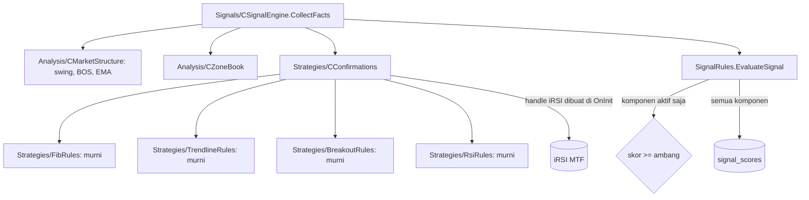

# Fase 5 — Konfirmasi: overview

Status: Approved (2026-10-05)
Sumber: PRD-EA §Skor konfluensi, §Pengujian dan kriteria penerimaan (tahap 2–3), §Roadmap Fase 5, §Temuan review (mode entry Adaptive); [python-bot-lessons.md](python-bot-lessons.md) §1; PC-15 (filter candle klimaks ke Fase 5); backtest dasar v1.18 (12 simbol, 2025-10..2026-10, OHLC M1, sesi DB 868–879)

Fase 5 menambahkan empat komponen skor konfirmasi PRD: Fibonacci (15), trendline (15), breakout & retest (10), dan RSI divergence (5). PRD meminta komponen ditambah satu per satu, dan masing-masing harus terbukti memperbaiki hasil forward test. Karena itu setiap komponen lebih dulu dicatat tanpa memengaruhi entry (mode bayangan), lalu diaktifkan hanya bila data out-of-sample mendukung.

## 1. Tujuan dan batas

Fase 5 selesai jika (PRD Roadmap):
- keempat komponen dihitung untuk setiap kandidat dan tercatat di `signal_scores`;
- setiap komponen punya keputusan aktif/bayangan yang didukung perbandingan in-sample vs out-of-sample;
- backtest dengan komponen aktif tidak lebih buruk dari backtest tanpa komponen pada periode out-of-sample.

Di luar Fase 5:
- tuning exit (BE, partial, trailing); pelajaran bot Python: tuning exit tidak menolong selama entry belum terbukti;
- validasi live akun cent (Fase 6);
- volume profile, filter AI (Fase 7).

## 2. Ukuran dari backtest dasar v1.18

248 trade, 12 simbol, 12 bulan, OHLC M1, semua filter Fase 4. Win rate 50%, rata-rata +0,016R per trade, total +3,86R. Profit factor sekitar 1,03, jauh dari target PRD 1,3.

| Pengukuran | Hasil | Arti untuk Fase 5 |
|---|---|---|
| Skor total (35–55) vs R | Semua bucket sekitar impas (−0,07R s.d. +0,04R) | Sama seperti bot Python: skor tidak memprediksi profit. Menambah komponen ke skor tanpa bukti hanya mengubah jumlah trade |
| Zona Fresh vs Tested | Fresh +0,065R (171 trade), Tested −0,093R (77) | Kualitas zona adalah satu-satunya komponen Fase 3 yang membedakan |
| Tren MTF searah penuh (15) vs tidak (0) | 15: −0,039R (187); 0: +0,396R (25) | Bobot tren PRD justru berlawanan dengan data (sampel kecil). Perlu dicek ulang di out-of-sample sebelum mengubah apa pun |
| Kekuatan PA 10 / 7 / 3 | +0,05 / +0,03 / −0,03R | Lemah |
| Loser dengan MFE ≥ 0,3R | 61 dari 123 | Separuh loser sempat untung; separuh lagi langsung salah arah |
| Alasan tutup | SL 123, trailing 73, TP 26, BE-stop 26 | — |

Kesimpulan: masalah utama ada di **pemilihan entry**, bukan pada jumlah komponen. Fase 5 harus mengukur daya pembeda tiap komponen sebelum memberinya bobot.

## 3. Use case

Nomor melanjutkan Fase 4 (UC-40..46).

| ID | Use case | Aktor | Spec |
|---|---|---|---|
| UC-50 | Membagi data menjadi in-sample dan out-of-sample, menjalankan keduanya dengan real ticks | Developer | 17 |
| UC-51 | Menilai daya pembeda satu komponen skor dari data kandidat | Developer | 17 |
| UC-52 | Melaporkan profit factor, drawdown, dan expectancy per periode | Developer | 17 |
| UC-53 | Skor Fibonacci dari level retracement terdekat | EA | 18 |
| UC-54 | Skor trendline searah sinyal | EA | 19 |
| UC-55 | Skor breakout & retest | EA | 20 |
| UC-56 | Skor RSI divergence | EA | 21 |
| UC-57 | Mengaktifkan komponen yang terbukti dan menyetel ulang ambang | Developer, Trader | 22 |

### UC-50: In-sample dan out-of-sample

- **Alur utama:** developer menjalankan backtest pada periode in-sample (misalnya 2025-10..2026-06) untuk mengembangkan dan menyetel, lalu sekali pada out-of-sample (2026-07..2026-10) yang tidak pernah dipakai menyetel. Model real ticks (spread asli akun cent).
- **Alternatif:** histori real ticks server cent tidak cukup panjang → periode in-sample dipendekkan, dicatat di laporan.

### UC-51: Daya pembeda komponen

- **Alur utama:** laporan mengelompokkan trade per nilai komponen (misalnya Fibonacci 0 / 8 / 15) dan menampilkan jumlah, win rate, dan R per trade, terpisah untuk in-sample dan out-of-sample. Komponen bayangan dinilai dengan cara yang sama.
- **Alternatif:** sampel per kelompok < 20 trade → ditandai "sampel kecil", tidak dipakai untuk keputusan.

### UC-53..56: Komponen konfirmasi

- **Alur utama:** untuk setiap kandidat, komponen dihitung dari bar tertutup MTF/HTF (tanpa repaint, tanpa lookahead) dan dicatat di `signal_scores` dengan detail di konteks sinyal.
- **Mode bayangan (default):** nilai dicatat tetapi tidak dijumlahkan ke skor gerbang, sehingga entry tidak berubah dan efeknya bisa diukur pada kandidat yang sama.
- **Mode aktif:** nilai ikut skor gerbang; maksimum skor bertambah sesuai komponen aktif (PRD: persen dari maksimum komponen aktif).

### UC-57: Aktivasi dan ambang

- **Alur utama:** komponen yang membedakan hasil di in-sample **dan** out-of-sample diaktifkan; ambang `MinConfluenceScore` disetel ulang dari in-sample lalu dicek di out-of-sample.
- **Alternatif:** tidak ada komponen yang terbukti → semua tetap bayangan, dan keputusan ini dicatat. Fase 5 tetap dianggap selesai karena PRD hanya meminta komponen yang terbukti saja yang dipakai.

## 4. Dari use case ke spec

| # | Spec | Use case | Isi | Butuh | Bukti selesai | Versi |
|---|---|---|---|---|---|---|
| 17 | `ea-17-validation-harness` | UC-50..52 | Runner `-Baseline` dengan periode IS/OOS dan real ticks; laporan PF, DD, expectancy; laporan per nilai komponen; cek kedalaman histori real ticks | 16 | pytest laporan; satu run IS + OOS untuk v1.18 sebagai acuan | 1.19 (alat) |
| 18 | `ea-18-fibonacci` | UC-53 | Swing impuls MTF, level 0.382 / 0.5 / 0.618 / 0.786, skor dari level **terdekat** dengan pengurangan jarak; komponen `FIB` bayangan | 17 | suite FibRules ALL PASS; laporan komponen IS/OOS | 1.20 |
| 19 | `ea-19-trendline` | UC-54 | Trendline dari swing terkonfirmasi, **kemiringan wajib searah sinyal**, 2 / 3+ sentuhan; komponen `TRENDLINE` bayangan | 17 | suite TrendlineRules ALL PASS (termasuk kasus garis melawan tren); laporan IS/OOS | 1.21 |
| 20 | `ea-20-breakout-retest` | UC-55 | Level yang ditembus close lalu diuji ulang searah sinyal; komponen `BREAKOUT` bayangan; uji bahwa komponen benar-benar terhubung ke pipeline | 17 | suite BreakoutRules ALL PASS; laporan IS/OOS | 1.22 |
| 21 | `ea-21-rsi-divergence` | UC-56 | Divergence harga vs RSI(14) dari swing terkonfirmasi, hanya skor (bukan gerbang); komponen `RSI` bayangan | 17 | suite RsiRules ALL PASS; laporan IS/OOS | 1.23 |
| 22 | `ea-22-score-calibration` | UC-57 | Aktivasi komponen terbukti, ambang baru, preset; DoD Fase 5 | 18–21 | backtest IS + OOS dengan konfigurasi akhir ≥ acuan v1.18 di OOS | 1.24 |

Urutan: alat ukur dulu (17), karena tanpa IS/OOS dan PF/DD tidak ada cara membuktikan "meningkatkan hasil". Komponen 18–21 berurutan sesuai bobot PRD; masing-masing bisa dikerjakan dan diukur sendiri. Aktivasi (22) terakhir, setelah semua komponen punya data pada kandidat yang sama.

## 5. Arsitektur bersama

Keputusan lintas spec:

1. **Lapisan `Strategies/`** (RULES sudah menyediakan folder): aturan murni per komponen, diuji tanpa terminal; kelas tipis `CConfirmations` membaca swing dan bar dari `CMarketStructure` (tidak menghitung ulang swing sendiri).
2. **Mode bayangan per komponen** lewat input (misalnya `InpScoreFibMode` = OFF / SHADOW / ACTIVE, default SHADOW). Bayangan tetap tercatat di `signal_scores`, dengan penanda aktif/bayangan, sehingga skor gerbang dan skor bayangan bisa dibandingkan pada kandidat yang sama.
3. **Komponen dinilai untuk semua kandidat yang lolos pre-filter**, termasuk yang ditolak `NO_PA_TRIGGER` atau `SCORE_TOO_LOW`, agar analisis tidak hanya melihat trade yang sudah terpilih.
4. **Tanpa lookahead:** semua komponen hanya membaca bar tertutup dan swing terkonfirmasi (jeda fractal), sama seperti struktur dan zona Fase 3.

## 6. Strategi uji

Sama dengan Fase 3–4 (Red → Green; skenario untuk yang menyentuh terminal; bug dimulai dari test case). Tambahan:
1. **Pelajaran bot Python sebagai test case wajib:** Fibonacci memilih level terdekat, bukan 0.618 (TC-FIB); trendline melawan tren bernilai 0 (TC-TL); breakout terbukti menyumbang skor di pipeline (TC-SG); RSI tidak pernah menolak kandidat (TC-SG).
2. **Tanpa repaint:** skenario yang menjalankan komponen bar per bar dan memastikan nilainya untuk bar lampau tidak berubah (pola SC-12).
3. **Disiplin IS/OOS:** setiap spec komponen melaporkan IS dan OOS. Periode OOS hanya dipakai untuk menilai, tidak untuk menyetel parameter.
4. **Beban CPU:** backtest real ticks dijalankan dengan satu agen tester dan diukur dulu durasinya; 12 simbol × 12 bulan real ticks bisa jauh lebih lama dari OHLC M1.

Penamaan: `TC-FIB-nn`, `TC-TL-nn`, `TC-BO-nn`, `TC-RSI-nn`, `TS-nn` untuk laporan, `SC-18..21`.

## 7. Keputusan yang perlu diambil

Usulan saya dalam kurung; finalnya di requirements spec terkait.

1. **Spec alat ukur (17) lebih dulu**, sebelum komponen apa pun. Alternatif: langsung Fibonacci, dengan risiko tidak bisa membuktikan perbaikan.
2. **Mode bayangan sebagai default** untuk setiap komponen baru (OFF / SHADOW / ACTIVE). Alternatif: langsung aktif dengan bobot PRD; dengan ambang 65% dari maksimum 100, kandidat Fase 3 yang tidak punya konfirmasi (maks 55) tidak akan pernah lolos, sehingga trade bisa hampir habis.
3. **Periode:** in-sample 2025-10..2026-06 (9 bulan), out-of-sample 2026-07..2026-10 (3 bulan), model real ticks. PRD tahap 2 meminta 3+ tahun dan tahap 3 meminta 12 bulan forward; kedalaman histori real ticks server cent diukur di spec 17, lalu periode disesuaikan.
4. **Kriteria aktivasi komponen:** kelompok nilai tertinggi komponen lebih baik dari kelompok 0 di IS **dan** OOS, dengan ≥ 20 trade per kelompok. Alternatif: hanya IS (berisiko overfit).
5. **Filter candle klimaks (PC-15) dan mode entry Adaptive/Limit** tidak masuk Fase 5 di awal; ditinjau di spec 22 bila data menunjukkan entry terlambat (loser dengan MFE kecil). Alternatif: spec terpisah setelah 21.
6. **Bobot Fase 3 tidak diubah di Fase 5** walaupun data tren MTF terbalik, kecuali spec 22 membuktikannya di OOS. Alternatif: koreksi tren lebih dulu.
