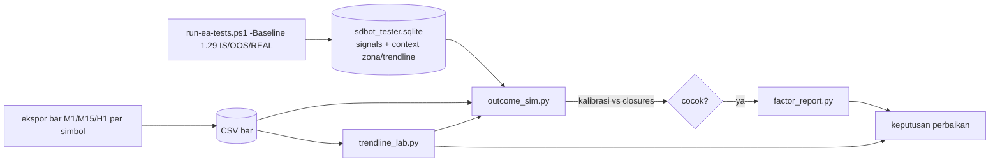

# Fase 5c — Riset sumber profit: overview

Status: Approved (2026-10-09)
Catatan: nomor 31–32 karena 27 (`ea-27-bias-responsive`) sedang berjalan dan 28–30 dipakai Fase 6 ([fase-6-overview.md](fase-6-overview.md)). Pencocokan live vs backtest (permintaan user 2026-10-09) sudah tercakup di spec 29 Fase 6 (`ea-29-live-replay`), jadi tidak diulang di sini.
Sumber: permintaan user 2026-10-09 ("test strategi, apakah di luar trendline juga bisa untung, dan apa yang menyebabkan untung, harus tahu alasannya"); temuan live 2026-10-08/09; PRD-EA §Telemetri sinyal, §Pengujian; `python-bot-lessons.md` (skor confluence tidak prediktif)

Hasil terbaik saat ini (1.25) tipis: real ticks +0,030R per trade, PF 1,06. Fase 5b memilih perbaikan dari R per trade agregat, tetapi belum menjelaskan **mengapa** sebuah trade untung. Jumlah trade juga kecil (sekitar 0,6 per hari untuk 12 simbol), jadi menunggu bukti dari live butuh terlalu lama.

Fase 5c memakai data yang sudah ada (setiap kandidat tercatat di `signals`) dan histori harga untuk menjawab dua pertanyaan:
1. **Apa yang membuat trade untung?** Faktor mana (zona, trendline, pola PA, sesi, skor, bias, R:R) yang konsisten memisahkan trade untung dari rugi di IS, OOS, dan real ticks.
2. **Apakah gerbang membuang trade bagus?** Hasil hipotetis kandidat yang ditolak, per tahap tolak.
3. **Apakah setup trendline + PA (yang dulu diingat user berhasil) punya keunggulan**, termasuk entry yang tidak membutuhkan zona S&D.

## 1. Tujuan dan batas

Fase 5c selesai bila:
- ada laporan faktor profit dengan tanda konsisten atau tidak di ketiga periode;
- ada hasil hipotetis per tahap tolak;
- tiga setup trendline H1 + PA M15 punya hasil IS/OOS/REAL dan keputusan: layak dibuat spec EA atau tidak.

Di luar Fase 5c:
- perubahan perilaku EA (temuan yang menjanjikan menjadi spec perbaikan tersendiri dengan aturan uji Fase 5b);
- optimasi parameter;
- machine learning (PRD §Di luar lingkup).

## 2. Pembagian spec

| # | Spec | Isi | Butuh kode EA | Versi |
|---|---|---|---|---|
| 31 | `ea-31-candidate-outcomes` | EA menambah batas zona (proximal/distal) dan jarak ke trendline di `context_json` agar SL setiap kandidat bisa dihitung. `tools/outcome_sim.py` mensimulasikan setiap kandidat (diterima maupun ditolak) dengan aturan exit EA (SL, TP, BE 1R, partial 1,5R 50%, trailing ATR(14) M15 × 2) di atas bar M1. Simulator dikalibrasi terhadap trade nyata backtest. `tools/factor_report.py` melaporkan R per trade per faktor dan per tahap tolak, untuk IS/OOS/REAL | ya (telemetri saja, keputusan entry tidak berubah) | 1.29 |
| 32 | `ea-32-trendline-setups` | `tools/trendline_lab.py`: deteksi trendline dari swing H1 (aturan yang sama dengan `TrendlineRules`), tiga setup dengan PA M15: (a) pantulan trendline tanpa syarat zona, (b) trendline + zona S&D, (c) break + retest. Setiap setup disimulasikan dengan `outcome_sim.py`, dilaporkan per periode dan per simbol, dan dibandingkan dengan acuan 1.25 | tidak | — |

Urutan 31 → 32: simulator dan kalibrasinya dari 31 dipakai ulang di 32.

Fase 5c dan Fase 6 berjalan berdampingan: Fase 6 mengukur live tanpa mengubah EA, Fase 5c meneliti di data backtest. Telemetri 1.29 (spec 31) tidak mengubah keputusan entry, jadi tidak mengganggu perbandingan live vs backtest Fase 6 selama replay memakai versi yang sama dengan live.

## 3. Use case

Nomor sesudah Fase 6 (UC-70..74).

| ID | Use case | Aktor | Spec |
|---|---|---|---|
| UC-80 | Mengetahui faktor yang konsisten membuat trade untung atau rugi | Trader, Developer | 31 |
| UC-81 | Mengetahui apakah sebuah gerbang membuang trade bagus (terlalu ketat) atau jelek | Trader, Developer | 31 |
| UC-82 | Menguji setup trendline + PA, dengan dan tanpa zona S&D, sebelum membangunnya di EA | Trader, Developer | 32 |
| UC-83 | Memutuskan perbaikan berikutnya berdasarkan sebab, bukan hanya angka agregat | Trader | 31, 32 |

### UC-80 Faktor profit
- **Alur utama:** developer menjalankan `factor_report.py` pada sesi acuan IS/OOS/REAL. Laporan menampilkan R per trade dan jumlah per bucket faktor, beserta tanda konsisten bila arah selisihnya sama di ketiga periode.
- **Alternatif:** bucket dengan trade < 10 ditandai SAMPEL KURANG dan tidak dihitung konsisten.

### UC-81 Gerbang terlalu ketat?
- **Alur utama:** `outcome_sim.py` menghitung hasil hipotetis kandidat yang ditolak. `factor_report.py` menampilkan R per trade per tahap tolak dibanding trade yang diterima.
- **Alternatif:** kandidat tanpa batas zona (data lama sebelum 1.29) diabaikan dan jumlahnya dicetak. Analisis memakai backtest ulang dengan 1.29.

### UC-82 Setup trendline
- **Alur utama:** `trendline_lab.py` mendeteksi setup a/b/c di 12 simbol, mensimulasikan, lalu melaporkan per periode dan simbol.
- **Alternatif:** setup yang lolos IS tetapi gagal OOS atau REAL dicatat sebagai ditolak, sama dengan aturan Fase 5b.

## 4. Arsitektur dan aliran data

Alat hanya membaca DB (`mode=ro`). Backtest dan ekspor bar memakai satu agen tester di background (batas CPU).

## 5. Strategi uji

- **Python:** pytest dengan DB dan bar fixture; ID TS dilanjutkan sesudah yang dipakai spec 27 (TS-91..93) dan Fase 6.
- **Kalibrasi simulator (wajib sebelum laporan dipakai):** trade nyata backtest acuan disimulasikan ulang; hasil simulasi harus cocok dengan `closures` (ambang di requirements spec 31).
- **EA (spec 31):** suite unit untuk kunci `context_json` baru, regresi `-All` dengan keputusan entry identik.

## 6. Keputusan yang perlu diambil

Usulan saya dalam kurung.

1. **Simulasi di Python di atas bar M1**, bukan Strategy Tester per kandidat. (Python: ribuan kandidat dalam hitungan menit. Tester per kandidat terlalu lambat.) Konsekuensinya: SL dan TP di bar M1 yang sama dihitung SL lebih dulu (konservatif), dan kalibrasi terhadap trade nyata menjadi syarat.
2. **Faktor yang dilaporkan:** status zona, skor trendline dan jarak ke garis, pola PA, jam/sesi UTC, persen skor, alasan bias, arah, R:R rencana, rezim ATR, simbol.
3. **Definisi "konsisten":** arah selisih terhadap rata-rata sama di IS, OOS, dan REAL, masing-masing dengan ≥ 10 trade per bucket.
4. **Trendline lab memakai aturan `TrendlineRules` yang sama** (swing H1, kekuatan 2, toleransi 0,2 ATR, kemiringan minimal), agar hasil bisa langsung dipindah ke EA.
