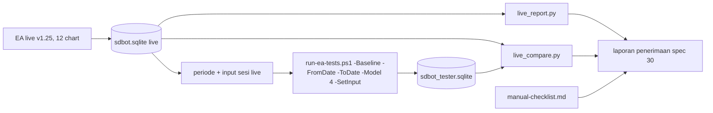

# Fase 6 — Validasi live akun cent: overview

Status: Approved (2026-10-09)
Catatan: nomor 28–30 karena spec 27 (`ea-27-bias-responsive`) dikerjakan paralel di sesi lain; spec 27 selesai 2026-10-10 (v1.28, H5 diterima), jadi versi live yang divalidasi bisa berganti ke 1.28.
Sumber: PRD-EA §Pengujian dan kriteria penerimaan (tahap 3 forward test, tahap 4 live akun cent), §Roadmap baris 6; hasil Fase 5b (`fase-5b-overview.md` §7); live v1.25 di Broker B sejak 2026-10-09 (12 simbol, risk 0,1%)

Fase 5b berakhir dengan satu perbaikan yang diterima (zona Fresh saja). Tiga hipotesis exit dan jam lainnya membaik di IS tetapi tidak bertahan di OOS atau REAL. Menyetel lebih jauh pada data yang sama berisiko mengejar kebetulan, apalagi OOS hanya sekitar 37 trade.

Fase 6 berganti fokus: membuktikan bahwa EA yang berjalan di akun cent berperilaku sama dengan backtest-nya, sambil mengumpulkan trade nyata. Data ini menjadi out-of-sample baru untuk keputusan berikutnya.

## 1. Tujuan dan batas

Fase 6 selesai bila kriteria PRD tahap 3 dan 4 terpenuhi, atau bila ada keputusan untuk kembali memperbaiki strategi:

| Tahap PRD | Arti di Fase 6 | Bukti |
|---|---|---|
| 3. Forward test | Periode live (tidak pernah dipakai menyetel) dibandingkan dengan backtest acuan | PF dan DD live tidak memburuk lebih dari 30% dibanding backtest IS versi yang sedang live (1.28: PF 1,17, DD 7,2%; 1.25: PF 1,10, DD 6,3%); dinilai dalam R karena risk live 0,1% dan backtest 0,5% |
| 4. Live akun cent | Sekitar 2 minggu live, lalu replay tester periode yang sama | Tidak ada error kritis; kandidat dan trade live cocok dengan replay tester; slippage rata-rata tercatat dan wajar |

Di luar Fase 6:
- perubahan strategi (spec perbaikan baru dibuat hanya bila data live menunjukkannya);
- backoffice (B1–B6) dan migrasi ke akun standar;
- otomatisasi laporan lewat Telegram (bisa menyusul bila laporan manual terbukti berguna).

## 2. Yang sudah ada

- Live v1.25 berjalan di 12 chart Broker B. Setiap kandidat tercatat di `signals`, trade di `trades` (termasuk `slippage_points`, `spread_points`), dan closure di `closures` (R, MFE/MAE, alasan tutup) di `Common\Files\sdbot.sqlite`.
- Runner tester bisa menjalankan periode bebas dengan real ticks: `-Baseline -FromDate -ToDate -Model 4 -SetInput`.
- `baseline_report.py` dan `exit_report.py` membaca DB tester. Belum ada alat untuk DB live, dan belum ada pencocokan trade live dengan tester.
- `ea/tests/manual-checklist.md` berisi MC yang hanya bisa dicek live (koneksi putus, restart dengan posisi, Telegram, SL dihapus manual, dan sebagainya). Sebagian besar belum diisi.

## 3. Pembagian spec

| # | Spec | Isi | Butuh kode EA | Versi |
|---|---|---|---|---|
| 28 | `ea-28-live-report` | `tools/live_report.py`: ringkasan DB live per periode. Isinya trade, R per trade, PF, DD dalam R, alasan tutup, slippage dan spread (point dan R), kandidat per tahap tolak, alert per tipe dan severity, celah waktu tanpa heartbeat | tidak | — |
| 29 | `ea-29-live-replay` | Replay tester periode live (real ticks, input sama dengan sesi live kecuali risk) dan `tools/live_compare.py`: pasangkan **kandidat** live dan tester per simbol dan bar (arah, skor, tahap tolak) serta **trade** per simbol, arah, dan waktu buka; laporkan kecocokan, alasan tutup, selisih R, dan yang hanya ada di satu sisi | tidak (kecuali bila replay menemukan bug) | — |
| 30 | `ea-30-acceptance` | Laporan penerimaan tahap 3 dan 4 dari keluaran spec 28–29 dan checklist manual; keputusan lanjut (2.00), perpanjang, atau kembali memperbaiki strategi | tidak; versi 2.00 bila lolos | 2.00 |

Urutan 28 → 29 → 30. Spec 28 dan 29 bisa dipakai berkala (misalnya tiap minggu) selama periode live. Spec 30 (tahap 4) ditulis sesudah sekitar 2 minggu live; tahap 3 dinilai terus dengan laporan bulanan dan tidak menghalangi pengembangan.

## 4. Use case

Nomor melanjutkan Fase 5b (UC-60..63).

| ID | Use case | Aktor | Spec |
|---|---|---|---|
| UC-70 | Melihat ringkasan hasil live per periode (trade, R, slippage, error) | Trader, Developer | 28 |
| UC-71 | Memastikan EA live mengambil keputusan yang sama dengan backtest pada data yang sama | Developer | 29 |
| UC-72 | Menemukan bug yang hanya muncul di live (eksekusi, waktu, data) dari selisih live dan replay | Developer | 29 |
| UC-73 | Memutuskan apakah EA lolos tahap 3 dan 4 PRD | Trader | 30 |
| UC-74 | Mengisi checklist manual selama live | Trader | 30 |

## 5. Arsitektur dan aliran data

Semua alat hanya membaca DB (`mode=ro`). EA live tidak disentuh. Replay memakai satu agen tester di background (batas CPU).

## 6. Strategi uji

- **Alat Python:** pytest dengan DB fixture (pola `test_exit_report.py`), TS-120 dan seterusnya (TS-91..112 dipakai spec 27 dan 31).
- **Replay:** uji ujung ke ujung pertama memakai periode live yang sudah ada (mulai 2026-10-09). Hasil yang tidak cocok diselidiki sebagai calon bug, dengan aturan bug-sebelum-fitur.
- **Tanpa perubahan EA.** Bila replay menemukan bug, perbaikannya menjadi spec perbaikan tersendiri dengan versi baru dan regresi `-All`.

## 7. Keputusan yang perlu diambil

Usulan saya dalam kurung.

1. **Tiga spec (28 laporan live, 29 replay, 30 penerimaan)**, berurutan. Alternatifnya satu spec besar; lebih cepat, tetapi alat laporan bisa dipakai lebih dulu bila dipisah.
2. **Penilaian dalam R, bukan uang**, karena risk live 0,1% dan backtest 0,5%. Kriteria "tidak memburuk > 30%" diterapkan ke PF dan DD dalam R.
3. **Acuan tahap 3 = backtest IS versi yang sedang live** (1.28: PF 1,17, DD 7,2%; sebelumnya 1.25: PF 1,10, DD 6,3%; DD dalam R dihitung ulang oleh `live_report.py`). Disesuaikan 2026-10-10 sesudah spec 27. Alternatifnya REAL 1.25 (PF 1,06): lebih realistis, tetapi periode REAL ikut dipakai memilih H1.
4. **Kecocokan replay (tahap 4), usulan ambang:** ≥ 95% kandidat live punya pasangan di replay dengan tahap tolak sama (dan sebaliknya); ≥ 90% trade live berpasangan; ≥ 90% pasangan punya alasan tutup sama; selisih R rata-rata ≤ 0,1R. Angka final ditetapkan di requirements spec 29.
5. **Tahap 4 sesudah sekitar 2 minggu, tahap 3 berjalan di belakang** (disetujui 2026-10-09, menggantikan usulan "minimal 1 bulan"):
   - Tahap 4 dinilai dari kandidat, bukan hanya trade. Live mencatat sekitar 100+ kandidat per hari, jadi 2 minggu cukup untuk menemukan bug perilaku. Syaratnya ambang keputusan 4, minimal sekitar 10 trade berpasangan, dan tidak ada error kritis.
   - Tahap 3 (profit) tidak bisa dibuktikan cepat. Edge sekitar +0,04R per trade dengan sebaran sekitar ±1,1R butuh ratusan trade: ketidakpastian ±0,26R di 1 bulan, ±0,15R di 3 bulan, ±0,07R di 12 bulan. Data live terus dikumpulkan sebagai out-of-sample tambahan dengan laporan bulanan, tanpa menghalangi Fase 5c atau spec lain.
   - Keputusan versi 2.00 di spec 30 memakai tahap 4 ditambah status tahap 3 saat itu (belum terbukti / tidak memburuk).
